### vulfocus环境搭建

---

#### 一、基础运行环境准备

> 我们选择直接使用本学期课程实验所用的虚拟机环境进行多重加载进行构建

##### 1.在Oracle VM VirtualBox 管理器中点击左上方菜单栏中”控制“，之后选择”新建“虚拟机进行虚拟机的构建

##### 2.为虚拟机命名并选择类型。

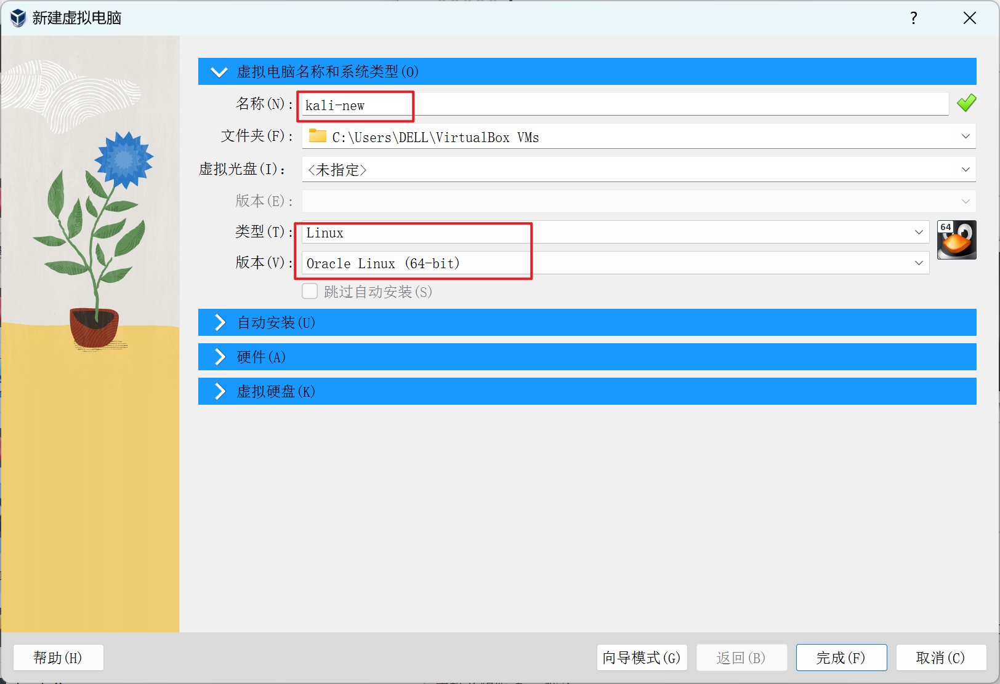

##### 3.自动安装和硬件可以选择使用默认配置。

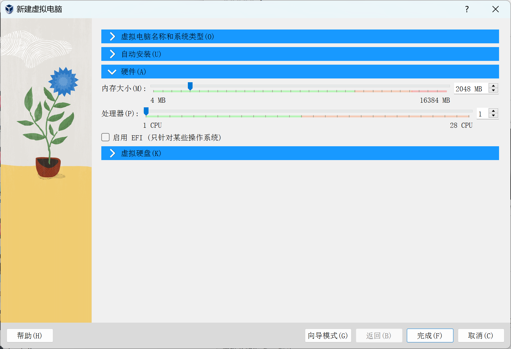

##### 4.虚拟硬盘选择多重加载（在此我们选择本学期实验所使用的kali-linux-2024.2-virtualbox-amd64.vdi虚拟硬盘文件）。

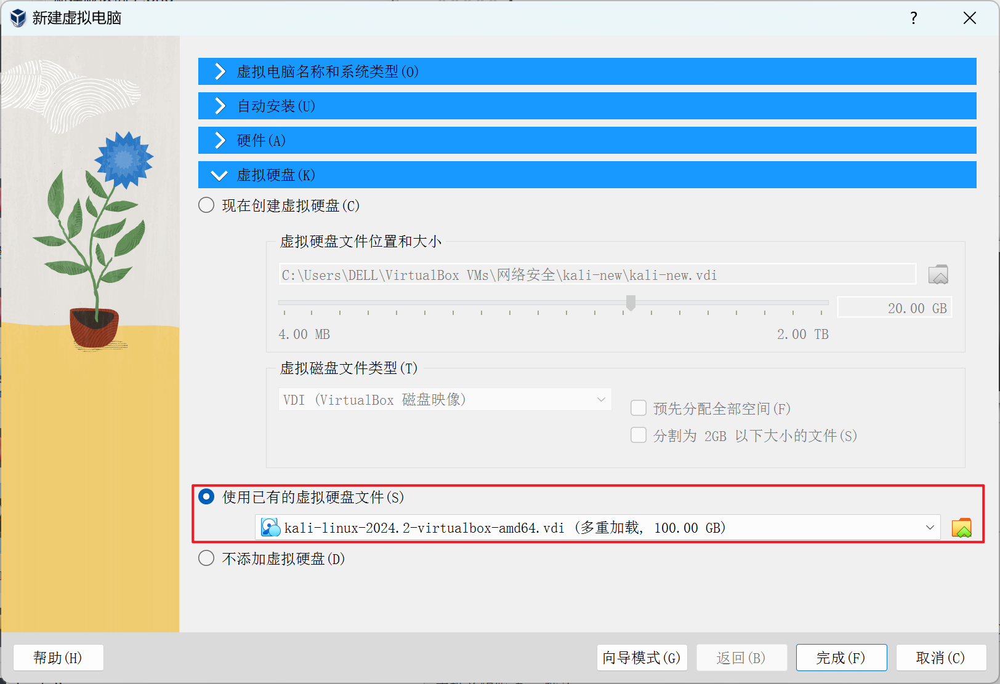

##### 5.为虚拟机配置NAT网卡（访问外网）、HostOnly网卡（与宿主机通信）。

<table>
  <tr>
      <td ><center>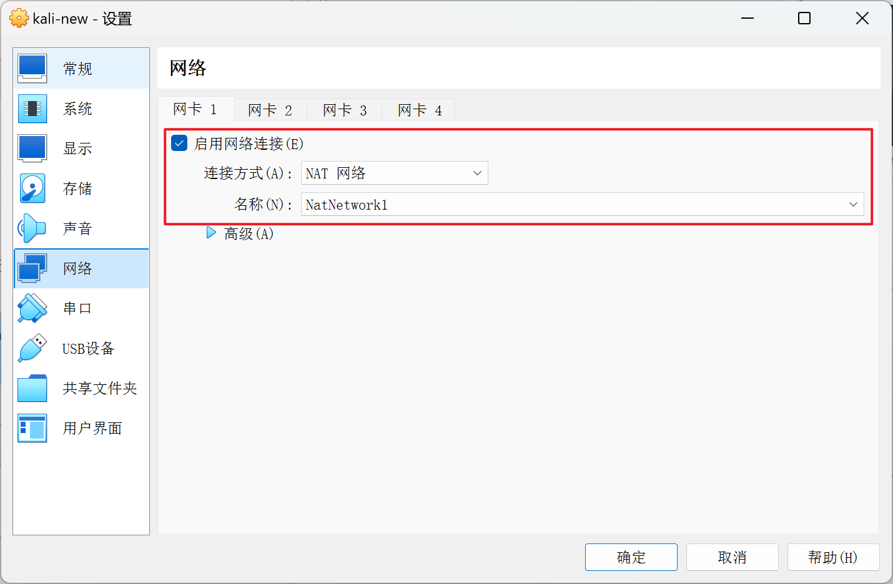网卡1</center></td>
      <td ><center>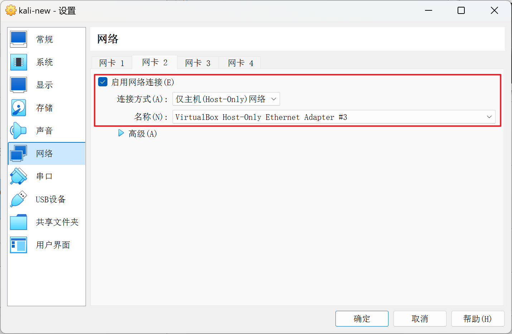网卡2</center></td>
  </tr>
</table>  
##### 6.虚拟机配置完成：

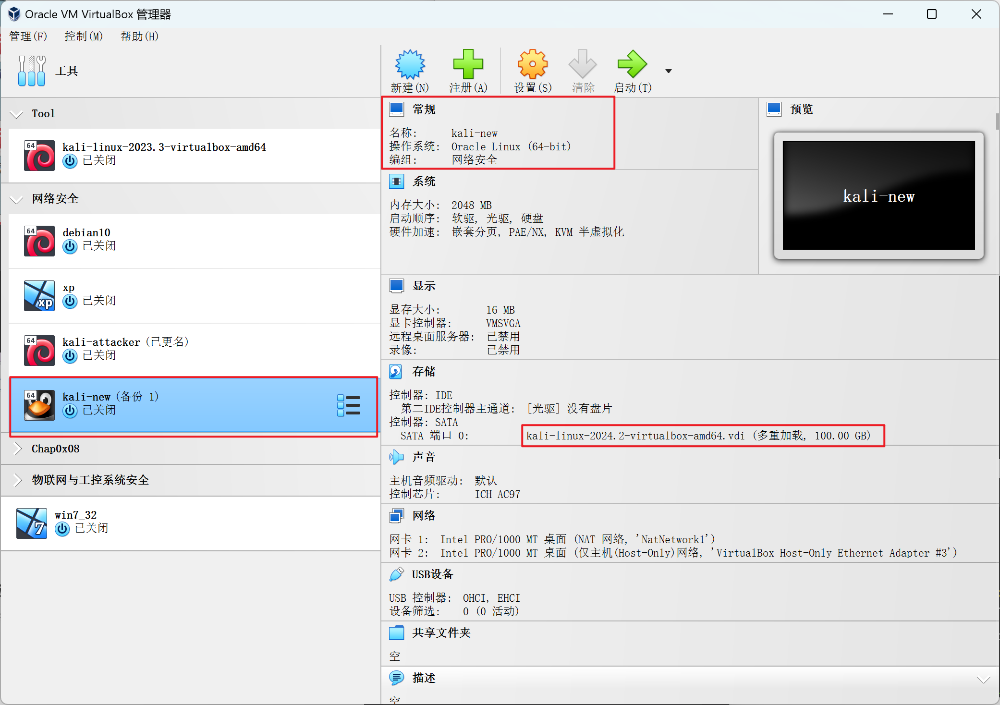

##### 7.配置宿主机与虚拟机之间的ssh免密连接。

----

#### 二、安装Docker、拉取镜像

##### 1.首先切换目录至工作目录中，之后执行命令`git clone https://github.com/c4pr1c3/ctf-games.git`克隆实验所需仓库。

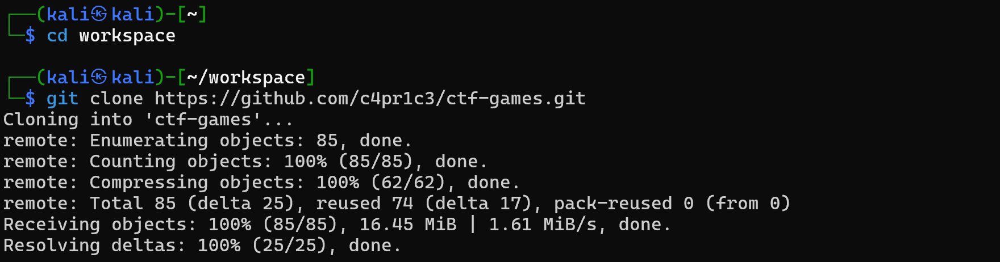

##### 2.参考[Installing Docker on Kali Linux | Kali Linux Documentation](https://www.kali.org/docs/containers/installing-docker-on-kali/#installing-docker-ce-on-kali-linux)，进行Docker的安装。

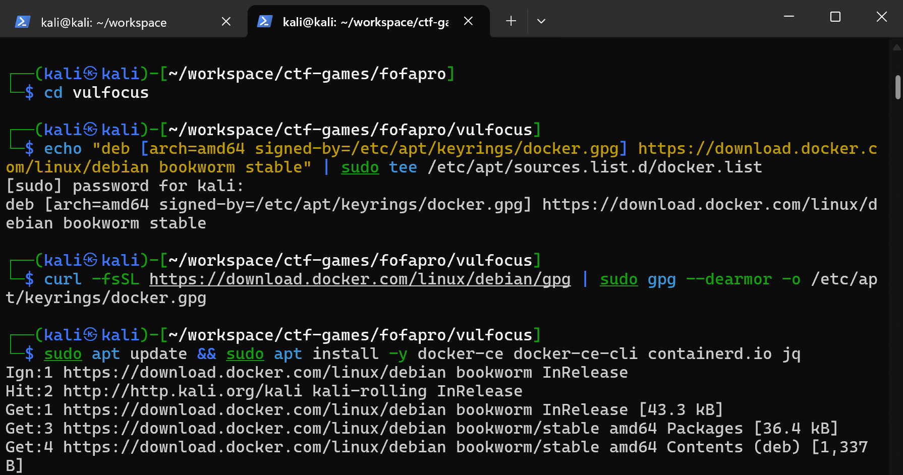

##### 3.执行命令`sudo usermod -a -G docker ${USER}`将当前用户添加到 docker 用户组，免 sudo 执行 docker 相关指令，之后为docker配置国内镜像源，最后重启docker守护进程，安装完毕。

```
# 配置国内镜像源
cat <<EOF > /etc/docker/daemon.json
{
	"registry-mirrors":[
		"https://docker.fendou.us"
	]
}
EOF
```

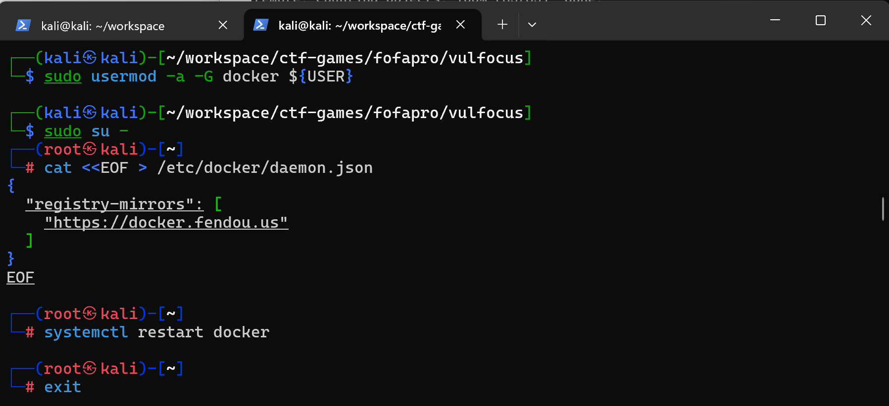

##### 4.拉取 vulfocus 镜像，此时遇到报错：权限拒绝，这代表我们当前用户没有权限运行，但我们刚刚已经将当前用户添加到docker用户组，可能权限没有更新，所以我们此时应该exit关闭ssh连接之后进行重连，在此运行拉取命令`docker pull vulfocus/vulfocus:latest`，成功拉取。

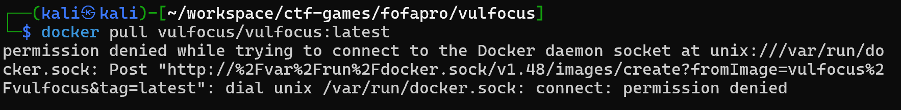

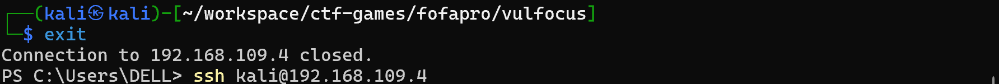

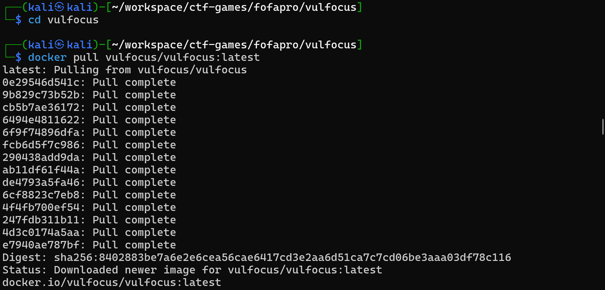

---

#### 三、启动Docker容器，访问Vulfocus Web页面

##### 1.启动Docker容器，使用简化后的启动方式：`bash start.sh`，启动后需要选择LOCAL_IP，在此推荐使用HostOnly下的IP地址，但我尝试直接默认回车使用NAT网络下IP地址也是可以的。

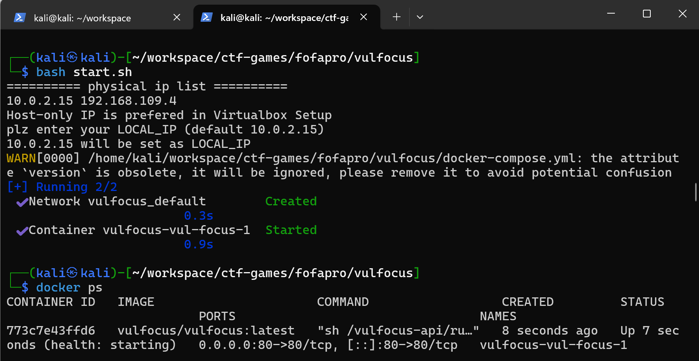

##### 2.使用宿主机访问Vulfocus，访问地址：`宿主机HostOnly IP地址:80`

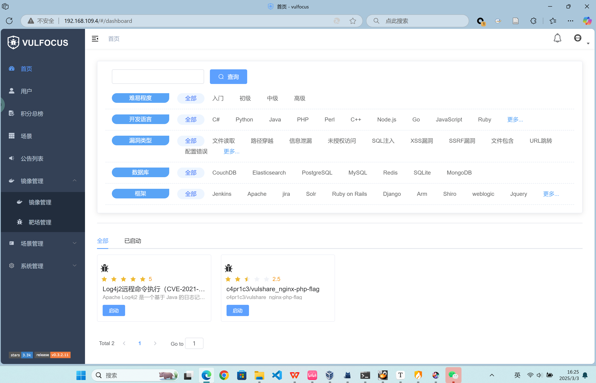

至此，vulfocus环境搭建完成。

##### 3.在左侧菜单中的镜像管理下，我们进入之后点击右上角的”一键同步“，vulfocus会去访问它自己的服务器，去拉取当前所有可用的漏洞复现环境的地址，之后我们便可以在此页面下搜索我们想要使用的漏洞复现的环境进行下载、启动。

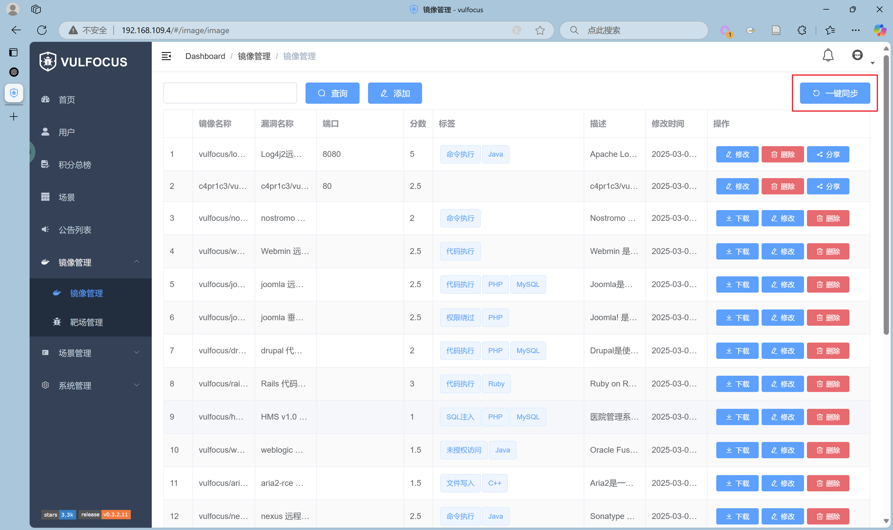

---

#### 遇到的问题及解决方法

##### 1.启动Docker容器，使用简化后的启动方式：`bash start.sh`,提示报错：`start.sh: line 47: docker-compose: command not found`

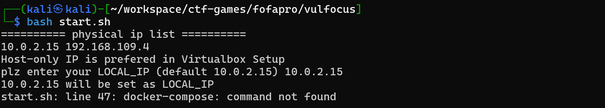

解决方法：

经过查阅官方文档以及相关资料：

- **`docker-compose`**是 Docker Compose 的旧版本命令格式，它是一个独立的工具，通常需要单独安装。在早期版本的 Docker Compose 中，它是主要的命令形式。
- **`docker compose`**是 Docker Compose 的新版本命令格式，从 Docker 20.10 版本开始，Docker Compose 的功能被集成到了 Docker CLI 中，因此可以直接使用 `docker compose` 命令，而无需单独安装 Docker Compose。它与 Docker 的集成更加紧密，支持更好的插件化和扩展性。

Docker Compose 从 **v1.27.0（2020 年 8 月）** 开始引入 `docker compose` 作为插件，但仍然支持 `docker-compose` 命令。

在 **Docker 20.10.0（2020 年 12 月）** 之后，`docker compose` 插件版本逐渐取代了 `docker-compose`，并在 **Docker 23.0（2023 年 2 月）** 正式废弃了 `docker-compose`，推荐使用 `docker compose`。

另外：来自[官方文档](https://docs.docker.com/compose/releases/migrate/#unsupported-in-v2)的一段话：
The following were deprecated in Compose V1 and aren't supported in Compose V2:

- `docker-compose scale`. Use `docker compose up --scale` instead.
- `docker-compose rm --all`

具体时间线如下：

| 版本                        | 变化                                                         |
| --------------------------- | ------------------------------------------------------------ |
| **Docker 19.x 及更早**      | 仅支持 `docker-compose`（独立二进制）                        |
| **Docker 20.10（2020.12）** | `docker compose` 作为 CLI 插件推出，但 `docker-compose` 仍然支持 |
| **Docker 23.0（2023.02）**  | `docker-compose` 被废弃，官方推荐 `docker compose`           |

我的版本为**28.0.1**，所以无法使用`docker-compose`命令，在此我不想要下载docker-compose工具，所以将`start.sh`中`docker-compose up -d`其修改为`docker compose up -d`

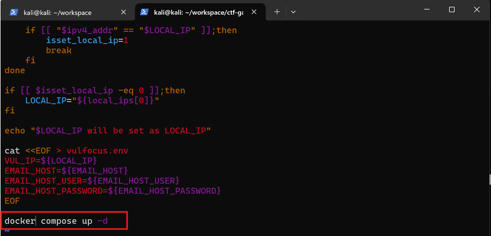

---

#### 参考链接

- [GitHub访问不了或者很慢的解决办法-腾讯云开发者社区-腾讯云](https://cloud.tencent.com/developer/article/2359332)
- [编写文件参考 |Docker 文档 --- Compose file reference | Docker Docs](https://docs.docker.com/reference/compose-file/?utm_source=chatgpt.com)
- [历史与发展 |Docker 文档 --- History and development | Docker Docs](https://docs.docker.com/compose/intro/history/)
- [迁移到 Compose V2 |Docker 文档 --- Migrate to Compose V2 | Docker Docs](https://docs.docker.com/compose/releases/migrate/)