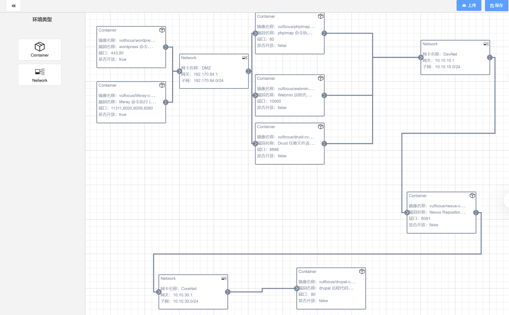
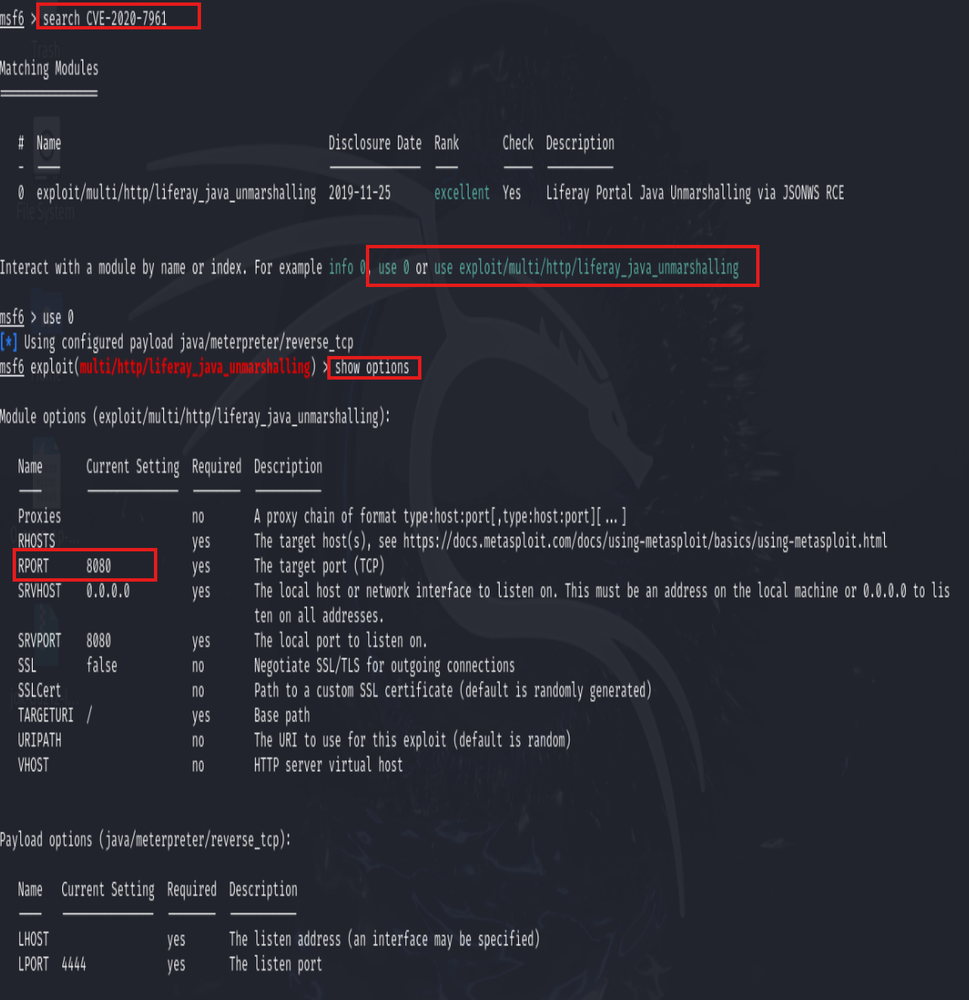
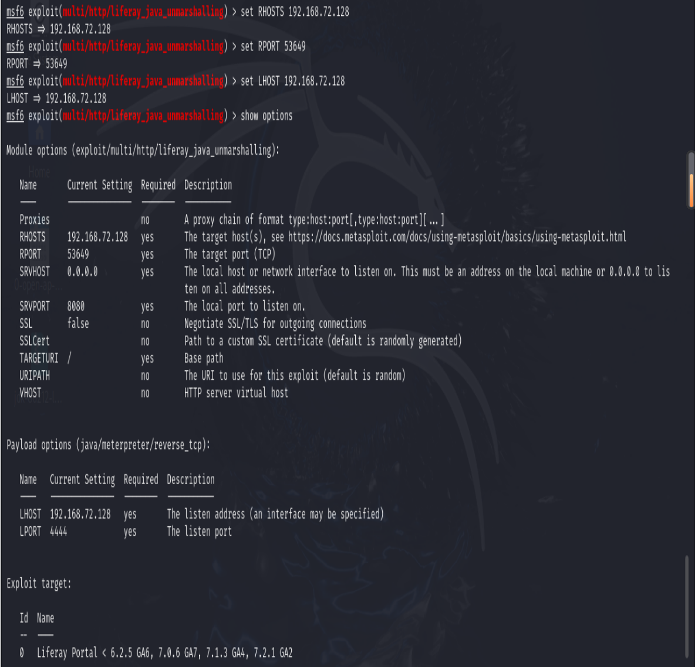
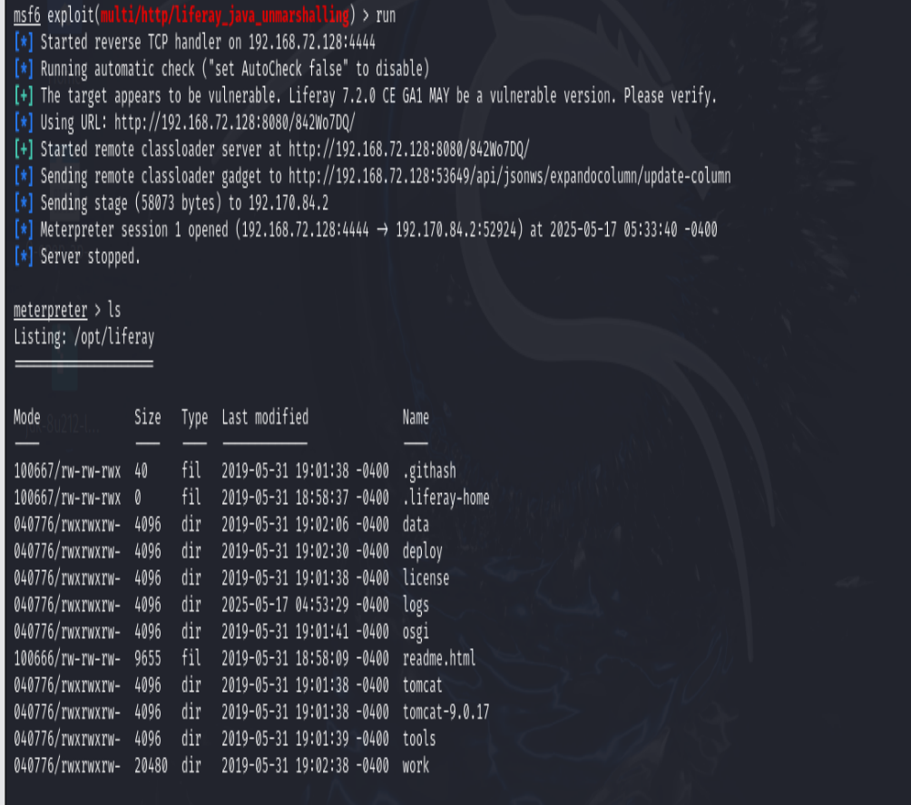
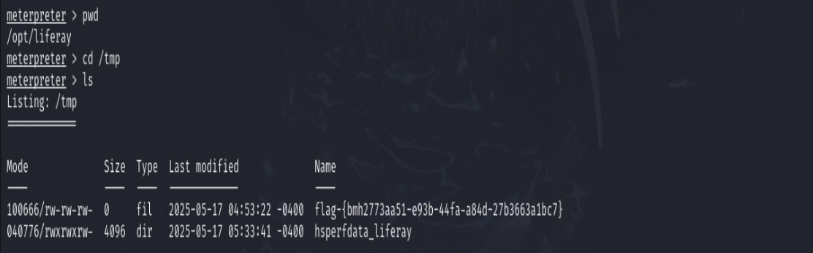
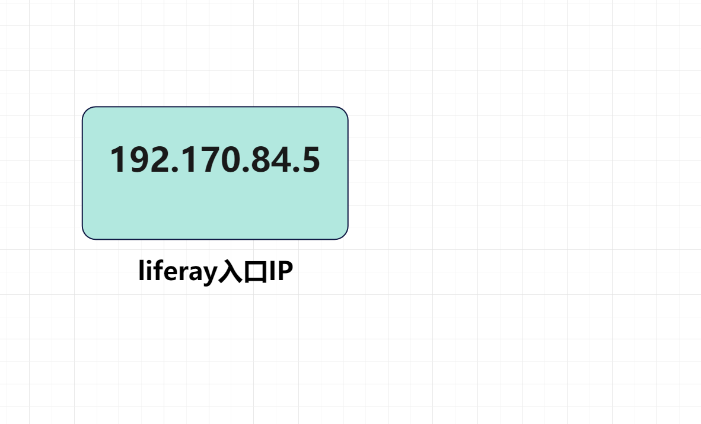
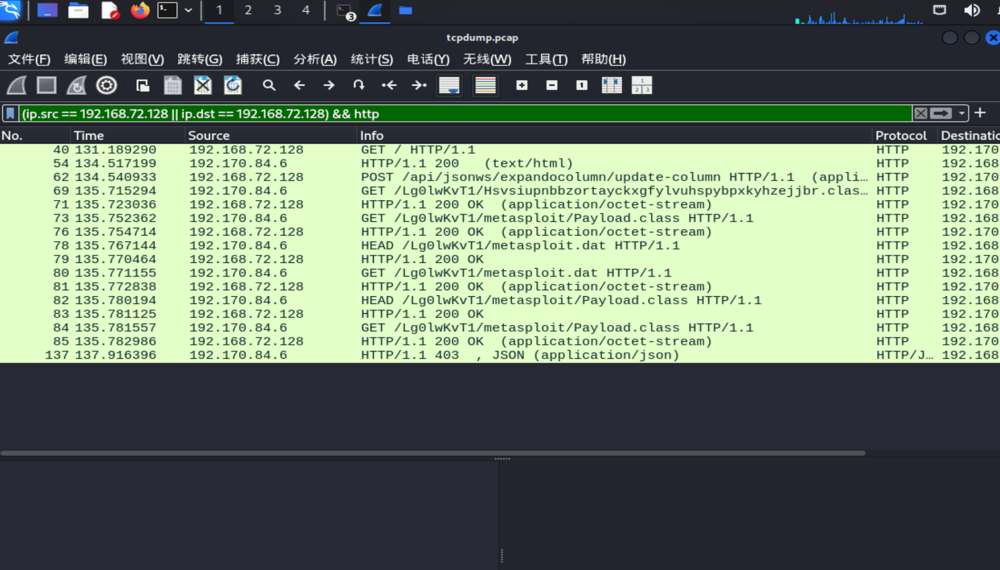
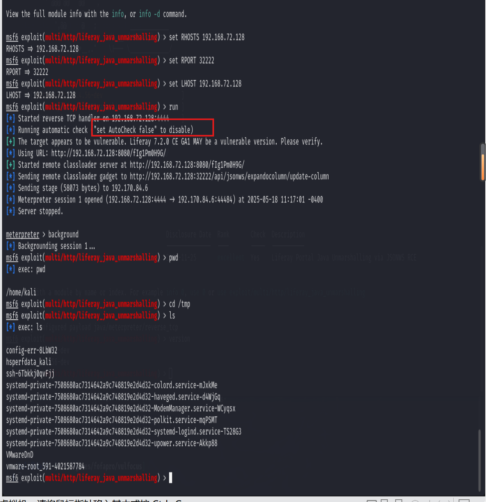
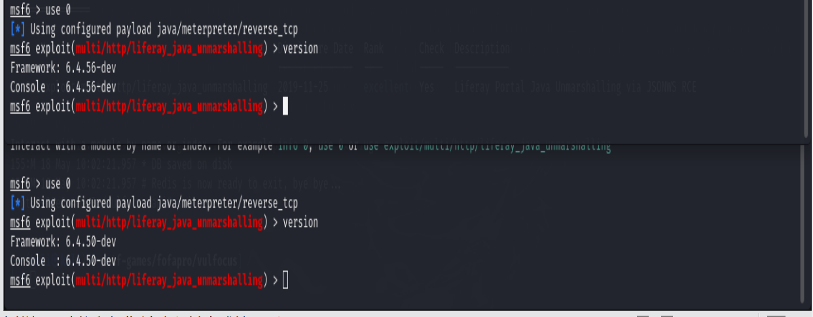
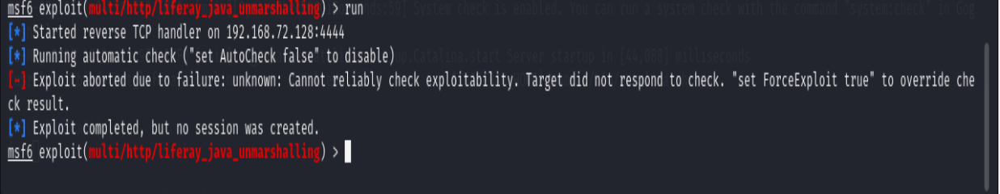

## 网安实践实验二

本实验围绕 Liferay 的命令执行漏洞（CVE-2020-7961）展开，通过攻击、检测、缓解和修复等多个阶段进行完整的安全分析。

---

### CVE-2020-7961 漏洞描述

**漏洞类型**：Java 反序列化远程命令执行（Remote Code Execution via Java Deserialization）  
**漏洞评分（CVSS 3.1）**：9.8（Critical）  
**影响组件**：Liferay Portal  
**影响版本**：Liferay Portal CE 7.2.0 GA1 及以下版本  
**发现时间**：2020 年 2 月  
**漏洞根因**：

该漏洞存在于 Liferay Portal 的 JSON Web Services（JSONWS）接口中。攻击者可以通过精心构造的恶意请求调用 `java.io.ObjectInputStream` 反序列化数据，触发远程命令执行。

由于 Liferay 在处理某些 JSON 请求时，允许对外公开调用 Java 对象方法，而未对输入的数据进行足够校验，攻击者可以传入恶意的序列化对象，从而在服务器端执行任意代码。

**利用条件**：

- 攻击者能访问 Liferay 的 JSONWS 接口；
- 目标系统启用了远程调用服务；
- 无白名单校验机制；
- 服务端无额外反序列化保护；

**攻击流程**：

1. 攻击者构造恶意 Java 序列化对象；
2. 提交至 Liferay JSONWS 接口；
3. 服务端反序列化并执行其中的命令；
4. 攻击者获取服务器控制权或反弹 shell。

**修复措施**：

Liferay 官方在新版本中采取以下修复策略：

- 禁用对未授权主机的 JSONWS 调用；
- 强化反序列化类型校验；
- 建议升级至 Liferay Portal 7.3.1 GA2 或以上版本。

---

### 一、网络拓扑结构

网络拓扑图如下所示：



---

### 二、Liferay 漏洞分析

#### 1. 命令执行

**漏洞查询**

首先查询目标系统中存在的漏洞编号：



**漏洞利用**

设置相关参数后执行命令攻击：

  


成功连接 Shell 后获取目标系统的 Flag：



使用 `ipconfig` 获取目标的入口 IP：



---

#### 2. 漏洞检测

部署相应的容器并抓取网络数据包，同时执行命令获取漏洞利用流量：



对比分析抓取到的数据帧，确认来自 Liferay 的漏洞利用流量：


---

#### 3. 漏洞缓解

**编写并部署恶意 Java 类**

编写恶意 Java 类后，使用 Python 启动 HTTP 服务以便远程加载类文件：

```bash
python3 -m http.server 9999
````

**生成恶意序列化数据**

利用 `marshalsec` 工具生成用于攻击的恶意序列化 Payload：


**配置文件层面禁用 JSONWS 调用**

编辑 `portal.properties` 文件，添加如下配置项以限制远程访问：

```properties
jsonws.servlet.hosts.allowed=Not/Available
```

该配置可防止通过 JSONWS 接口发起反序列化攻击。

**验证缓解效果**

执行攻击操作，确认攻击已被阻止：



---

#### 4. 漏洞修复

该漏洞（CVE-2020-7961）影响 Liferay Portal CE 7.2.0 GA1 及以下版本。本实验中的版本为 6.4.56，处于受影响范围。



**升级方案**

根据 Liferay 官方建议，升级至 Liferay Portal 7.3.1 或更高版本。

升级完成后再次尝试攻击，验证漏洞已修复：



---

### 三、总结

本实验通过真实攻击与防护过程，对 Liferay 命令执行漏洞进行了深入分析，掌握了漏洞检测与缓解的技术手段，并通过版本升级实现了彻底修复。

---

