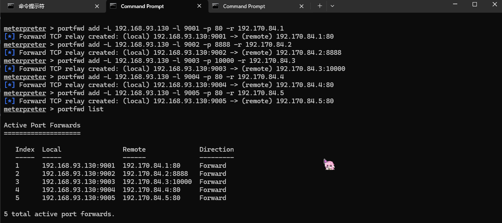
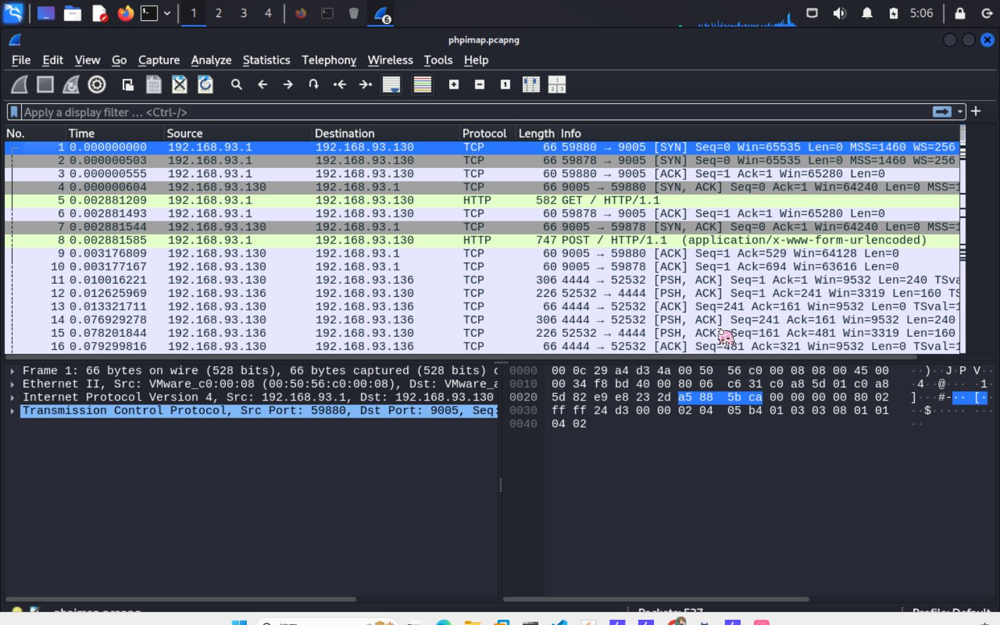
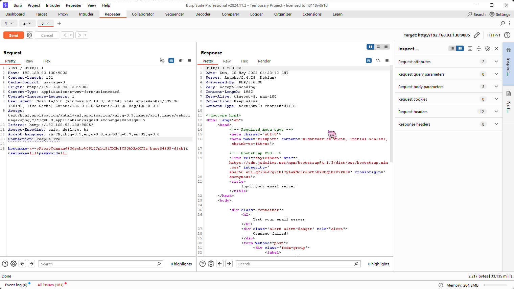
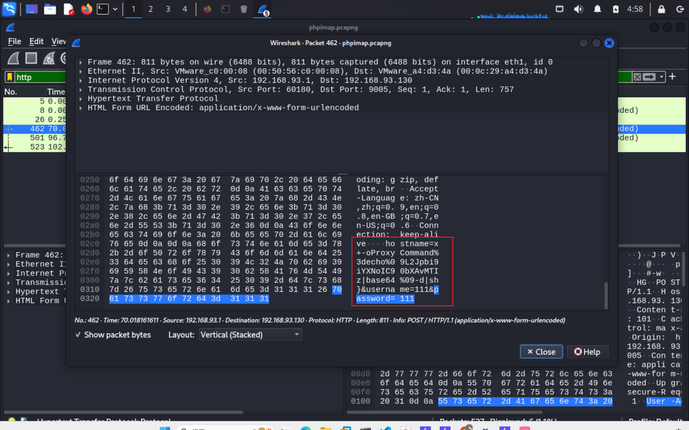
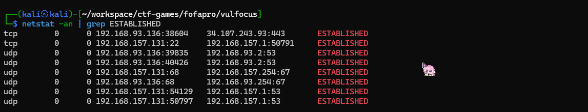
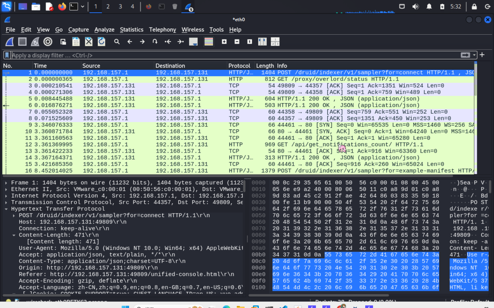
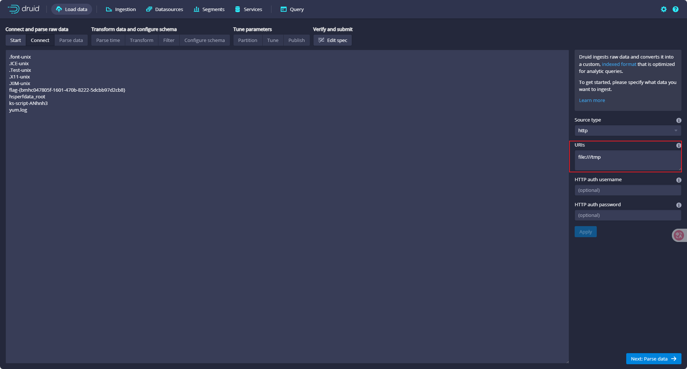
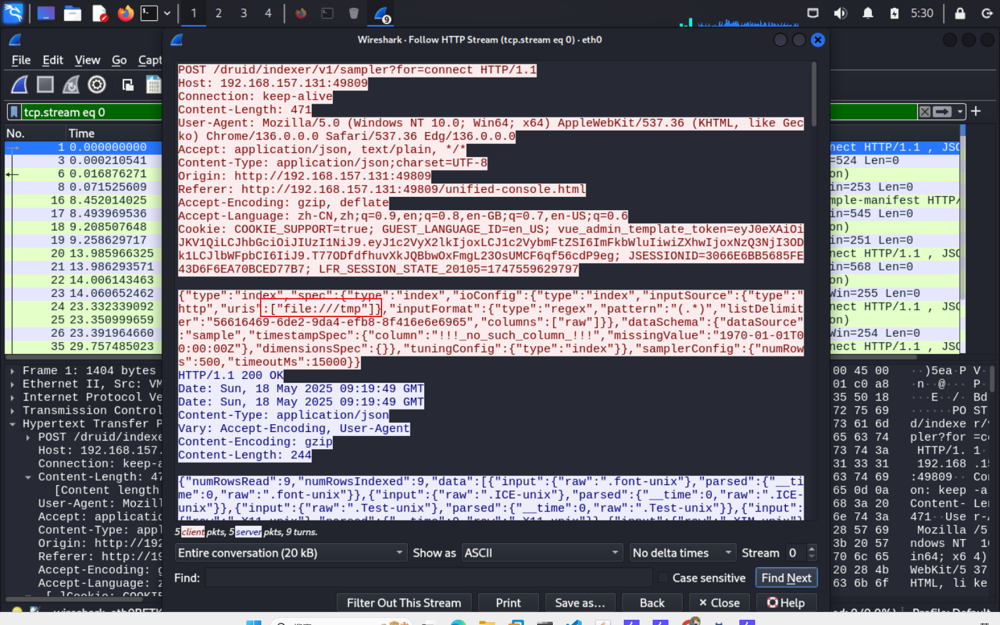

# 漏洞利用检测

在反弹第一层shell后并转发端口


## phpimap

在靶机中打开wireshark进行抓包


再次通过bp进行反弹shell攻击


停止抓包，过滤出http请求，发现可疑输入,重新编码后发现是/bin/bash /tmp/123启动了一个脚本存在异常
```
hostname=x+-oProxyCommand%3decho%09L2Jpbi9iYXNoIC90bXAvMTIz|base64%09-d|sh}
```


同时查看靶机所连接的ip，发现可疑ip连接

```
正常连接：
192.168.157.131:22 与 192.168.157.1:50791
说明当前的 Kali 虚拟机正被主机通过 SSH 连接,是常见的本地连接。
所有指向 :53 和 :67 的 UDP 连接：
UDP 53 是 DNS 查询端口；
UDP 67/68 是 DHCP 请求；
都是系统正常的网络通信行为。
```
```
tcp        0      0 192.168.93.136:38604    34.107.243.93:443       ESTABLISHED
```
这个 IP 34.107.243.93 是公网地址，不属于本地网络；这可能是恶意反连（reverse shell）、信息泄露、C2通信（Command & Control）等行为的特征。

## Druid
在靶机中打开wireshark进行抓包


再次进行文件读取操作


在靶机中停止抓包，过滤http请求，在/druid/indexer/v1/sampler发现可疑数据
文件URL被传递给HTTP InputSource绕过

