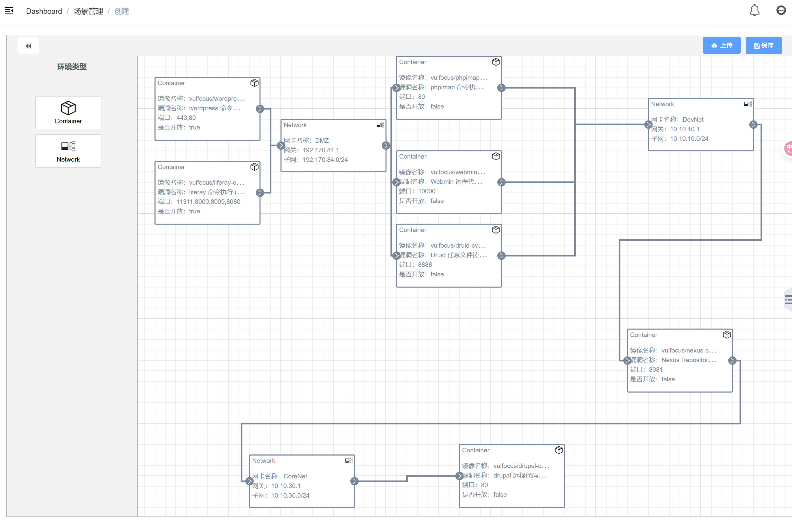

# 网安实践实验二
---
## 拓扑搭建
候选镜像经过测试，可用列表如下：

- drupal 远程代码执行 （CVE-2019-6339）
- wordpress 命令执行 （CVE-2016-10033）
- Webmin 远程代码执行 （CVE-2022-0824）
- jenkins 代码执行 （CVE-2017-1000353）
- liferay 命令执行 (CVE-2020-7961)
- ~~ofbiz 远程代码执行 (CVE-2020-9496)~~
- ~~samba 代码执行 (CVE-2017-7494)~~
- ~~rsync-common 未授权访问~~
- phpimap 命令执行 (CVE-2018-19518)
- Nexus Repository Manager3 EL注入
- Druid 任意文件读取 （CVE-2021-36749）

故搭建下面结构的网络：

## 

