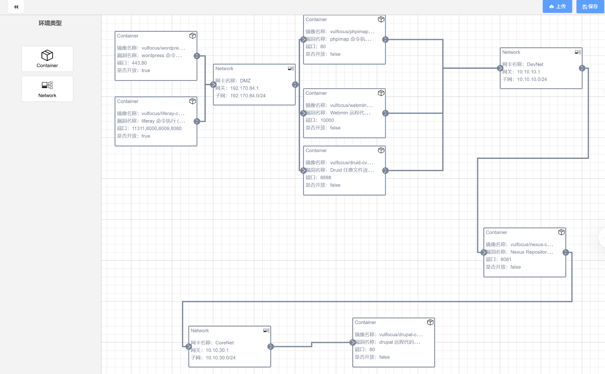
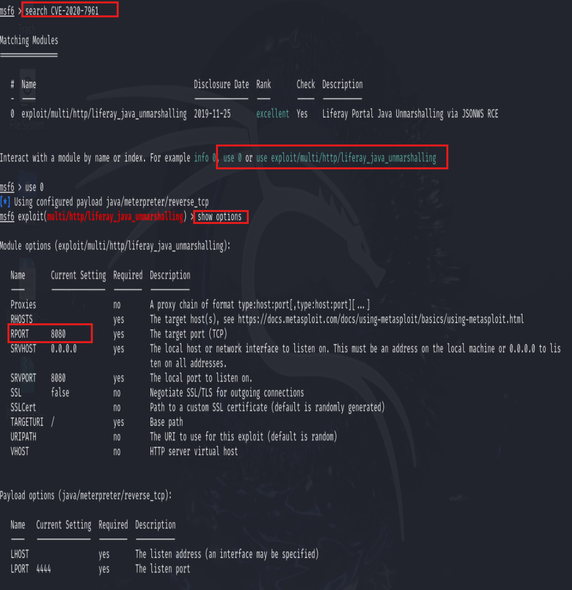
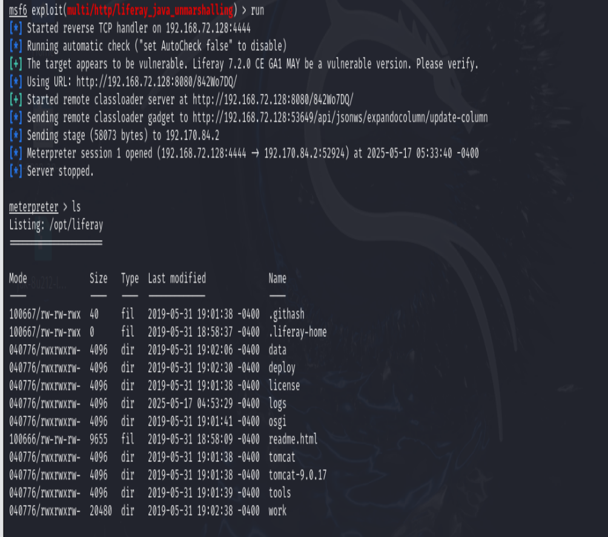
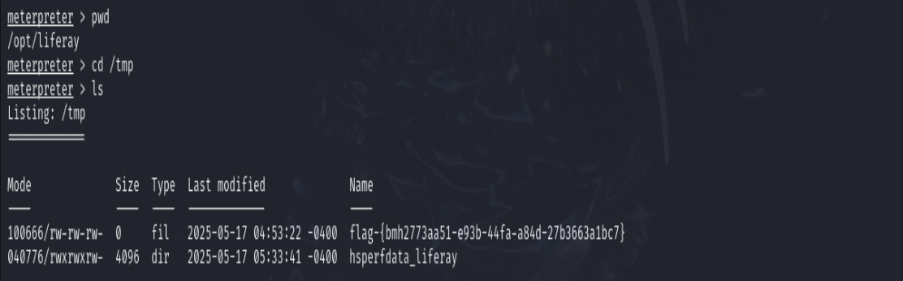
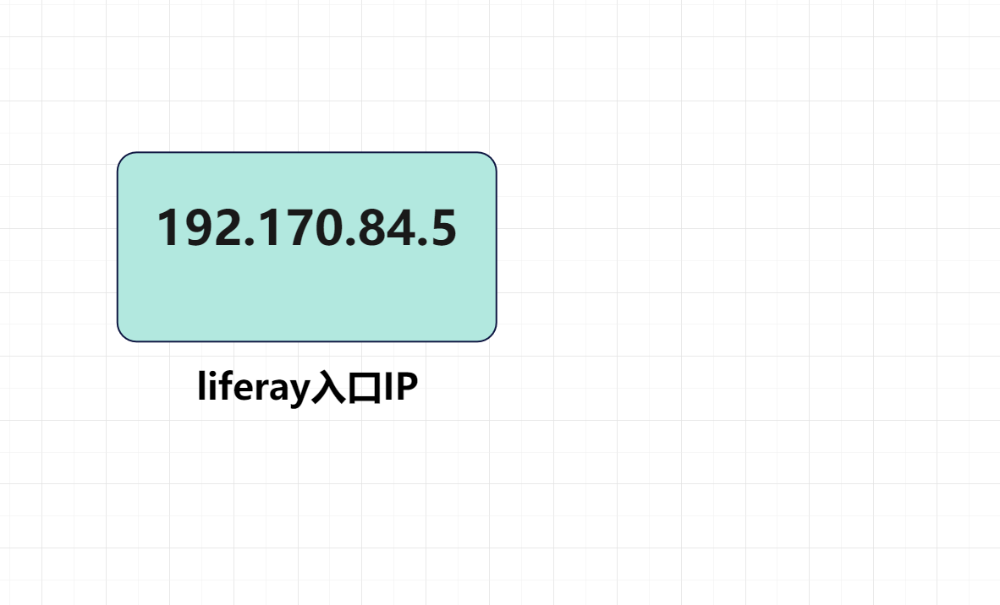
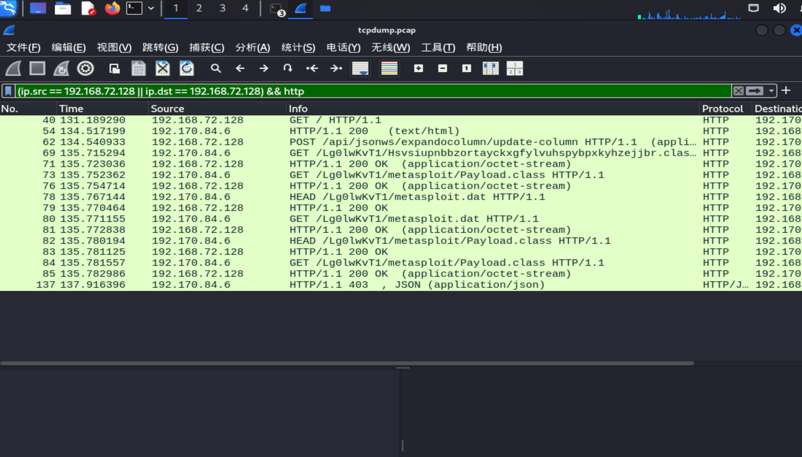
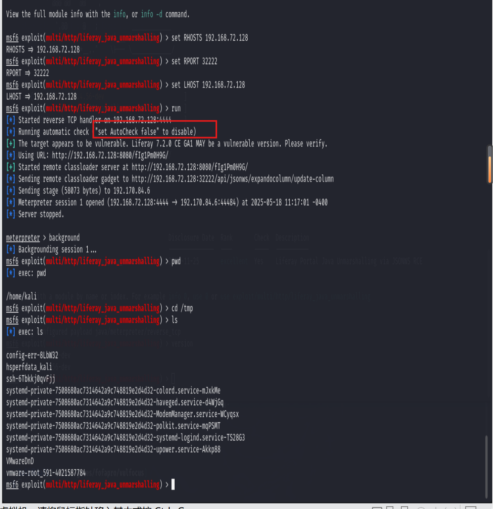
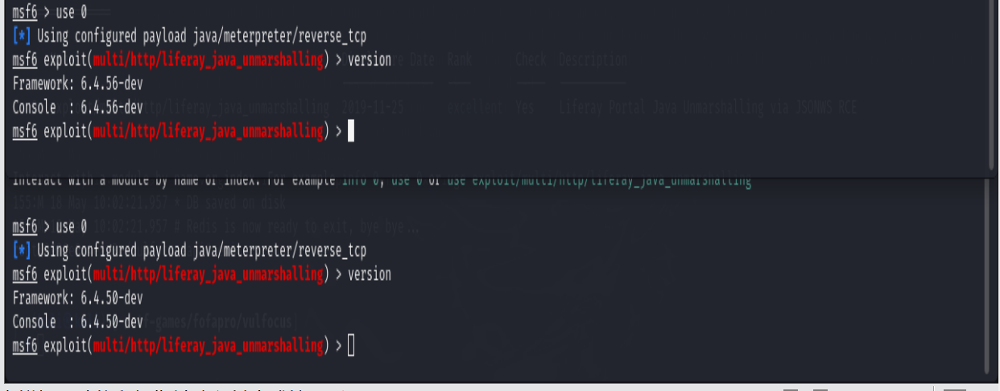
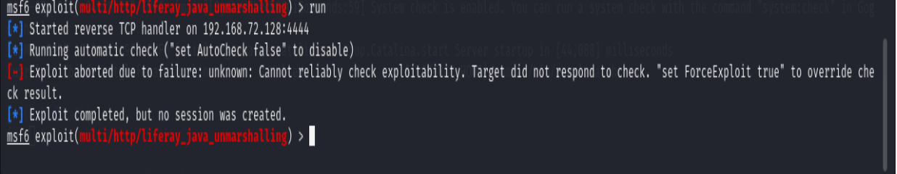

## 网安实践实验二

网络拓扑图如下：

### liferay漏洞
#### 1.命令执行
查询漏洞号


设置参数


设置好后进行攻击


连接shell后得到flag


利用ipconfig得到入口IP

#### 2.漏洞检测

设置容器并进行抓包，同时进行命令执行，得到数据包并进行过滤


对比查找可以发现liferay的数据帧，图片是数据帧详细数据


#### 3.漏洞缓解

首先编辑一个恶意的Java类并进行编译，如何在保存Java类的文件目录下运行一个HTTP文件服务，
```
python3 -m http.server 9999
```

使用marshalsec工具生成恶意的反序列化数据


在 Liferay 的配置文件中禁用 JSONWS 调用。编辑 portal.properties 文件，添加以下内容：
```
jsonws.servlet.hosts.allowed=Not/Available
```
这将禁用 JSONWS 的调用，从而防止反序列化漏洞

然后进行攻击检查缓解是否成功


#### 4.漏洞修复
，CVE-2020-7961 漏洞影响 Liferay Portal CE 7.2.0 GA1 及之前的版本。前面查看版本的时候发现我们的版本是6.4.56，

需要进行修复或升级，对于 CVE-2020-7961 漏洞，根据Liferay官方建议升级Liferay Portal 7.3.1


升级后我们再进行攻击，会发现攻击失败


